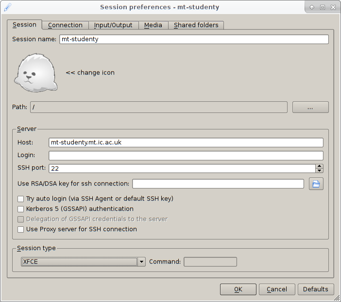

Getting Started in Linux
========================

Connecting to the Linux server
------------------------------

Most materials modelling research of the type you will be learning about in
this course is done through the Linux Operating System. For example, all the
major High Performance Computing (HPC) resources you may eventually use, such
as ARCHER2 which is a national HPC facility and CX1 which is the Imperial HPC
system, run Linux.

In this course, you will also be using a Linux server to run your
calculations. You can remotely open a desktop session on the server we will be
using with `x2go` which can be run from the
[Imperial Software Hub](https://softwarehub.imperial.ac.uk/) if you're using
a lab workstation. If you'd prefer to use your own laptop to connect, you'll
need to download and install the x2go client that's freely available via
[their website](https://wiki.x2go.org/doku.php/download:start).

If there is not already a session named "mt-studenty" or "mt-studentx" visible 
in the right-hand list on x2go when you start it up, you will need to create it.

- The shortcut to create a new session is "Ctrl+n".
- In this menu, you should name the session "mt-studenty" or "mt-studentx".
- Set the Host as "mt-studenty.mt.ic.ac.uk" or "mt-studentx.mt.ic.ac.uk".
- Select "XFCE" as the session type in the bottom drop down menu.
- An image of this is given below:

<figure markdown="span">
  { width="500" }
</figure>

- Once you have set this, click OK.
- Then select the session from the right-hand menu (e.g. click on the
  picture).
- Enter your Imperial username and password to login.
    - The username is case sensitive and should be in lowercase letters.
- Note: while I try to ensure students registered for the course have
  access before the first class, I may not have the most up-to-date
  information. If it doesn't accept your login details please let me know
  and I can give you access.
- If it is your first time connecting it may ask you whether you want to
  accept the host key (or something to that effect), to which you should click
  "yes".
- If using a college workstation you may also get some pop up messages
  about pulseaudio which you're free to ignore.
- It will take a minute or so for the session to fully start up so by patient.
- When logging in for the first time, once the desktop loads it will ask if
  you want to accept the default menu configuration. **You should accept the
  default here**. If you do not, you'll have no desktop menus. You can still
  access everything by right clicking on the desktop. The desktop menus are
  all customizable and you can always  change them later however you'd like,
  but the default is the best place to start. If you make any customizations,
  they'll be remembered when you next log in.
- I'd suggest also turning the sound volume on your pc down as command line
  work can produce a lot of beeps which may become annoying.

Once you've loaded into the desktop session, feel free to take a look around
the menus and settings that are there. This is the XFCE desktop manager, and
while it is basic, it is quite light on resources (important as you are all in
fact using a single powerful workstation simultaneously), and very
customizable.

Using the command line
----------------------

For the majority of first principles codes calculations are launched from the
command line, so it's important to have some familiarity with it. Often, when
running calculations on a HPC system, the command line will be the only way
to access the system. While you'll be able to use a file manager on the
desktop to access files, I encourage you to use the command line instead
even if it takes you a little longer initially.

The terminal application brings you to the command line and allows you to type
in various commands and instructions directly. Open the terminal application
from the menu. You can customize the appearance to your preference by changing
the text size, font and colour scheme.

You can launch a program from the terminal by typing its name. For example
typing `gedit` will launch the gedit text editor by default. Note if you
do this now, you won't be able to use the same terminal until gedit is closed.
A way around this is discussed later in the lab.

Files and Directories
---------------------

Once you have opened the terminal, the first thing you need to be able to do
is navigate the file structure.

### ls

`ls` is used to list the contents of a directory. Please note the first
character of this command is the lowercase `L` rather than the digit `1`. Try
typing it now. By default you should start off in your home directory when you
open a terminal, so you should see several automatically generated
directories. Note `ls` has been set to use colour highlighting for you by
default, so different types of files are shown in different colours.

You can list the contents of any directory by name. For example:

- `ls /opt/share/` will list the contents of that directory. Here we have
  provided the full (absolute) path, since we started with `/`.
    - The filesystem hierarchy always has `/` as the very top level directory
      for a linux system.
    - If we specify a path to a directory, beginning with
      `/` it means we are giving its absolute path from the top level
      directory down to its location.
    - Your home directory is `/home/username/` where `username` is your
      college id. `~` is a shortened way to write this: `~` also refers to
      your home directory.
- `ls Documents` will list the contents of the `Documents` directory below
  the current directory _if it exists_. This is the same as typing
  `ls ./Documents` as will be discussed later. Note this directory is empty
  to begin with so you won't see any output from this command.
    - Here we specify a path without a leading `/`. It means we are referring
      to a file or directory relative to your current location.

#### Useful Options

- `ls -lh`. The `-l` option requests a long listing format, giving extra
  details about each file and folder, such as permissions, owner, size, and
  modification date. The `-h` requests sizes in a human-readable format,
  otherwise sizes are listed in bytes i.e. with this option `ls` would list
  "4.0K" instead of "4096".
- `ls -a`. This tells `ls` to list _all_ files, i.e. to not to ignore files
  starting with "." which are typically hidden by `ls` and often used to store
  various user configuration files. Try typing this now, and you'll see many
  more files and folders than previously.

### pwd

`pwd` will output the name of the present working directory. Try using it now.
It should respond with something like `/home/username`.

### cd

`cd` is used to change directory. You can specify either the full path, or a
directory relative to your current directory.

- `cd Documents` to move to the `/home/username/Documents` directory assuming
  we are in `/home/username`.
- `cd /home/username/Desktop` to move to the users `Desktop` directory
  regardless of where we start from.
- `cd ..` to move up one directory.
- `cd .` to move to the present directory (i.e. do nothing).
- `cd` and `cd ~` will both move to your home directory.

------------------------------------------------------------------------------

### _Task_

Now that you know these few commands, let's take a look at some important
locations on the system for this course:

- The various files associated with the labs for this course are all available
  in `/opt/Courses/MSE404`.
- The documentation files for the version of Quantum Espresso we will be using
  are all collected in `/opt/share/quantum-espresso/doc-6.3`.
- Try changing to each of these directories now and taking a look at files
  that are contained in each of them.

------------------------------------------------------------------------------

### mkdir

`mkdir` is used to create new directories. For example `mkdir carbon` will
create a new directory called `carbon`.

#### Useful Options

- `mkdir -p` can be used to make parent directories as needed. For example,
  `mkdir -p carbon/lda/dos` if `carbon` already exists will create `lda` as a
  subdirectory of it, and `dos` as a subdirectory of `lda`.

### rm

`rm` is used to delete files. For example, if we create a text file with the
text editor `gedit` called `tmp`, then we can delete it with `rm tmp` in the
directory that contains it.

#### Useful Options

- `rm -r` will recursively delete a directory and any files contained in it.
- `rm -f` can be used to force deletion without prompting. Combine with the
  previous option with caution. **There is no recycle bin** when using `rm`.
  When you use it to delete a file it is gone, unless you have a backup.
  (On mt-studenty and mt-studentx there are daily snapshots you can recover 
  deleted files from in ~/.snapshots)

### rmdir

`rmdir` is used to delete directories. Note this will give an error if the
directory you try to delete is not empty.

### cp

`cp` is used to copy files. For example, `cp sourcefile newfile` would copy
the file `sourcefile` to `newfile`.

#### Useful Options

- `cp -r` will recursively copy a directory and any files contained in it.

### mv

`mv` is used to move or rename files. For example,
`mv oldfilename newfilename` would rename a file from "oldfilename" to
"newfilename", while `mv filename ../` would move "filename" to the parent
directory.

### ln

`ln` is used to create links. These are somewhat similar to shortcuts in
windows except that they operate at the filesystem level. A link to a file can
be used in the same way as the file itself. They are useful for many reasons:
- Convenience: you may want to frequently use a particular directory, but it
  has quite a long path. You can create a link to it in your home directory
  and use the link in exactly the same manner as the original path.
- Saving space: For example, when working with a code that expects a certain
  file as input in the current directory. If the file is very large you might
  want to avoid making copies of it, so you can instead make a link to the
  file.
- If a parameter file is used in several places, you can use links so that
  when you update one file, they are all updated, instead of having to update
  several copies manually.

Note, while the other commands we've looked at so far can all be done through
the file manager rather than the command line, link creation is less well
supported or at least less obvious in most file manager software.

`ln` can create two types of links: hard links are created by default, and
symbolic links are created when the `-s` option is specified. Symbolic links
contain text which points to a particular file, while hard links point to the
same data on the disk as the original file. It's generally simplest to stick
to symbolic links, especially starting out. An example of how links are
used is as follows:

1. `mkdir tmpdir1; mkdir tmpdir2; touch tmpdir1/tmpfile1` This will create two
   directories and a file in one of them. Note semi-colons can be used to
   separate commands on the same line. And we have also used the `touch`
   command which offers a quick way to create an empty file.
2. `cd tmpdir2` Move to the tmpdir2 directory.
3. `ln -s ../tmpdir1/tmpfile1 tmpfile2` This will create a symbolic link to
   the file.
3. `ln -s ../tmpdir1 .` will create a link to the `tmpdir1` directory in
   `tmpdir2`.
4. Typing `ls` in the `tmpdir2` directory will show the files `tmpfile2` and
   `tmpdir1`. If your colour highlighting is working, you should see these as
   different colours to usual files (probably light blue). To see where the
   links point you can use `ls -l`.

`cp -s` can also be used to create symbolic links (with `cp -l` creating hard
links), and can be a little easier to use, particularly for linking a set of
files.
- `cp -s ../results/*dat .` would create symbolic links from all the `.dat`
  files in the results directory to the current directory.

If you create a link to a directory, one thing that may not be immediately
obvious is how to delete it. Say your link is called ``tmpdir``. If you
try `rm tmpdir/` you'll get the error
`rm: cannot remove 'tmpdir': Is a directory`. Then if you try
`rmdir tmpdir/` you'll get the error
`rmdir: failed to remove 'tmpdir/': Not a directory`. What you need to do
is use `rm` but ensure you don't have a trailing slash following the link
name: `rm tmpdir`. **NB** if you use `rm -r tmpdir/`, this will delete the
contents of the directory you have linked to which is likely not what you
want to do, so be careful.

#### Useful Options

- `ln -sf`: the additional `-f` option forces the link to overwrite any
  pre-existing files or links.
    - For example, if we had incorrectly done `ln -s ../tmpdir1/tmpdir1 .` in
      the above example, the link would have been created, but wouldn't point
      to any valid file. `ls` will usually show these invalid links as red. We
      could then do `ln -sf ../tmpdir1 .` to overwrite the `tmpdir1` link with
      the correct path, rather than deleting incorrect link and repeating the
      `ln` command.

**Note** If you create a link correctly and have colour highlighting in the
terminal application you are using, symbolic links that work will be blue. If
they are red it means they don't point to a valid file or directory. You can
use `ls -l` to see where a symbolic link points. If you've made a mistake
you'll need to either delete the incorrect link, or use the `-f` flag as
described above to overwrite it.

------------------------------------------------------------------------------

### _Task_

Now that you know how to copy files and make directories, let's set up some
folders for the labs in the course. While it's of course possible to do this
through the file manager, please use the commands we've gone through so far to
do the following:

- In your home directory make the directory `MSE404`.
- Copy the directory with the input files for this course
  `/opt/Courses/MSE404/lab01` to the directory you just created `~/MSE404`.
  Remember you need to pass an additional flag to `cp` to copy a directory.
- List the contents of directory `~/MSE404/lab01/methane` with `ls -l`
    - You'll see there are three files in the directory you copied.
      1. `CH4.in` - an input file for the DFT code you'll be using.
      2. `C.pz-vbc.UPF` - a pseudopotential file for carbon, which tells the DFT code
      what approximation to use in your calculation.
      3. `H.pz-vbc.UPF` - a pseudopotential file for hydrogen, which tells the DFT code
      what approximation to use in your calculation.
    - You'll learn more about these types of files in later classes.
    - If you've followed the steps as given here, and have colour highlighting
      in the terminal application you're using, you'll see the pseudopotential files are
      highlighted in red when you did `ls -l`. This is because they are links
      and currently don't point to valid files. It's looking for files at
      `../../pseudo/C.pz-vbc.UPF` and `../../pseudo/H.pz-vbc.UPF` 
      where `../..` means go up two directories
      from the current directory. In other words this is looking for the files
      at `~/MSE404/pseudo/C.pz-vbc.UPF` and `~/MSE404/pseudo/H.pz-vbc.UPF`.
      You'll correct this in the next step.
- Go to the `~/MSE404` directory and make a copy there of the directory
  holding various pseudopotentials used in the course:
  `/opt/Courses/MSE404/pseudo`. You should now see that the file in
  `~/MSE404/lab01/methane` is blue when you do `ls` in this directory
  indicating it can now find a file in the location specified by the link.
- Within your `MSE404` directory also create a symbolic link to the Quantum
  Espresso documentation folder `/opt/share/quantum-espresso/doc-6.3` called
  `qe-doc`.

------------------------------------------------------------------------------

Tab completion
--------------

A useful feature which has long been available in the Linux terminal is tab
completion. This is also referred to as command-line completion. These days
this is available in both Mac and Windows systems also.

Try typing `ged` in a terminal and hitting `tab`. The full name of the program
`gedit` should automatically fill in. If more than one match is possible,
pressing `tab` twice will bring up a list of possible matches. Try typing
`ge` and pressing tab twice to see this.

This can also be used to complete file and directory names. From your home
directory, try typing `cd De` and pressing tab. It should automatically fill
in the full command to be `cd Desktop/`.

Reading a file
--------------

There are several built-in programs that will allow you to examine a text file
in the terminal.

### cat

`cat` is the simplest command to check the output of a file.
- `cat filename` will output the contents of `filename` to the terminal. For a
  large file you may need to scroll back up in the terminal (e.g.
  `shift+PdgUp`).

### more

`more` works in a somewhat similar way to `cat`, except for files bigger than
the terminal window, it allows you to look through a page (screen) full of
data at a time.

- `more filename` to start paging through a file.
- To move to the next page press `space` or `z`.
- To move down one line of text press `enter`.
- To quit before reaching the end of the file press `q`.

### less

`less` is more advanced version of `more` with many more features. This doesn't
output file contents to the terminal however, so once you exit `less` your
terminal will be as it was before the file was opened.

- `less filename` to open a file.
- move down one line: `down-arrow`, `enter`, `j`, or `e`.
- move up one line: `up-arrow`, `y`, or `k`.
- move down one page: `page-down`, `space`, or `f`.
- move up one page: `page-up`, `w`, or `b`.
- search for a string of text: `/`, type in the search text and press enter.
- A useful feature when trying to check a file that is currently being written
  to is to press `F`. This is similar to `tail -F`. It will scroll forward and
  keep trying to read when the end of the file is reached. To exit this mode
  press `ctrl+c`.
- quit: `q`.

------------------------------------------------------------------------------

### _Task_

Let's try taking a look at one of the quantum-espresso documentation files at
`~/MSE404/qe-doc/INPUT_PW.txt` (since you linked the folder in the previous
set of tasks).

- Try looking at this file with `cat`. You'll see the entire file is dumped
  straight to your terminal. If you want to scroll up and down from the
  keyboard you can do this with `shift+PdgUp` and `shift+PdgDwn`.
- Now try looking at the same file with `less`. Now you can scroll up and down
  with the arrow keys or with the `k` and `j` keys.
- Within less, search for the text `disk_io`.
- Take a look at the file `~/MSE404/lab01/methane/CH4.in` in `less`. This is
  a basic Quantum Espresso input file. You'll be learning more about this in
  the next lab.

------------------------------------------------------------------------------

Other Useful Command Line Features
----------------------------------

While at first, the command line can seem quite basic. There are many built-in
features that allow you to work extremely efficiently after a little practice.

The Manual and man command
--------------------------

Linux systems provide an interface to a built-in reference manual through the
`man` command. This is very useful as a quick way to check the syntax used by
a command, and what options it might take.

- Type `man ls` to check the manual page for the ls command.
- Type `man man` to check the manual page for the man command.
- Type `man intro` to get an introduction to user commands.

When reading the manual data, by default it should use the `less` pager, so
you can use all the commands for `less` listed above to navigate and search
through the manual.

Wildcards
---------

In Linux many commands will accept wild cards as a way to perform their action
on a set of files.

- `*` is used to represent zero or more characters. The `*` wildcard is very
  commonly used and worth remembering.
    - `ls *.pdf` would list all the files ending in `.pdf` in the current
      directory.
    - `rm *.o` would remove all files ending in `.o` in the current directory.
- `?` is used to represent any single character.
    - `cp ../example?.cpp .` would copy all files with names such as
      `example1.cpp`, `example2.cpp`, `examplea.cpp` from the parent to the
      current directory.
- `[]` specifies a range.
    - `ls example_0[2,3,5]` would list files with the name `example_02`,
      `example_03` and `example_05`.
    - `ls example_0[3-5]` would list files with the name `example_03`,
      `example_04` and `example_05`.

For more information on this see `man 7 glob`.

IO Redirection
--------------

IO redirection allows you to easily send the output of a command to a file, use
a file as input for a command, or use the output of one command as input to
another command. The most frequently used features are as follows:

- `>` is used to redirect the output from a command into a file.
    - `ls > dirlist.txt` will save the result of the `ls` command in a file
      called `dirlist.txt`. **Take care:** if `dirlist.txt` already exists it
      will overwrite the previous contents.
- `&>` is used to redirect both the standard output and standard error from a
  command to the same file.
- `>>` is used to redirect the output from a command to a file, but will append
  the output to the end of the file if the file already exists.
    - If you run `ls >> dirlist.txt` you will see the ls output repeated
      several times in the file `dirlist.txt`.
- `<` is used to redirect a file to the input of a command.
    - `less < dirlist.txt` will work as `less` is happy to read either from
      stdin or a file.
- `|` is used to redirect the output of a command to the input of another
  command.
    - `ls | less` will take the output of the `ls` command and display it
      directly in `less` (this is why it's useful for `less` to be able to read
      from stdin).
- `tee` allows you to split a stream so that the output goes both to stdout and
  to a file.
    - `ls -l | tee dirfiles` will output the result of `ls -l` to the terminal
      and also save it in the file `dirfiles`.

History
-------

By default the terminal keeps a history of previously entered commands. You can
scroll back through previously entered commands using the `up-arrow` and
`down-arrow` keys.

The `history` command will output a list of all the previously entered commands
following a history index number. By default the list is usually limited to
1000 commands, with the oldest being removed as new commands are entered. You
can look at the full list with `history | less`.

- `!!` will repeat the most recent command.
- `!n` will repeat the command indexed by `n` in the history list. For example
  `!100` would repeat the command at history index 100.
- `!string` will repeat the most recent command in the history starting with
  "string".

For more details see `man history`.

The linux shell also gives a built in way to search through previously entered
commands. You can press `ctrl+r` to bring up the reverse-history-search and
type some text from the command you want to re-enter. You can keep hitting
`ctrl+r` to search back through commands containing that text. If you
accidentally go past the entry you want, `ctrl+s` will go forward through
your history.

An additional useful shortcut is 'alt+.' which will enter the most recent
argument you used, and repeated presses will cycle back through arguments.

Job Control
-----------

Linux allows jobs to run both in the foreground and background of a terminal
session. If we launch a program from the terminal by typing e.g. `gedit` and
pressing enter (`gedit` is a text editor), then we can't can't do anything else
in the terminal until `gedit` is closed. `gedit` is said to be running in the
foreground in this case.

With `gedit` running in the foreground, we can move it to the background as
follows.

1. In the terminal where it is running, press `ctrl+z`. This stops the job. A
   message will appear in the terminal like
   `[1]+  Stopped gedit`. If you try to type, or click any menu buttons, on
   `gedit` it won't respond.
2. Type `bg` in the terminal. This moves the most recent stopped job to the
   background, i.e. `gedit` in this example. Now you'll be able to use both
   `gedit` and the terminal as normal.

- To move a job that's running in the background, back to the foreground you
  can use the `fg` command.
- To start a job in the background you can append `&` to the command when you
  enter it in the terminal. For example `gedit &` will launch `gedit` in the
  background directly.

Environment Variables
---------------------

There are a couple of environment variables that are important for running
commands via the command line.

- `$PATH` - this is a colon-separated list of directories that are searched
  for executables to run when you type in a command without specifying any
  path.
    - If you type `echo $PATH` you can see what this is.
    - For example, when you type `gedit`, it searches each directory in turn
      for an executable named `gedit`, and runs the first one it finds.
    - You can use the `which` command to see where it would find an
      executable.
    - For example `which gedit` returns `/usr/bin/gedit` on our system.
    - Note you can run a particular executable by specifying it's path and not
      relying on `$PATH`. So if `$PATH` was unset, we could type
      `/usr/bin/gedit`, or we could do `cd /usr/bin`, `./gedit`.
- `$LD_LIBRARY_PATH` - this is a colon-separated list of _additional_
  directories to search for libraries used by applications.
    - Libraries are pieces of code that are common to many applications, so
      are shared and installed separately. And when the application is run, it
      tries to find this library.
    - Generally, most default OS software will work fine without this set, but
      if you're using some custom mathematical libraries or compilers this may
      be needed.

Environment Modules: Lmod
-------------------------

Environment modules simplify the whole process of changing environment
variables to get some custom software package working. When a module is loaded
it sets whatever environment variables are required automatically. This lets
many different and possibly conflicting software versions be installed on the
same system. Environment modules are almost always used on HPC systems to make
various versions of common version of computational software packages
available. The version installed on mt-studenty/mt-studentx is called
[Lmod](https://www.tacc.utexas.edu/research-development/tacc-projects/lmod).

- The main command is `module`.
- For help type `module help` (the same text is output if you just `module`).
- To see what modules are currently available type `module avail`. (some
  groups of modules which require a compiler module to be loaded will not be
  visible).
- To load the module making software compiled using the gcc compilers
  available type `module load gcc`. This makes some additional modules
  available.
- To see a complete list of all modules type `module spider`.
- The particular module implementation we use allows us to easily switch
  between versions of codes compiled with different compilers.
- For example to load the Quantum Espresso module, you'll first need to
  have the "gcc" and "mkl" modules loaded. You can load everything in a
  single command though provided the order is correct:

```bash
module load gcc mkl espresso
```
- Throughout the course, when running on the undergrad server you'll need to
  remember to load the modules above before you'll be able to use the codes
  in the Quantum Espresso package.
- If you want to have the modules necessary loaded automatically whenever you
  log in to the server, you can add the above module load command to the
  end of the file `~/.bashrc`. This file is run whenever your start a shell
  and can be used to customize your environment.

------------------------------------------------------------------------------

### _Task_

Now you know enough to run your first DFT calculation.

- First we need to load the Quantum Espresso module. An optimized compilation
  of this is available on the system compiled with the GCC compilers and
  Intel Math Kernel Libraries. Type the following in your terminal to load
  everything you need in one go `module load gcc mkl espresso` to load
  everything you need.
- Now you'll be able to use the various Quantum Espresso package executables
  directly. Go to the methane folder you copied earlier
  (`~/MSE404/lab01/methane`) and look at what files are in that directory.
- The input file there is for the `pw.x` code. You can pass this file to
  `pw.x` with input redirection and save the output to a file with output
  redirection (otherwise the output will just be in the terminal). To do this
  type `pw.x < CH4.in > CH4.out`.
- See what files are present in the directory now. As well as the output file
  we saved, some others were generated.
- Take a look through the output file using `less`. We'll discuss the
  contents of this in next week's lab, but for now skip to the section
  immediately following the line that reads
  `End of self-consistent calculation`:
    - This lists the calculated eigenvalues.
    - We have four doubly-occupied bands in our calculation, so you'll see
      four numbers.
    - Following this, you can see in the output, the value of the highest occupied
      energy level in eV, and the total energy in Rydberg.
- Congratulate yourself on running your first DFT calculation.

------------------------------------------------------------------------------

There are a lot of commands to remember from this week's lab. You can always
refer back to this week, but to make things easier in future weeks you might
find a cheatsheet useful. If you don't want to make your own, a quick Google
search of `Linux cheat sheet` brings up a number of options.

If you're interested in seeing some more command line tools, some of these are
listed in [linuxcommands](../extras/misc/linuxcommands/readme.md). If you have
time, I encourage you to at least skim through them, as it's very useful to know
what kinds of things are possible. We'll refer back to some of these commands
throughout the course.

**Once you're finished with everything, be sure to log out of the remote
desktop session. You can see this option if you click on your name on the
top right.**

-----------------------------------------------------------------------------

Summary
-------

To run the DFT example in this lab you will need to do the following:

- Make a directory that will hold the material for the MSE404 labs:
  `mkdir ~/MSE404`.
- Copy the directory with the inputs for this lab to this directory:
  `cp -r /opt/Courses/MSE404/lab01 ~/MSE404`.
- Copy the directory with the various pseudopotential files to this directory
  also: `cp -r /opt/Courses/MSE404/pseudo ~/MSE404`.
- Make a link to the Quantum Espresso documentation directory in your home directory:
  `cd ~/MSE404; ln -s /opt/share/quantum-espresso/doc-6.3 ./qe-doc`.
- Load the modules needed to run Quantum Espresso:
  `module load gcc mkl espresso`.
- Go to the directory with the input files you copied and use these with
  `pw.x` saving the output in a file:
  `cd ~/MSE404/lab01/methane; pw.x < CH4.in > CH4.out`.
- Take a look through the output file:
  `less CH4.out`.
- Logout of the remote server once you're done.
