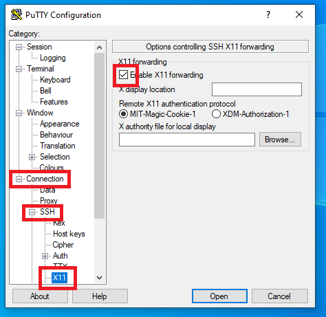
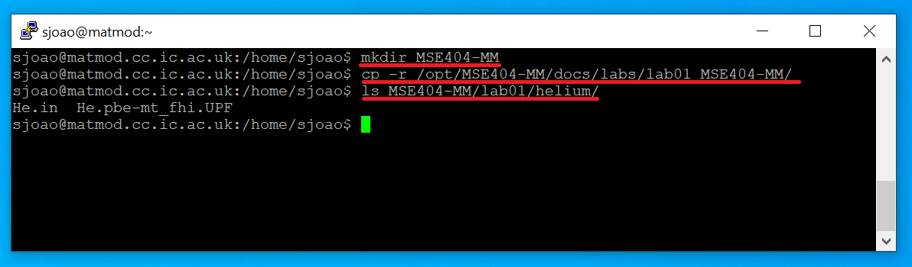
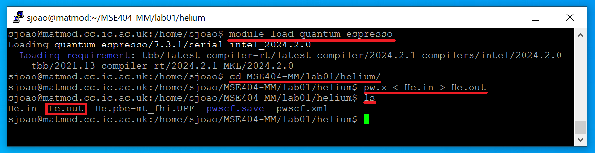

Getting Started in Linux
========================


## 1. Introduction

In this course, you will use a dedicated Linux server to run your calculations, which can be accessed remotely. In this first Lab, you will learn how to:

1. access this server remotely with your college credentials
2. interact with the server using the Linux command line
3. set up your work environment in the terminal
4. run your first DFT calculation!

These steps closely resemble what you would need to do in a real-world scenario. When you’re researching more advanced topics, you will require powerful computers to run your simulations. At Imperial, you could get access to CX1, the local High Performance Computing (HPC) facility containing hundreds of machines. On a national level, you could get access to ARCHER2, the UK national supercomputing service. All these facilities use the Linux operating system, so it is important to get comfortable with the Linux command line because in many situations this will be your only option to interact with those machines. The server you will use in this course is called `matmod` and it will be your first step into the world of material simulation.


## 2. Accessing the server remotely

The server can be accessed by using PuTTY and XMing, which can be run from the [Imperial Software Hub](https://softwarehub.imperial.ac.uk/). XMing runs in the background in your Windows machine and enables the remote server to display graphics when needed. For the most part, however, you will have to interact with the command line. PuTTY is the program used to establish the connection to the remote server.

!!! example "Task 1 - Connecting to the remote server"

    1. Access the [Imperial Software Hub](https://softwarehub.imperial.ac.uk/) and first run Xming, then PuTTY.<br>
    {: width="600" }<br>
    2. In the PuTTY interface, inside the **Connection** tab, enable X11 forwarding. This will allow the server to communicate with Xming to show you graphical data when required.<br>
    {: width="600" }
    3. In the **Session** tab, under **Host Name**, input the name of the server that you want to access, and save this session by giving it a name under **Saved Sessions** and clicking **Save**. Whenever you want to reconnect with PuTTY, you can simply load this session again. Finally, click **Open**:<br>
    {: width="600" }    
    4. If this is your first time connecting to this server, you might get a security alert asking whether you want to accept the host key. Press "Accept".<br>
    {: width="600" }
    5. A terminal will be presented to you. In order to login, you will have to enter your College username, press **Enter**, enter your password and press **Enter** again.<br>
    {: width="600" }

    **Note:** while we try to ensure students registered for the course have access before the first class, we may not have the most up-to-date information. If it doesn't accept your login details please let me know and we can give you access.<br>

    **Congratulations**! You are now connected to **matmod** and have complete access to its powerful Linux command line.


## 3. Basic command line usage

While using a computer for day-to-day activities, you most likely have become familiar with a Graphical User Interface (GUI), which is a graphical way to interact with the computer. Most Operating Systems (OS) also provide a non-graphical way to interact with the computer through the command line (also usually denoted as the terminal). In this course we will deal exclusively with the Linux command line. The command line offers a completely equivalent way to the GUI to perform tasks, but has several advantages:

- It uses very few system resources. This is especially useful if there are dozens of users using the same machines simultaneously, as in this Lab
- It is extremely flexible. With knowledge of just a few basic operations, it is possible to chain them together to perform complex tasks, or to automate tasks altogether

In this section, you will learn how to use the command line to perform simple tasks like listing the files inside a directory, creating and copying directories and run simple programs. Most of the programs that you will use in this course will run exclusively in the command line, but you can also use it to run programs with a GUI.

If you successfully connected to the remote server using PuTTY, you should have a Linux command line in front of you right now.

The terminal will give you access to a prompt that can be used to interact with the computer. The prompt contains three sections: `username @ machine : current working directory $`. The commands you write will always be in front of the `$` symbol.

{: width="600" }

!!! example "Task 1: launching your first program"

    Write the command `gedit` then press Enter. This might take a few seconds, but then it will open a graphical text editor. The prompt will be unresponsive until this program finishes. This will be the case for most Linux commands. In this case, the program will finish once you close the `gedit` window. Until the command completes its assigned task, you cannot use the prompt, but once the task is finished, the prompt can be used again.


    {: width="600" }

    **Important** Remember to close the `gedit` window

!!! example "Task 2: command line programs"

    Not all commands open up graphical interactive windows. Let's now take a look at commands which provide output exclusively in the command line. 

    1. Run the program `date`, which will print out to the terminal the current date and time. 
    2. You can also provide additional parameters to certain commands to make them do specific tasks. For example, the command `echo` prints out to the terminal the text that’s written after it. Run the program echo with `DFT` as a parameter - `echo DFT`, and check that it prints out the word `DFT` to the terminal. 


    {: width="600" }


In sum, commands in the Linux command line have the following structure

```bash
command argument1 argument2 ...
```


where the number of arguments can be virtually arbitrary.


### 3.1 Writing to and reading from file
In many circumstances, you might want to save the output of a command to a file so that you can process it later. This can be done with the **output redirect** symbol `>`. For example, running 
```bash
date > file.txt 
```

in the command line will save the output that you got previously into the file called “file.txt”. You can check that this file has been created by using gedit.

!!! example "Task 3: saving to file"
    1. Run the previous command
    2. Open it using gedit and check that its contents match your expectation
    ```bash
    gedit file.txt
    ```

    {: width="600" }

While gedit provides all the means necessary to read and write files, it can be very slow when the connection to the server is not stable, or when many people are connected to the server simultaneously. A quicker way to read the contents of a file is by using the `cat` command. When you provide an argument to the `cat` command, it will assume that the argument is a file name and will output its contents.

!!! example "Task 4: Reading from a file"
    Run the following command and check that the output matches what you saw with gedit

    ```bash
    cat file.txt
    ```

    {: width="600" }

 
 If the file is very long, you can also use `head file.txt` if you just want to print out the first lines of the file, or `tail file.txt` if you just want to print out the last lines. Alternatively, you can use a more interactive command like `less file.txt` which will replace the terminal with a file reader that you can scroll through with your mouse wheel or the keyboard arrows. You can exit this file reader by pressing `q`. Reading the file directly from the command line is often the quickest and most convenient way to do so.

### 3.2 Using a file as argument to a command
Some Linux commands can use instructions saved in files to perform their job. For the purposes of this Lab, we will be doing this by using the **input redirect** feature with the symbol `<`. 

!!! example "Task 5 - Files as input"
    The command `sort` sorts the input that is given to it. 

    1. Using gedit, create a file called **numbers.txt** containing three separate lines with the numbers 3,9 and 1
    2. Run `sort < numbers.txt`. This command will print out the sorted list of numbers.
    3. Save the output of this command into another file **numbers_sorted.txt** using what you learned previously: `sort < numbers.txt > numbers_sorted.txt`
    4. Read the contents of this new file using `cat` and check that the numbers have been sorted

    {: width="600" }
    {: width="600" }


## 4. Navigating the system
So far, all the commands you have been running were executed inside of your **home** directory. In a GUI, you navigate the system by clicking on folders with the cursor and looking at their contents. In a terminal, everything is done via commands. Instead of clicking on a folder, you issue a command to change your current location to that folder. Instead of visualizing the files as icons inside a folder, you issue a command to show the file names in the current directory.

### 4.1 Understanding the directory structure
The directory (or folder) structure in Linux is defined through the use of the forward slash `/`. For example, `/file1.txt` means that `file1.txt` is inside the root directory, which is represented by a single forward slash `/`. `/directory1/file1.txt` means that `file1.txt` is inside `directory1` which is inside the root directory `/`. As a user of the **matmod** server, your files are located in the directory `/home/username`, which has a shorthand expression `~`. This is called the **home** directory.

{: width="600" }

### 4.2 Figuring out where you are
If you want to check what is your current directory, run the command `pwd`, which stands for **print working directory**. This will print out something like “/home/sjoao”, which means that the directory “sjoao” is located inside the directory “home”. It also means that you are currently located inside the `/home/username` folder. This directory “/home/sjoao” is known as the home directory, and is equivalently represented by a tilde “~” as a shorthand.

!!! example "Task 4.1"
    Run the command `pwd` in the command line. Check that this output corresponds to a directory structure as discussed above

    {: width="600" }

### 4.3 List the contents of the directory
If you want to list the contents of your current directory, run `ls`. This will print out to the terminal the list of folders and files that exist in the current directory. 

!!! example "Task 4.3" 
    Run the command `ls` and check that the files that you created in the previous tasks are here.
    {: width="600" }


### 4.4 Creating new directories and changing directories
The command `mkdir` (which stands for **make directory**) is used to create new directories inside of the current directory. If you run `mkdir newDirectory`, you will see that a directory **newDirectory** has been created. To navigate to that directory, run `cd newDirectory`. To navigate to its parent directory, run `cd ..` in the command line. The two dots **..** stand for **parent directory**. 

These commands are all relative to the current directory, but you can also use the absolute path. For example, run `mkdir ~/newDirectory/dir2`. You will see that a directory will be created inside of **newDirectory**, which is inside of your home `~` directory. To navigate to it directly, you can run `cd ~/newDirectory/dir2` in just the same way. Running `cd ~` will place you back into your home directory.


!!! example "Task 4.4" 
    Run the commands above and in each step run `ls` and `pwd` to better understand the directory structure.
    {: width="600" }


## 5. File manipulation

### 5.1 Copying files
In the terminal, you copy files by using the `cp` command, which requires the origin (file to be copied) to be specified as the first argument and destination to be specified as second argument. For example, if you want to copy file `~/text.txt` (which is located in your home folder) to the directory **~/newDirectory/dir2**, you can do it in two ways:

1. Specify the full paths:
```
cp ~/file.txt  ~/newDirectory/dir2
```
2. Navigate to one of the directories and use a relative path:
```
cd ~/newDirectory/dir2
cp ~/file.txt .
```
The dot `.` in this last command represents **this directory**, so the command means: “copy the file ~/file.txt, which is located in the home directory into the current directory”. <br>
**Note:** if the file already exists in the destination, it will be overwritten. 

### 5.2 Copying folders
To copy folders, the only extra thing you need to do is to specify the additional “-r” argument to “cp”. For example, you can copy the directory dir2, which has the location “~/newDirectory/dir2” to the home directory as such:
```
cp -r ~/newDirectory/dir2  ~
```

**Note:** Unlike files, folders are not overwritten. If you copy a folder into the location of another, instead of overwritting, the command will place the source folder inside of the destination folder.

!!! example "Task "
    Run the commands from the previous two sections and check with `ls` that the contents of each folder correspond to the expectation.


### 5.3 Moving and renaming files
The syntax to move files is exactly the same as the one for the “cp” command. To move a file “file.txt” from “~/newDirectory/dir2” to “~/newDirectory”, run the command
```
mv ~/newDirectory/dir2/file.txt ~/newDirectory
```
You can also move directories in a similar way to “cp”, but without the additional “-r” argument. 
!!! example "Task"

    Create a new directory “dir3” inside the home directory and move “~/dir2” into “dir3”
    ```
    cd ~
    mkdir dir3
    mv dir2 dir3
    ```

To rename a file, you also use the “mv” command. You can think of renaming a file as moving a file into another with a different name. For example, to rename “file.txt” to “data.txt”, use “mv file.txt data.txt”

!!! example "Task"
    Run the previous command and check that the file has the expected name.


### 5.4 Deleting files
To delete a file, you use the “rm” command. For example, if you want to remove file “file.txt”, use
`rm file.txt`. To delete directories, the argument “-r” has to be provided: `rm -r ~/newDirectory/dir2`<br>
**Note:** If you run the “rm” command, the deleted file or directory will be deleted permanently, there is no way to undo it, so make sure you are running the correct command.

!!! example "Task"
    Run the previous command and check that file.txt and dir2 no longer exist.


## 6. Wildcards

In Linux many commands will accept wild cards as a way to perform their action on a set of files. `*` is used to represent zero or more characters. The `*` wildcard is very commonly used and worth remembering.

- `ls *.txt` would list all the files ending in `.txt` in the current directory.
- `rm *.o` would remove all files ending in `.o` in the current directory.


## 7. Job Control - terminating commands
Sometimes, you will execute a command which does not seem to finish, so you may want to force it to terminate. You can do this by pressing the keys `Ctrl+C`

!!! example "Task"
    Run `gedit` and terminate it with `Ctrl+C`. Make sure that you are pressing the keys `Ctrl+C` while the terminal window is selected, not the gedit window.

## 8. Tab completion

Typing commands in their entirety can be a time-consuming process while interacting with a terminal. Tab completion is a very useful feature of the Linux command line which tries to fill in the commands for you.

!!! example "Task"
    Try typing `ged` in a terminal and hitting `tab`. The full name of the program
    `gedit` should automatically fill in. If more than one match is possible,
    pressing `tab` twice will bring up a list of possible matches. Try typing
    `ge` and pressing tab twice to see this.


## 9. Loading modules

Environment modules provied extra functionality to your session by giving you access to additional software packages. The reason why these additional softwares are often not available by default is because they may cause conflict with other softwares. Environment modules ensure that these softwares can be loaded safely without causing conflicts. They are almost always used on HPC systems to make various versions of common version of computational software packages available. The main command to know is `module`. This command allows you to load and unload different software packages. To load a package, use `module load` followed by the name of the packages. In this lab, you will need to load the **Quantum Espresso** package:

```bash
module load quantum-espresso
```
{: width="600" }

Throughout the course, when running on the server you'll need to remember to load the modules above before you'll be able to use the codes in the Quantum Espresso package. 


## 10. Running your first DFT calculation!


Now that you know the basics of the Linux operating system, it's time to run your first DFT calculation. First, we need to setup a few files and directories. The various files associated with the labs for this course are all available
in `/opt/MSE404-MM/docs/labs`.

!!! example "Task 4.5"
    Try changing directories to `/opt/MSE404-MM/docs/labs` and exploring the folders and taking a look at files that are contained in there. Change back to the home directory once you're done.


!!! example "Task"

    - In your home directory create the directory `MSE404-MM`.
    - Copy the directory with the input files for this course `/opt/MSE404-MM/docs/labs/lab01` to the directory you just created `~/MSE404-MM`. Remember you need to pass an additional flag to `cp` to copy a directory.
    - List the contents of directory `~/MSE404-MM/lab01/methane` with `ls`
        - You'll see there are three files in the directory you copied.
          1. `CH4.in` - an input file for the DFT code you'll be using.
          2. `C.pz-vbc.UPF` - a pseudopotential file for carbon, which tells the DFT code what approximation to use in your calculation.
          3. `H.pz-vbc.UPF` - a pseudopotential file for hydrogen, which tells the DFT code what approximation to use in your calculation.
        - You'll learn more about these types of files in later classes.

    {: width="600" }


Now you are finally ready to run the DFT calculation

!!! example "Task"

    - First we need to load the Quantum Espresso module. If you haven't done this already, run `module load quantum-espresso`.
    - Now you'll be able to use the various Quantum Espresso package executables directly. Use `cd` to go to the methane folder you copied earlier (`~/MSE404-MM/lab01/methane`)
    - The input file there is for the `pw.x` code. You can pass this file to `pw.x` with input redirection and save the output to a file with output redirection (otherwise the output will just be in the terminal). To do this type `pw.x < CH4.in > CH4.out`.
    - See what files are present in the directory now. As well as the output file we saved, some others were generated.<br>
    {: width="600" }<br>
    - Take a look through the output file `CH4.out` using `less`. You can usse the arrow keys to scroll, `g` to go to the beginning of the file, `G` to go to the end of the file and `q` to exit the reader. We'll discuss the contents of this in next week's lab, but for now skip to the section immediately following the line that reads `End of self-consistent calculation`:
          - This lists the calculated eigenvalues.
          - We have four doubly-occupied levels in our calculation, so you'll see four numbers.
          - Following this, you can see in the output, the value of the highest occupied energy level in eV, and the total energy in Rydberg.
          - Congratulate yourself on running your first DFT calculation.

    {: width="600" }


Once you're done, exit the session by closing the terminal.

## 11. Summary

There are a lot of commands to remember from this week's lab. You can always
refer back to this week, but to make things easier in future weeks you might
find a cheatsheet useful. If you don't want to make your own, a quick Google
search of `Linux cheat sheet` brings up a number of options.

To run the DFT example in this lab you will need to do the following:

- Make a directory that will hold the material for the MSE404 labs:
  `mkdir ~/MSE404-MM`.
- Copy the directory with the inputs for this lab to this directory:
  `cp -r /opt/MSE404-MM/docs/labs/lab01 ~/MSE404-MM`.
- Load the modules needed to run Quantum Espresso:
  `module load quantum-espresso`.
- Go to the directory with the input files you copied 
  `cd ~/MSE404-MM/lab01/methane`.
- Use `pw.x` to process the input file, saving the output to a file:
  `pw.x < CH4.in > CH4.out`.
- Take a look through the output file:
  `less CH4.out`.
- Logout of the remote server once you're done.
