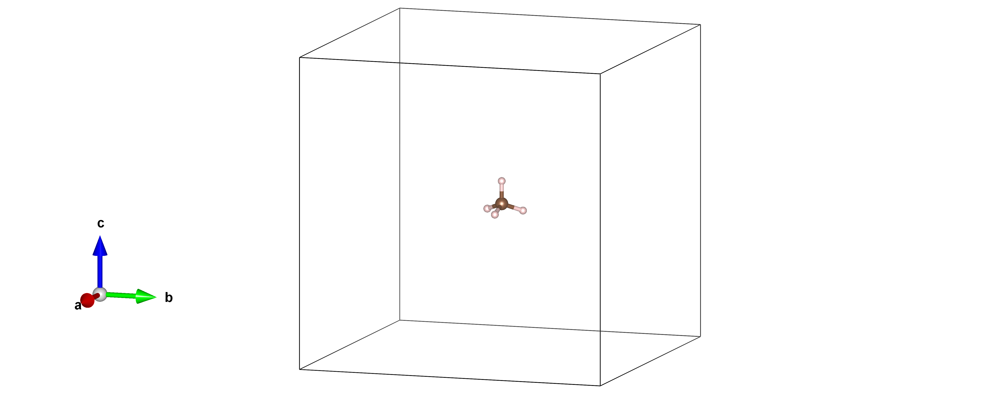

Quantum Espresso Input and Output for Molecules
===============================================

This week you will run some DFT calculating using Quantum Espresso for molecular systems. We are going to be focusing on understanding and constructing input files that you will need for the rest of the course.

<div markdown="span" style="margin: 0 auto; text-align: center">
[Download the input files for this tutorial](./assets/lab02_input.zip){ .md-button .md-button--primary }
</div>

Before starting, if you can't remember how to do something from the command line, you can always refer back to [Lab 1](../lab01/readme.md).

------------------------------------------------------------------------------

## Quantum Espresso

[Quantum Espresso](http://www.quantum-espresso.org) is a freely available package of open-source codes for electronic-structure calculations and materials modelling at the nanoscale. It is based on density-functional theory, plane waves, and pseudopotentials, which you will be learning about in lectures.

Quantum Espresso is used via the command line. There is no graphical interface by default, which is typical of most electronic structure codes. Throughout this course we will be interacting with Quantum Espresso through the command line via ssh (through PuTTY that you used in [Lab 1](../lab01/readme.md)).


!!! example "Task 1 - Copy Input Files"

    In lab 1 you should have created a directory named `MSE404` in your home directory.

    - Check this by issuing the command `cd ~` followed by `ls`.
    - Copy the input files from `opt/Courses/MSE404/lab02` to your `MSE404` folder. Remember you need to pass an additional flag to `cp` to copy a directory. If you are struggling with this, revisit [Lab 1](../lab01/readme.md).
    - Copy the directory containing the pseudopotentials that you will be using during this course to your `MSE404` directory. These are stored in `/opt/Courses/MSE404/pseudo`

You should now have a directory `lab02` and `pseudo` within your `MSE404` directory. This contains a set of basic input files for a variety of systems and the pseudopotentials for the input files.

## Input Files

Before running a calculation we need to write input files. These give instructions to Quantum Espresso to tell it what we want to calculate, and what parameters to use to do the calculation. The first example we will be looking at is in the `01_methane` directory. This is an input file for the `pw.x` module of Quantum Espresso which calculates the total energy of your system.

Let's take a look at our first input file [CH4.in](01_methane/CH4.in).

```bash
&CONTROL #(1)!
    pseudo_dir = '.' #(2)!
/

&SYSTEM
    ibrav = 1 #(3)!
    A = 15.0 #(4)!
    nat = 5 #(5)!
    ntyp = 2 #(6)!
    ecutwfc = 18.0 #(7)!
/

&ELECTRONS
/

ATOMIC_SPECIES
 C  12.011  C.pz-vbc.UPF #(8)!
 H   1.008  H.pz-vbc.UPF

ATOMIC_POSITIONS angstrom #(9)!
C 7.2433205 7.5 7.137
H 7.2433205 7.5 8.225999999999999
H 8.2700395 7.5 6.773999999999999
H 6.729960500000001 6.610835 6.773999999999999
H 6.729960500000001 8.389165 6.773999999999999

K_POINTS gamma #(10)!
```

1. Quantum Espresso input files are ordered with 'tags'. These 'tags' start with a `&` and end with a `/`. They are blocks of input parameters.
2. Directory containing your pseudopotentials defined later in the input file. The directory `.` means the current directory. 
3. Bravais lattice type e.g. simple cubic, face centered cubic etc. These are documented on the [Quantum Espresso input description page](https://www.quantum-espresso.org/documentation/input-data-description/). You will get familiar with this throughout the course. ibrav = 1 is a simple cubic lattice.
4. Crystalographic constant i.e. cell vector length. Simple cubic with A=15 means a 15x15x15 Å box. 
5. Number of atoms.
6. Number of species.
7. Energy cutoff for wavefunction expansion. You will learn more about this in your lectures and [Lab 3](../lab03/readme.md)
8. Atomic species, atomic mass and the name of the pseudopotential file.
9. Below this tag are the atomic positions of your atoms. The `angstrom` after `ATOMIC_POSITIONS` specifies these are in cartesian coordinates in units of Å.
10. K-Points for the calculation. We have chosen to do this calculation at the Gamma point.

Later we will learn how to visualise the structure, but for now, here is our methane molecule:

<figure markdown="span">
{ width="900" }
</figure>

!!! example "Task 2 - Alternative Input File Style"
    Take a look at the input file in the `01a_methane` directory.

    - How is this different from the input file discussed above?

    ??? success "Answer"
        ibrav is now set to 0. This means 'free cell' meaning the user needs to specify the cell parameters manually. The parameter defining the cell vector length is not present. There is also a section called `CELL_PARAMETERS`.

    - Will this input file do the exact same thing as the one in `01_methane`?

    ??? success "Answer"
        Yes! Instead of specifying the cell vector length we have just specified the length of each cell vector in the `CELL_PARAMETERS` section. 


!!! warning "Warning - Periodic Boundary Conditions and Molecules"
    Quantum Espresso is a periodic DFT code due to it using a plane wave basis. This is something you will learn about later in the theoretical part of this course. We therefore need to be smart in order to model isolated molecules, since by definition these are not periodic. One way of doing this is to put the molecule in the center of a large box. This minimises any interaction with its periodic neighbour.

## Running and examining the calculation

The Quantum Espresso package has been compiled as a module on the server as discussed in [Lab 1](../lab01/readme.md). Modules are often used on HPC systems to make different versions of packages available to users.
In order to be able to run any Quantum Espresso calculation, it must first be loaded to your environment. This can be done by issuing the command


```bash
module load quantum-espresso
```

This will load Quantum Espresso and any module dependencies.

!!! example "Task 3 - Running a calculation"
    To run the first calculation of the day, make sure you have loaded Quantum Espresso to your environment as discussed above.

    - Navigate to the `01_methane` directory.

    - Issue the command 
    ```bash
    pw.x < CH4.in > CH4.out
    ```
    
After the calculation has finished take a look at the files created in your directory. You should have a file named `pwscf.xml` and a new directory named `pwscf.save`.

- `pwscf.xml` has the results of the pw.x calculation in machine readable format (not so readable for humans!)
- `pwscf.save` is a directory which contains: 
	- A copy of `pwscf.xml`.
	- A copy of the pseudopotential files used in the calculation.
	- A file with the charge density stored. This is mostly used for post-processing to obtain observables.
	- Wavefunction files which are stored in binary (and thus are not readable). These can be used as inputs to other calculations.

Now that we have run the calculation for methane, we should examine the output file `CH4.out`, which is where we instructed Quantum Espresso to pipe the output of the pw.x calculation.
Using the command
```bash
less CH4.out
```
we can look at the output file. Output files are generally structured as such:

- Begining - Important information about the system including parameters used in the calculation.
- Middle - Self-consistent cycle starting from randomised atomic wavefunctions.
- End - Final results like total energy, band energies etc.

!!! example "Task 4 - Examining an output file"
    Using the `less` command specified above

    - How many valence electrons were in your calculation?

    ??? success "Answer"
        8.00. This is found at the top of your output file.
        ```bash
        number of electrons       =         8.00
        ```

    - How many scf cycles (iterations) did your calculation go through?

    ??? success "Answer"
        9 scf cycles. This is found on the line:
        ```bash
        convergence has been achieved in   9 iterations
        ```

    - What is the total energy of the Methane molecule?

    ??? success "Answer"
        $E_{\text{Tot}} = -15.49834173 \, \text{Ry}$. This is found on the line:
        ```bash
        !    total energy              =     -15.49834173 Ry
        ```
        Notice the converged total enegry will always have a `!` at the beginning of the line.

    - What accuracy is your calculation converged to?

    ??? success "Answer"
        0.00000066 Ry. This is found on the line:
        ```bash
        estimated scf accuracy    <       0.00000066 Ry
        ```
        We did not specify this in the input file. The default value of below 1E-6 was therefore used.

    - How many Kohn-Sham energies were calculated?

    ??? success "Answer"
        4 Kohn-Sham energies were calculated. This is found in the lines:
        ```bash
        End of self-consistent calculation

        k = 0.0000 0.0000 0.0000 ( 14712 PWs)   bands (ev):

        -17.3307  -9.3182  -9.3176  -9.3173
        ```

!!! note "Electrons and Energy Eigenvalues"
    Note that in this calculation we had 8 valence electrons but only 4 energy eigenvalues were calculated. This is because we have treated the 8 electrons as 4 doubly occupoed states, and therefore only 4 energy eigenvalues are outputted.

!!! example "Task 5 - Alternative Input File"
    Navigate to the directory `01a_methane`. 

    - Run the same calculation as in Task 4 and confirm that you get the same results.

## Visualising Structures - VESTA

Interactive visualisation software are crucial in computational physics. Not only are they a way of checking your input structure, but they are also very useful when checking output structures of relaxation calculation. You will learn more about this in [Lab 5](../lab05/readme.md). The visualisation software we are going to use through this course is called [VESTA](https://jp-minerals.org/vesta/en/).

Vesta, like Quantum Espresso, has been loaded into a module. To use it you will need to issue the command:

```bash
module load vesta
```

You have now loaded VESTA to your environment. By default, VESTA cannot read Quantum Espresso input files. Therefore, we will need to convert to a format that VESTA can read. To do this we are going to use another module `c2x`. To use it you will need to issue the command:

```bash
module load c2x
```

We are going to convert the Quantum Espresso .in file into a .cif file that VESTA can read. To do this, issue the command:

```bash
c2x --cif <filename.in> <filename.cif>
```

You will now see a .cif file in your directory. VESTA can visualise this file. You can do this with the command:

```bash
vesta <filename.cif>
```

!!! note ".cif Files"
    A .cif file is a Crystalographic Information File and is a standard text file format used to describe the structure of crystalline materials. The cif file usually contains atomic positions, symmetry operations, lattice vectors etc. They are very useful for materials modellers since it is a standardised format. Additionally, .cif files are commonly used to store experimental crystalographic data, so they can be used as a way of rapid visualisation between experiments and theory.

During this lab we will be working with different molecules. It will be a good exercise to visualise them as we go along.

It is also possible to visualise structures using `xcrysden`. More information on how to use this as a visualisation software can be found [here](http://www.xcrysden.org/doc/pwscf.html).

## Methane, ethane and ethene

Now we have understood the basics of the Quantum Espresso input file, let's try some other molecules. We have been looking at Methane (CH4), so we can go up one step and look at ethane (C2H6)

<figure markdown="span">
{ width="900" }
</figure>

and then ethene (C2H4).

<figure markdown="span">
{ width="900" }
</figure>

The only thing that is going to change in our input files are the number of atoms and the atomic positions. The input files [C2H6.in](02_ethane/C2H6.in) and [C2H4.in](03_ethene/C2H4.in) have been made for you in the directories `02_ethane` and `03_ethene` respectively.

Recall that we can use the `diff` command to check for differences between two files, as we learned in [Lab 1](../lab01/readme.md). To see the changes made in the ethane input file relative to the one for methane that we have been working on, use the diff command. If you are in the `lab02` directory then this can be done using the command:

```bash
diff 01_methane/CH4.in 02_ethane/C2H6.in
```

!!! example "Task 6 - Visualising and Running"
    We want to visualise all three molecules; methane, ethane and ethene to see the structural differences. We then want to run a total energy calculation

    - Using `c2x` and `vesta`, visualise the structures for Methane, Ethane and Ethene yourself.

    - Run a total energy calculation for ethane and ethene using `pw.x` as you did for methane. How do the eigenvalues compare between the molecules?

    ??? success "Answer"
        The eigenvalues are printed in eV. Methane, ethane and ethene have a different number of eigenvalues as shown below.

        Methane:    -17.3307  -9.3182  -9.3176  -9.3173

        Ethane:    -18.9981 -15.1568 -10.4905 -10.4893  -9.0301  -7.7951  -7.7936

        Ethene:    -19.2564 -14.3120 -11.4232  -9.9431  -8.1807  -6.8756

        - Methane has 8 electrons in the calculation, therefore 4 doubly occupied states and 4 eigenvalues.
        - Ethane has 14 electrons in the calculation, therefore 7 doubly occupied states and 7 eigenvalues.
        - Ethene has 12 electrons in the calculation, therefore 6 doubly occupied states and 6 eigenvalues.

    - A common mistake in calculations is the wrong units. In the example for ethene, the atomic species cartesian coordinates are defined in Bohr. Try changing the units in ATOMIC_SPECIES from bohr to angstrom. Rerun pw.x. What is the difference?

    ??? success "Answer"
        Convergence was not achieved in 100 iterations.

## C$_{20}$ isomers

The total energy of a molecule isn't that useful by itself. However, the ***relative*** energies between, say, different isomers of a given molecule are much more useful.

!!! note "Kohn-Sham Energies"
    The energy eigenvalues calculated in DFT are the Kohn-Sham energies (eigenvalues). These are the energies of the single-particle Kohn-Sham states. Since these single particle Kohn-Sham states are ficticious ( the real wavefucntions are NOT single-particle wavefunctions), then the Kohn-Sham eigenvalues are also ficticious. The total energy is the internal energy of the structure, and therefore does have meaning. However, since we are using pseudopotentials, it loses some of its meaning as you will learn later. What is meaningful is comparisons of total energy!

In general (ignoring effects of e.g. temperature), a lower total energy indicates that an isomer is more stable.
As an example, we are going to be looking at three different isomers of 
C$_{20}$.

- C$_{20}$ in a bowl structure

<figure markdown="span">
{ width="900" }
</figure>

- C$_{20}$ in a ring structure

<figure markdown="span">
{ width="900" }
</figure>

- C$_{20}$ in a cage structure.

<figure markdown="span">
{ width="900" }
</figure>

If you are wondering if this is really a cauculation people do, [here is an article doing this exact calculation](https://pubs.acs.org/doi/10.1021/acs.jpca.5b10266)

!!! example "Task 7 - Total Energy Of Isomers"

    - Run the inputs for the three different isomers in `04_c20_bowl`, `05_c20_ring` and `06_c20_cage`

    - Which Isomer has the lowest total energy?

    ??? success "Answer"
        $E_{\text{Tot}}^{\text{Bowl}} = -218.12242650 \,\text{Ry}$

        $E_{\text{Tot}}^{\text{Ring}} = -217.76506479 \,\text{Ry}$

        $E_{\text{Tot}}^{\text{Cage}} = -218.37740806 \,\text{Ry}$

        Therefore the cage structure has the lowest energy. ALSO MAYBE LOOK AT THE TOTAL ENERGY DIFFERENCE PER ATOM AND COMPARE TO KBT

    - What does it mean to have the lowest total energy of the three isomers? What conclusions about stability can we draw from these calculations?

    ??? success "Answer"
        The lowest energy typically means that the structure is the most stable. However, these energies are very close, so it is hard to draw conclusions based on these calculations.


You will notice that the three isomers are very close in total energy. We can draw some conclusions on stability by running a total energy calculation on an amorphous structure.


<figure markdown="span">
{ width="900" }
</figure>

Another way is to do a calculation on an unreasonable structure to be able to compare the total energy. Consider for example, a cicle with a "smiley" face in the centre :).


<figure markdown="span">
{ width="900" }
</figure>

!!! example "Task 8 - Amorphous and Unrealistic Calculation"

    - Run the inputs for the amorphous structure found in `07_c20_amorphous`. How does the energy compare to the three isomers above? Is this what you expect?

    ??? success "Answer"
        $E_{\text{Tot}}^{\text{Amorphous}} = -217.09833963 \,\text{Ry}$

        This energy is higher than all other structures. This is expected as amorphous structures are typically higher in energy due to their disorder.

    Finally we can run a calculation on something less relaistic.

    - Navigate to `08_c20_smile` and visualise the structure. 

    - Run a total energy calculation and compare the enrgies to previous runs. Is this what we expect?

    ??? success "Answer"
        $E_{\text{Tot}}^{\text{Smile}} = -216.92844798 \,\text{Ry}$

        This is even higher than that of the amorphous structure. This is as expected as this is a totally unrealistic structure and we do not expect it to be stable.

In the paper linked above it was shown that the relative energies of the ring, cage and bowl structure are very sensitive to the details of the approach used. For these systems using just DFT it is hard to say with certainty which is the most stable isomer.
However, comparing to less realistic structures we can see the difference in energy between structures which should be stable and which should not be stable, which is very valuable information.

!!! warning "Convergence Issues"
    If you were to use a structure which more closely resembled a smiley face, Quantum Espresso would be unable to reach convergence within 100 iterations, just as when we used the wrong units for ethene. 
    If you encounter a problem with convergence, the first thing you should check is whether or not the input strucutre is sensible which shows the importance of visualising your structures before you run calculations!

-------------------------------------------------------------------------------

## Summary

In this lab we have looked at how to create input files and examine the output files for some different molecules:

- Methane
- Ethane
- Ethene
- Different isomers of C$_{20}$

We have also learned how to use VESTA to visualise our structures with the help of the `c2x`.

-------------------------------------------------------------------------------

