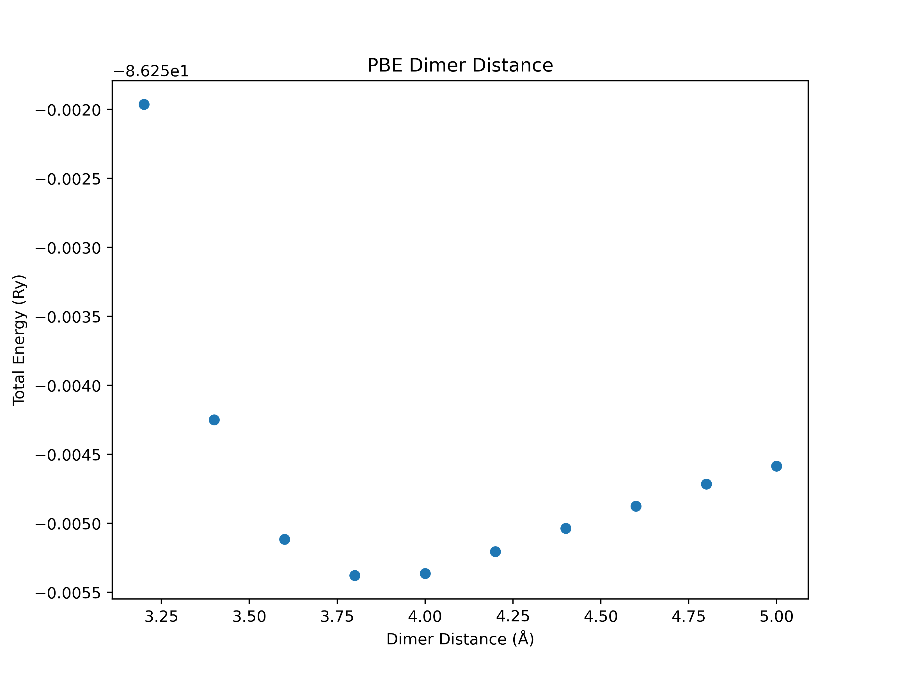

Convergence Tests
=====================================
This week we are going to continue on the topic of DFT calculations for isolated molecules. Specifically, we will be focusing on ensuring that our calculations are converged, i.e. that the numerical parameters, such as the plane-wave cutoff, the energy threshold or the box size, are chosen in such a way that physically meaningful results are obtained. Ensuring that convergence is reached is a key step in every DFT study of materials. 

If needed, you can refresh your memory of the Linux command line by referring back to [Lab 1](../lab01/readme.md).

-------------------------------------------------------------------------------------------

## Plane Waves and Pseudopotentials

As discussed in lecture, the Kohn-Sham wavefunctions are expressed as linear combination of plane waves in Quantum Espresso and the total number of plane waves used in the calculation is a convergence parameter. In the region between the atomic nuclei where chemical bonding takes place, the Kohn-Sham wavefunctions are relatively smooth and therefore not too many plane wave are needed to accurately describe them. However, very close to the atomic nucleus the Kohn-Sham wavefunctions vary rapidly (this is a consequence of the requirement that the valence orbital are orthogonal to the tightly bound core orbitals) and lots of plane waves are needed corresponding to a high plane-wave cutoff. Unfortunately, this would make the calculations very slow...

To get around this problem, Quantum Espresso uses pseudopotentials. The idea is to combine the atomic nucleus with the tightly bound core electrons (which do not participate in chemical bonding) into an atomic core whose interaction with the valence electrons is described by the pseudopotential. Since there are no more core electrons in the calculations, the valence electrons do not exhibit rapid variations near the nucleus any more and a low plane-wave cutoff can be used. 

In the figure below, you can see the true "all-electron" potential and the resulting "all-electron" wavefunctions (blue-dashed lines) and also the pseudopotential and the corresponding pseudo-wavefunctions (red lines): 

<figure markdown="span">
  { width="400" }
</figure>

Note that the pseudopotentials are generated from DFT calculations of isolated atoms. These calculations require a choice for the exchange-correlation functional. Therefore, a pseudopotential is always generated for a specific exchange-correlation functional. If you want to try out a different exchange-correlation functional, you have to use a different pseudopotential. 

The beginning (or "header") of pseudopotential files contains important information about how the pseudopotential was generated, such as which state are considered to be core states and which approximation is used for the exchange-correlation energy. 

To start this lab, copy the `/opt/MSE404-MM/docs/labs/lab03` to your `MSE404` directory.

!!! example "Task 1 - Pseudopotential File"

    Navigate to the `01_carbon_monoxide/01_convergence_threshold` directory. Here you will see an input file `CO.in` and two pseudopotential files. Open the pseudopotential file for oxygen using the `less` command.

    - Which approximation is used for the exchange-correlation functional?

        ??? success "Answer"
            The local density approximation (LDA). This is found at the top of the pseudopotential file:

            ```
            Info:   O LDA 2s2 2p4 RRKJ3 US
            ```

    - Which atomic orbitals are included as valence states and which ones are included in the core?

        ??? success "Answer"
            The states listed in the pseudopotential file are the valence states. These are:
            ```
            nl pn  l   occ               Rcut            Rcut US             E pseuo
            2S  0  0  2.00      0.00000000000      0.00000000000      0.00000000000
            2P  0  1  2.00      0.00000000000      0.00000000000      0.00000000000
            ```
            The core state are therefore the 1S state.
    - What is the valence charge of the oxygen atom core consisting of the nucleus and the core electrons?

        ??? success "Answer"
            The valence charge is 4. This is state in the line `4.00000000000 Z valence`:
            ```
            <PP_HEADER>
            0                      Version Number
            C                      Element
            NC                     Norm - Conserving pseudopotential
            F                      Nonlinear Core Correction
            SLA PZ NOGX NOGC PZ    Exchange-Correlation functional
            4.00000000000          Z valence
            0.00000000000          Total energy
            0.0000000  0.0000000   Suggested cutoff for wfc and rho
            0                      Max angular momentum component
            269                    Number of points in mesh
            2    1                 Number of Wavefunctions, Number of Projectors
            Wavefunctions          nl  l   occ
                                   2S  0  2.00
                                   2P  1  2.00
            </PP_HEADER>
            ```


## Total Energy Convergence Threshold

In a DFT calculation, the Kohn-Sham wavefunctions which minimize the total energy are found using a self-consistent procedure: one starts with an initial guess for the density, constructs the Kohn-Sham potential and then solves the Kohn-Sham equations to obtain the Kohn-Sham wavefunctions. These can then be used to find a new density and this procedure is repeated until self-consistency is achieved. Usually, we monitor the total energy and stop the self-consistent cycle when its change (relative to the previous iteration) is below a certain threshold. This threshold is a convergence parameter and must be chosen sufficiently small such that physically meaningful results are obtained. 

Let's take at a look at the input file for a carbon monoxide (CO) molecule in `01_carbon_monoxide/01_convergence_threshold`.

!!! tip annotate "Tip: In-code annotations"
    Click (1) to see notes on the input tags.

1. This is an annotation

```bash
&CONTROL
   calculation      = 'scf'
   disk_io          = 'none' #(1)!
   pseudo_dir       = '.' #(2)!
/

&SYSTEM
   ibrav            = 1 #(3)!
   A                = 30 #(4)!
   nat              = 2
   ntyp             = 2
   ecutwfc          = 20
/

&ELECTRONS
   mixing_beta      = 0.7
   diagonalization  = 'david'
   conv_thr = 1e-4 #(5)!
/

&IONS
/

&CELL
/

ATOMIC_SPECIES
O 15.999 O.pz-rrkjus.UPF #(6)!
C 12.011 C.pz-vbc.UPF 

K_POINTS gamma

ATOMIC_POSITIONS angstrom
O 15.0000000000 15.0000000000 16.1503400000
C 15.0000000000 15.0000000000 15.0000000000
```

1. This specifies that we don't want any of the charge density or wavefunction information saved in a file. We specify this just to save disk space :-).
2. Specifies that the pseudopotentials to use are in the current directory.
3. ibrav=1 is the bravais lattice type 'simple cubic'.
4. The lattice parameter for the bravais lattice.
5. This is the total energy convergence threshold. Successive iterations will have their total energy compared to one another. When this difference is less than the convergence threshold, we deem the total energy to be converged.
6. The structure of this line is [element name] [element atomic mass] [name of pseudopotential].


!!! tip annotate "Tip: Running Quantum Espressso"
    Make sure to have loaded the quantum espresso module and its dependencies using the command:

    `module load quantum-espresso`


!!! example "Task 2 - Convergence Threshold"

    Make four copies of the `CO.in` input file named `CO_i.in`, where i should range from 5 to 8. In each of these files, reduce the order of magnitude of the conv_thr by a factor of 10, i.e. replace `conv_thr = 1e-4` with `conv_thr = 1e-5` in `CO_5.in`, etc. 

    - Run the four input files using `pw.x` e.g. `pw.x < CO_5.in > CO_5.out`.

    - What do you expect will happen when you reduce the convergence threshold?

        ??? success "Answer"
            More iteration in the self-consistent cycle are needed and the calculations take longer. A more accurate value of the total energy is obtained. 

    Quantum Espresso outputs the number of scf cycles it took for convergence to be achieved. Look for this line in the output file: 
    ```bash
    convergence has been achieved in ...
    ```

    - How many iterations did it take each calculation to converge? Is this what you expected? 
    
        ??? success "Answer"
            ```bash
            CO_5.out:     convergence has been achieved in   6 iterations
            CO_6.out:     convergence has been achieved in   8 iterations
            CO_7.out:     convergence has been achieved in   9 iterations
            CO_8.out:     convergence has been achieved in  11 iterations
            ```
    We could have taken advantage of the `grep` command here. If you don't remember how to use this command, refer back to [Lab 1](../lab01/readme.md) for documentation on `grep`. 

    - Try this again using the `grep` command.

        ??? hint "Hint For Using Grep"
            `grep 'convergence has been achieved in' CO_5.out`. 


## Plane-wave cutoff

In the expansion of the Kohn-Sham wavefunctions, only plane waves with wave vectors whose lengths are smaller than that of the maximum wavevector, $\bf{G_{\text{max}}}$, are included. This maximum wave vector is specified through the variable `ecutwfc` which is the kinetic energy associated with $\bf{G_{\text{max}}}$, i.e. $\hbar^2 |\bf{G}_{\text{max}|^2/(2m)}$. We must ensure that this cutoff is large enough such that physically meaningful results are obtained. 

An example demonstrating the convergence of the total energy as function of the plane-wave cutoff can be found in the `01_carbon_monoxide/02_ecutwfc` directory.
To find the plane-wave cutoff required to achieve convergence, you will create a set of input files which are all identical except for the value of `ecutwfc`. 

!!! example "Task 3 - Kinetic Energy Cutoff"

    Navigate to the directory `01_carbon_monoxide/02_ecutwfc`. Here, you will again see an input file for CO and two pseudopotential files. Make 10 copies of this file named `CO_i.in` where i ranges from 20 to 65 in steps of 5. Change the `ecutwfc` variable in these files to systematically increase from 20 to 65 i.e. set `ecutwfc` to be equal to the number i.

    - Use `pw.x` to perform a DFT calculation for each input files.

    - Check the output file `CO_20.out`. What is the converged total energy?

        ??? success "Answer"
            `!    total energy              =     -42.74125239 Ry`

    - Check the output file `CO_30.out`. What is the converged total energy? Is this lower than `CO_20.out`?

        ??? success "Answer"
            `!    total energy              =     -43.00067775 Ry`.

            This is lower than the total energy in `CO_20.out`.

    - Use `grep` to extract the total energy from all output files.

    These energies are in Ry. Often it is more insightful to convert these values to eV.

    - Create a text file named `data.txt`. Copy your results into this file: the first column should be the kinetic energy cutoff in Ry and the second column should be the total energy in eV.
    
    Examine the file `data.txt`.

    You should observe that the total energy decreases as we increase the plane-wave energy cutoff `ecutwfc`.
    
    - At what plane-wave cutoff is the total energy converged to within 0.1 eV of your most accurate result (, i.e. the one obtained for `ecutwfc = 65`)?

        ??? success "Result"
            ecutwfc = 55 Ry.

            $E_{tot}^{65} = -586.30894733 \,\text{eV}$

            $E_{tot}^{55} = -586.21615168 \,\text{eV}$

            $\Delta E_{tot} = 0.09279565 \,\text{eV}$

    - Plot the total energy against the plane-wave cutoff using the python script `plot.py` by issuing the command:
    `python3 plot.py`

        ??? success "Result"
            <figure markdown="span">
            { width="500" }
            </figure>

    We also discussed above that increasing `ecutwfc` increases the number of plane waves in the expansion of the Kohn-Sham states. This infomation is stored near the beginning of the output file, in a section that looks like:

    ```bash
     G-vector sticks info
     sticks:   dense  smooth     PW     G-vecs:    dense   smooth      PW
     Sum       20461   20461   5129              2201421  2201421  274961
    ```

    The number of plane-waves in our calculation is in the final column PW. 

    - Look for this line in the `CO_20.in` and the `CO_65.in` and verify that the number of plane-waves is significantly higher.
    
Note that:

- Different systems converge differently: You shouldn't expect diamond and silicon to be converged to the same accuracy with the same plane-wave cutoff despite having the same atomic structure and the same number of valence electrons.

- Different pseudopotentials for the same atomic species will also converge differently. Often (but not always) pseudopotential files will suggest a plane-wave cutoff.

- Different calculated physical quantities will converge differently. 
	- If we want to calculate the lattice parameter of a material, don't expect it to be converged to the same accuracy as another parameter, e.g. the bulk modulus.

!!! warning
    You should be particularly careful when calculating parameters that depend on volume, as the number of plane-waves for a given plane-wave cut-off changes when the volume is changed.

Actually, we typically converge the total energy **per atom** (meV/atom) or **per electron** (meV/electron). This is due to the scaling of the total energy with system size (number of atoms/electrons). If we have more atoms in our system, the magnitude of the total energy will naturally be larger i.e. the total energy scales with system size. However, the total energy per atom/electron is a normalised quantity, providing a measure of the total energy that is independent of system size, and thus can be compared between systems to make sure you are converged to the same accuracy.

## Box Size

Quantum Espresso uses periodic boundary conditions (recall that plane wave can only be used as a basis for periodic functions). Therefore, it is not possible to model a truly isolated molecule with Quantum Espresso. The best we can do is model a periodic crystal of molecules whose unit cell is so large that each molecule is not affected by the presence of all other molecules. The size of the unit cell (aka the box size) is therefore a convergence parameter and we must ensure it is sufficiently large so that physically meaningful results are obtained. Unfortunately, increasing the box size also increases the time of the calculations.

!!! example "Task 4 - Unit Cell Size"

    Navigate to the directory `01_carbon_monoxide/03_box_size`. Here, you will again see an input file for CO and two pseudopotential files. Make 10 copies of this file named `CO_i.in` with i ranging from 10 to 30 in steps of 2. Edit the `A` variable in these files to systematically increase from 10 to 30, i.e. set `A` to be equal to the number i. This increases the size of the unit cell, and thus the distance between periodic images of the molecule.

    - Use `pw.x` to perform DFT calculations for these input files.

    - Take a loot at the output file `CO_10.out`. What is the energy of the highest occupied molecular orbital (HOMO)?

        ??? success "Answer"
	    The HOMO energy can be extracted from the list of Kohn-Sham energies, or alternatively is printed under `highest occupied level` in the output file.
            `highest occupied level (ev):    -9.0118`

    - Now inspect the output file `CO_26.out`. What is the energy of the highest occupied molecular orbital (HOMO)? How does this compare to the CO_10.out calculation where the distance between periodic images is much smaller?

        ??? success "Answer"
            `highest occupied level (ev):    -9.2100`.

    - Create a text file named `data.txt`. Place your results here in the format [Unit Cell Size (Å)] [Energy of HOMO (eV)]
    
    - At what unit cell size is the HOMO converged to within 0.1 eV of your most accurate run (`A = 30`)?

        ??? success "Result"
            A = 14.
            This means that CO molecules need to be ~ 14 Å away from one another to have less than 0.1 eV effect on each others HOMO. Note that each CO molecule has a dipole moment which produces a long-ranged potential that affects the other molecules.

    - Plot the energy of the HOMO against the unit cell size using the python script `plot.py` by issuing the command:
    `python3 plot.py`

        ??? success "Result"
            <figure markdown="span">
            { width="500" }
            </figure>

### Bash Scripting

You have run a lot of DFT calculations in this lab. Running all of these `pw.x` commands manually is time consuming. To speed things up we can use a small bash script that will automate running these jobs for us. Bash is a programming language (the one we use to interact with the command line), like python. In the same directory `01_carbon_monoxide/03_box_size` you will find a run.sh bash script. Let's quickly examine it.

```bash
#!/bin/bash #(1)!

# Run pw.x for each input file sequentially
for i in {10..30..2}; #(2)!
do
	pw.x < CO_$i.in &> CO_$i.out #(3)!
done
```

1. This tells the compiler that the commands below are bash commands.
2. Entering a simple for loop going from i=10 to i=30 in steps of 2.
3. Issue the command pw.x < CO_$i.in > CO_$i.out.

To use this script, just issue the command;

```bash
./run.sh
```

Redo Task 4 and verify that you get the same result.

## Python Plotting 

In Task 3 and 4, we used the code `plot.py`. This code uses the matplotlib library to plot the results stored in data.txt to visualise the convergence of the total energy as the plane-wave cutoff is increased.
Later in this course you will use python scripts to plot band structures and density of states. You are encouraged to examine and play around with these python codes to develop your coding skills!

Let's take a quick look at plot.py from the `01_carbon_monoxide/02_kinetic_energy_cutoff` directory.

```python
#############################################################################################################################################
#############################################################################################################################################
#############################################################################################################################################
#      	 This is a plotting code. Put your data into data.txt in column format. <column 1 = cutoff> <column 2 = total energy>               #
#      	 					To use this code, issue the command:							    #
#      	 						python3 plot.py									    #
#############################################################################################################################################
#############################################################################################################################################
#############################################################################################################################################
import numpy as np
import matplotlib.pyplot as plt

def main():
	data = np.loadtxt("data.txt") #(1)!

	ecut, etot = data[:,0], data[:,1] #(2)!

	plt.figure(figsize=(8, 6)) #(3)!
	plt.scatter(ecut, etot) #(4)!
	plt.xlabel("Kinetic Energy Cutoff (Ry)")
	plt.ylabel("Total Energy (eV)")
	plt.title("Total Energy Convergence")
	plt.show() #(5)!

if __name__ == "__main__":
	main()
```
1. Loading in the data that is in column format in `data.txt`.
2. The first column is the plane-wave cutoff in Ry and the second column is the corresponding total energy in eV.
3. Initialising the size of our figure. This allows you to control the aspect ratio of the plot.
4. Scatter plot of ecut vs etot.
5. After giving python all of the plotting information, we tell it to plot.

## Exchange & Correlation Functional

How we approximate the exchange and correlation between elections is a key part of DFT. The functional that we use determines how we approximate these many-body interactions.

By default, Quantum Espresso reads what exchange correlation functional to use from the header of the pseudopotential file, as we saw earlier in Task 1.
It is possible to override this by using the `input_dft` variable in the &system section.

!!! Warning "Mixing Approximations"
    It is generally not a good idea to mix approximations. It is best to use the same approximation for the exchange correlation functional as was used to construct the pseudopotential.

As you might expect, the exchange correlation functional chosen can have a big impact on a number of parameters. When we change the exchange correlation functional, we are changing the level of theory our calculations are running at.

??? note "Levels of approximation"
    - Lowest level of approximation is the local density approximation (LDA)
    - Next highest level of approximation is the generalised gradient approximation (GGA)
    - More complicated functionals like 'meta-GGA', 'hybrid' etc.

    This is usually depicted in 'Jacob's ladder' of approximations, where the higher on the ladder you are, the more accurate the more accurate the description of exchange and correlation between the electrons are.
    <figure markdown="span">
    { width="500" }
    </figure>

In `03_argon` we are going to investigate the change in the binding energy as we vary the bond length between an argon dimer using two different levels of theory.

!!! example "Task 8 - Argon Dimer"
    Examine and run the scripts `file_builder.py` and `run.sh` in `03_argon/01_lda`.

    - What level theory is this at?

    ??? success "Answer"
        This is at the local density approximation (lda) level.

    - What are these script doing?

    ??? success "Answer"
        The script is generating multiple input files of varying bond length for the argon dimer and running a total energy calculation on them. The end of `run.sh` is collecting the relevant data for us and outputting it into a file called data.txt.
    
    Now examine and run the script `analysis.py`.

    - What is this script doing?

    ??? success "Answer"
        The script is looking through data.txt and finding the lowest energy. This is the 'optimal' distance between the two argon atoms.

    - At what distance does the argon dimer have the lowest energy?

    ??? success "Result"
        a = 3.4 Å gives the minimum energy of -1172.70049957 eV
        <figure markdown="span">
        { width="500" }
        </figure>

    Do the same for `03_argon/02_pbe`. This is at the GGA level, specifically using the pbe functional.

    - At what distance does the argon dimer have the lowest energy?

    ??? success "Result"
        a = 4.0 Å gives the minimum energy of -1173.066229 eV

        However, the minimum is not very well defined.
        <figure markdown="span">
        { width="500" }
        </figure>
    
    This is a known problem in DFT. LDA tends to 'overbind' and PBE tends to 'underbind'. In dimer situations like this Argon dimer, one may think van der Waals interactions are something important to consider. In fact, in this case it is very important. Van der Waals can be taken into account in different ways - an additional term added to the total energy or directly through the exchange-correlation potential.

    Navigate to `03_vdw`.

    - Run `file_build.py`. Examine the input files. You will see a tag `vdw_corr = 'grimme-d3'`. This means that we are going to include van der Waals corrections (via a total energy correction term).

    - At what distance does the argon dimer have the lowest energy?

    ??? success "Result"
        a = 3.8 Å gives the minimum energy of -1173.07559029 eV

        <figure markdown="span">
        { width="500" }
        </figure>


## More Convergence Parameters


Additionally, if we are dealing with crystals which are periodic, then we need to sample the Briouillin zone with 'k points'. This will be covered in [Lab 4](../lab04/readme.md). The number of k points used to sample the Briouillin zone should also be converged when dealing with periodic crystals.

------------------------------------------------------------------------------------

Summary
-------

In this lab we looked at defining pseudopotentials, checking the convergence of the total energy with respect to the plane-wave energy cutoff, and the effect of exchange and correlation functional.

- Convergence of any parameter is done by systematically varying the corresponding calculation parameter and looking at how the result changes.

We saw how we can use python and bash scripts to automate this process.

- We can use python scripts to generate multiple input files with systematically varied parameters.
- We can use a bash `for` loop to perform a calculation for a number of
  input files.
- We can use `grep` or `awk` to parse results or parameters from our
  output files.
- We can quickly generate a plot of a data file with pythons matplotlib.

------------------------------------------------------------------------------
