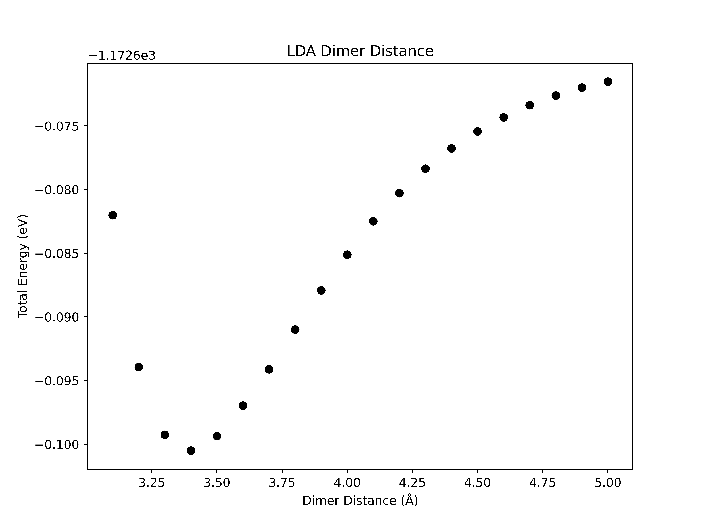

Convergence Tests
=====================================
This week we are going to continue looking at isolated molecules. Specifically, we will be focusing on determining how well converged our results are. This is a necessary step to have any confidence in your results, and to make sure the result is meaningful. This should always be done before running calculations on new systems.

Before starting, if you can't remember how to do something from the command line, you can always refer back to [Lab 1](../lab01/readme.md).

-------------------------------------------------------------------------------------------

## Plane Waves and Pseudopotentials

As will be discussed in lectures, pseudopotentials are used in DFT calculations to approximate the potential of the core region. The core is made up of tightly bound electrons close to the nucleus. In this region, the electrons are in a strong coulomb potential generated by the nucleus. This creates a strong oscillation in the electronic wavefucntions in the core region. If one wanted to express the electronic wavefunctions in a plane-wave basis, this rapid oscillation of the electronic wavefucntion would require a significant number of plane waves to describe. To reduce the number of plane-waves needed in the expansion of the Kohn-Sham wavefunctions, and thus reduce the computational load significantly, we approximate the core region. This is essentially 'freezing' the core electrons. The self-consistent calculations are therefore only done on the valence electrons.

The motivation for this is that most of the interesting chemistry we want to study is dictated by the valence electorns, and thus approximating the core is reasonable. A pseudopotential will therefore replace the exact core potnetial with an approximate potential that mimics the effects of the core electrons on the valence electrons, but is also a smooth, slowly varing potential. Diagramatically this looks like the following:

<figure markdown="span">
  { width="400" }
</figure>

Pseudopotentials are created from DFT calculations of single atoms (so-called 'all electron' calculations). In these calculations, a certain exchange-correlation functional will have been chosen e.g. local density approximation (lda), pbe, etc. Thus, within the pseudopotential itself an approximation has been made to generate it.

The header of pseudopotential files contain valuable information about how the pseudopotential was generated, such as what states are included, and what approximations are used for exchange and correlation.

To start this lab, copy the `/opt/MSE404-MM/docs/labs/lab03` to your `MSE404` directory.

!!! example "Task 1 - Pseudopotential File"

    Navigate to the `01_carbon_monoxide/01_convergence_threshold` directory. Here you will see an input file `CO.in` and two psedupotnetial files. Open the pseudopotential file for oxygen using the `less` command.

    - What level of approximation are we using e.g. Local Density Approximation (LDA), PBE, etc..? Hint: This is usually stored at the top of pseudopotential files.

        ??? success "Answer"
            LDA. This is found at the top of the pseudopotential file:

            ```
            Info:   O LDA 2s2 2p4 RRKJ3 US
            ```

    - What were the 'core' and 'valence' states used to generate the pseudopotential file??

        ??? success "Answer"
            The states listed in the PP file are the valence states, and thus these are:
            ```
            nl pn  l   occ               Rcut            Rcut US             E pseuo
            2S  0  0  2.00      0.00000000000      0.00000000000      0.00000000000
            2P  0  1  2.00      0.00000000000      0.00000000000      0.00000000000
            ```
            The core states are therefore 1S.
    - What is the valence charge of the oxygen atom core consisting of the nucleus and the core electrons?

        ??? success "Answer"
            The valence charge is 4. Found by identifying the line `4.00000000000 Z valence` in the information below:
            ```
            <PP_HEADER>
            0                      Version Number
            C                      Element
            NC                     Norm - Conserving pseudopotential
            F                      Nonlinear Core Correction
            SLA PZ NOGX NOGC PZ    Exchange-Correlation functional
            4.00000000000          Z valence
            0.00000000000          Total energy
            0.0000000  0.0000000   Suggested cutoff for wfc and rho
            0                      Max angular momentum component
            269                    Number of points in mesh
            2    1                 Number of Wavefunctions, Number of Projectors
            Wavefunctions          nl  l   occ
                                   2S  0  2.00
                                   2P  1  2.00
            </PP_HEADER>
            ```


## Total Energy Convergence Threshold

DFT is an iterative process. We self-consistenly solve the Kohn-Sham equations for the ground-state electron density, i.e. until we meet convergence. The criteria for convergence is defined as when the total energy between successive scf iterations is below a certain value, called the convergence threshold. This can play a crucial role in determining the accuracy and and stability of the results.

Let's look at a brief view of an example of the CO input file stored in `01_carbon_monoxide/01_convergence_threshold`.

!!! tip annotate "Tip: In-code annotations"
    Click (1) to see notes on the input tags.

1. This is an annotation

```bash
&CONTROL
   calculation      = 'scf'
   disk_io          = 'none' #(1)!
   pseudo_dir       = '.' #(2)!
/

&SYSTEM
   ibrav            = 1 #(3)!
   A                = 30 #(4)!
   nat              = 2
   ntyp             = 2
   ecutwfc          = 20
/

&ELECTRONS
   mixing_beta      = 0.7
   diagonalization  = 'david'
   conv_thr = 1e-4 #(5)!
/

&IONS
/

&CELL
/

ATOMIC_SPECIES
O 15.999 O.pz-rrkjus.UPF #(6)!
C 12.011 C.pz-vbc.UPF 

K_POINTS gamma

ATOMIC_POSITIONS angstrom
O 15.0000000000 15.0000000000 16.1503400000
C 15.0000000000 15.0000000000 15.0000000000
```

1. This specifies that we don't want any of the charge density or wavefunction information saved in a file. We specify this just to save disk space :-).
2. Specifies that the pseudopotentials to use are in the current directory.
3. ibrav=1 is the bravais lattice type 'simple cubic'.
4. The lattice parameter for the bravais lattice.
5. This is the convergence threshold. Successive scf iterations will have their total energy compared to one another. When this difference is less than this convergence threshold, we deem the total energy to be converged.
6. The structure of this line is [element name] [element atomic mass] [name of pseudopotential].


!!! tip annotate "Tip: Running Quantum Espressso"
    Make sure to have loaded the quantum espresso module and its dependencies using the command:

    `module load quantum-espresso`


!!! example "Task 2 - Convergence Threshold"

    Make 4 copies of the `CO.in` input file named `CO_i.in`, where i should go from 5 to 8. In each of these files, reduce the order of magnitude of the conv_thr by 10 each time i.e. replace the `conv_thr = 1e-4` with `conv_thr = 1e-5` in `CO_5.in`, etc. 

    - Run these 4 input files using `pw.x` e.g. `pw.x < CO_5.in > CO_5.out`.

    - What does changing this convergence threshold do? What do you expect to happen?

        ??? success "Answer"
            After one scf cycle, a total energy is calculated. The calculation is converged when the difference in the total energy between two successive scf iterations is less than the convergence threshold. Therefore, reducing this convergence threshold is making our convergence tighter, meaning differences in successive iterations must be smaller for our calculation to be converged. This means the smaller the convergence threshold, the more iterations it should take for convergence.

    Quantum Espresso outputs the number of scf cycles it took for convergence to be achieved. Look for this line in the output file: 
    ```bash
    convergence has been achieved in ...
    ```

    - How many iterations did it take each calculation to converge? Is this what you expected? 
    
        ??? success "Answer"
            ```bash
            CO_5.out:     convergence has been achieved in   6 iterations
            CO_6.out:     convergence has been achieved in   8 iterations
            CO_7.out:     convergence has been achieved in   9 iterations
            CO_8.out:     convergence has been achieved in  11 iterations
            ```
    We could have taken advantage of the `grep` command here. If you don't remember how to use this command, refer back to [Lab 1](../lab01/readme.md) for documentation on `grep`. 

    - Try this again using the `grep` command.

        ??? hint "Hint For Using Grep"
            `grep 'convergence has been achieved in' CO_5.out`. 


## Plane-wave energy cut-off

In principle we expand the Kohn-Sham states in an infinite plane-wave basis. In practice however, we truncate this expansion by defining a maximum wavevector, $\bf{G_{\text{max}}}$. We specify this in Quantum Espresso through the variable `ecutwfc` which is the kinetic energy of the free electron with a wavevector $\bf{G_{\text{max}}}$.

Regardless of the type of system we are looking at, we need to check how well converged the result is (no matter what you are calculating) with respect to the plane-wave kinetic energy cutoff. As discussed above this cutoff governs how many plane-waves are used in the expansion of the Kohn-Sham states (and thus how many are in the calculation).


An example demonstrating the total energy convergence with respect to energy cutoff is shown in the `01_carbon_monoxide/02_ecutwfc` directory.
To converge the kinetic energy cutoff we are going to set up a series of input files which are all identical except we systematically increase **only** the value of `ecutwfc` and record the total energy.

!!! example "Task 2 - Kinetic Energy Cutoff"

    Navigate to the directory `01_carbon_monoxide/02_ecutwfc`. Here, you will again see an input file for CO and two pseudopotential files. Make 10 copies of this file named `CO_i.in` where i is going to range from 20 to 65 in steps of 5. Edit the `ecutwfc` variable in these files to systematically increase from 20 to 65 i.e. set `ecutwfc` to be equal to the number i.

    - Use `pw.x` to run a total energy calculation for each of these files.

    - Check the output file `CO_20.out`. What is the converged total energy?

        ??? success "Answer"
            `!    total energy              =     -42.74125239 Ry`

    - Check the output file `CO_30.out`. What is the converged total energy? Is this lower than `CO_20.out`?

        ??? success "Answer"
            `!    total energy              =     -43.00067775 Ry`.

            This is lower than the total energy in `CO_20.out`.

    - Use `grep` to grep the total energy from all of these output files.

    These energies are in Ry. Typically when doing convergence tests we report our convergece in eV.

    - Create a text file named `data.txt`. Place your results here in the format [kinetic energy cutoff (Ry)] [Total energy (eV)]
    
    Examine the file `data.txt`.

    As you should see, the total energy decreases as we increase the plane-wave energy cutoff `ecutwfc`.
    
    - At what plane-wave cutoff is the total energy converged to within 0.1 eV of your most accurate run (`ecutwfc = 65`)?

        ??? success "Result"
            ecutwfc = 55 Ry.

            $E_{T}^{\text{best}} = -586.30894733 \,\text{eV}$

            $E_{T}^{55} = -586.21615168 \,\text{eV}$

            $E_{T}^{\text{diff}} ~ 0.09279565 \,\text{eV}$

    - Plot the total energy against the kinetic energy cutoff using the python script `plot.py` by issuing the command:
    `python3 plot.py`

        ??? success "Result"
            <figure markdown="span">
            { width="500" }
            </figure>

    We also discussed above that increasing `ecutwfc` increases the number of plane waves in the expansion of the Kohn-Sham states. This infomation is stored near the beginning of the output file, in a section that looks like:

    ```bash
     G-vector sticks info
     sticks:   dense  smooth     PW     G-vecs:    dense   smooth      PW
     Sum       20461   20461   5129              2201421  2201421  274961
    ```

    The number of plane-waves in our calculation is in the final column PW. 

    - Look for this line in the `CO_20.in` and the `CO_65.in` and verify that the number of plane-waves is significantly higher.
    
Note that:

- Different systems converge differently. You souldn't expect diamond and silicon to be converged to the same accuracy with the same energy cutoff despite having the same structure and same number of valence electrons.

- Different pseudopotentials for the same atomic species will also converge differently. Often pseudopotential files will suggest an energy cutoff as mentioned previously.

- Different calculated parameters will converge differently. 
	- If we want to calculate the lattice parameter of a material, don't expect it to be converged to the same accuracy as another parameter e.g. the bulk modulus.

!!! warning
    You should be particularly careful when calculating parameters that depend on volume, as the number of plane-waves for a given energy cut-off is directly proportional to the volume so this can introduce an additional variation.

Actually, we typically converge the total energy **per atom** (meV/atom) or **per eectron** (meV/electron). This is due to the scaling of the total energy with system size (number of atoms/electrons). 

If we have more atoms in our system, the magnitude of the total energy will naturally be larger i.e. the total energy scales with system size. However, the total energy per atom/electron is a normalised quantity, providing a measure of the total energy that is independent of system size, and thus can be compared between systems to make sure you are converged to the same accuracy.

## Box Size


## Plotting

### Python

Most of the plotting in this course can be done with Python. Scripts will be provided for you, but you are encouraged to play around with them to fit your needs if you want to test things out.

You will have noticed that at the end of the `convergence_processing.py` there is more python code. This uses matplotlib to plot the results stored in data.txt to visualise the convergence as ecutwfc is increased.
Later on in the course you will have python scripts to plot band structures and density of states.

For now, we will have a brief overview of the final few lines of `convergence_processing.py`.

```python
import numpy as np
import matplotlib.pyplot as plt
##############################################################################################################################################
##############################################################################################################################################
##############################################################################################################################################
#                               This script checks for converged results. Change the convergence parameter if needed.                        #
#                                                                                                                                            #
#                                               How to run: python3 convergence_processing.py                                                #
##############################################################################################################################################
##############################################################################################################################################
##############################################################################################################################################

def main():
    filename = "data.txt"

    edata = np.loadtxt(filename, delimiter=' ')
    ecut, etot = edata[:, 0], edata[:, 1]

    convergence_parameter = 0.1 #in eV
    print(f"Convergence defined as within {convergence_parameter} meV/atom of the most accurate result")
    flag = 0 # Flag for arrow

    print("ecut (Ry)", " ", "∆_last (meV/atom)")
    print("-----------------------------------------------")
    for row in edata:
        diff = abs(abs(row[1])-abs(etot[-1]))*1000
        if (diff  <= convergence_parameter*1000 and flag==0):
            print(row[0],"  ", diff, "      <-------------")
            flag = 1
        else:
            print(row[0],"  ", diff)

    for i in range(0, len(ecut)):
        if abs(etot[i] - etot[-1]) <= convergence_parameter:
            value = ecut[i]
            print("")
            print(f"Accuracy of {convergence_parameter*1000} meV")
            print(f"Convergence at ecutwfc = {value} Ry")
            break
        else:
            continue

    plt.figure(figsize=(8, 6)) #(1)!
    plt.scatter(ecut , etot, color='black', marker='o') #(2)!

    plt.ylabel("Total Energy (eV)")
    plt.xlabel("Energy Cutoff (Ry)")
    plt.title("Convergence Testing")
    plt.show() #(3)!

if __name__ == "__main__":
    main()
```

1. Initialising the size of our figure. Changing these will change the aspect ratio of the plot.
2. Scatter plot of ecut vs etot.
3. After giving python all of the plotting information, we tell it to plot.

!!! example "Task 6 - Convergence Plot"

    Uncomment the final few lines of the `convergence_processing.py` and run it again.

    - What do you expect the plot to look like?

    ??? success "Result"
        <figure markdown="span">
        { width="500" }
        </figure>


!!! example "Task 7 - Convergence of CO2 vs Methane"

    We have now done a convergence test using the scripts `file_builder.py` and `convergence_processing.py` for methane. Copy `convergence_processing.py` and `file_build.py` to `02_ecut/01/carbon_dioxide`. Redo the convergence for CO2 using the convergence scripts as we did above using the script `run_02.sh`. Before running anything, make sure to remove the `data.txt` that is already in this directory from our previous calculation.

    - Which molecule has the lower plane-wave cutoff?

    ??? success "Answer"
        After running `convergence_processing.py` we can see that:

        $E_{\text{cut}}^{\text{CO2}} = 65 \,\text{Ry}$

        $E_{\text{cut}}^{\text{Methane}} = 75 \,\text{Ry}$

        CO2 Has the lower plane-wave energy cutoff.

    - What do the convergence plots look like?

    ??? success "Result"
        <figure markdown="span">
        { width="500" }
        </figure>
        <figure markdown="span">
        { width="500" }
        </figure>

    - Is this a fair comparison?

    ??? success "Answer"
        No. If we want to compare the two we should have convegred the total energy per atom.


## Exchange & Correlation Functional

How we approximate the exchange and correlation between elections is a key part of DFT. The functional that we use determines how we approximate these many-body interactions.

By default, Quantum Espresso reads what exchange correlation functional to use from the header of the pseudopotential file, as we saw earlier in Task 1.
It is possible to override this by using the `input_dft` variable in the &system section.

!!! Warning "Mixing Approximations"
    It is generally not a good idea to mix approximations. It is best to use the same approximation for the exchange correlation functional as was used to construct the pseudopotential.

As you might expect, the exchange correlation functional chosen can have a big impact on a number of parameters. When we change the exchange correlation functional, we are changing the level of theory our calculations are running at.

??? note "Levels of approximation"
    - Lowest level of approximation is the local density approximation (LDA)
    - Next highest level of approximation is the generalised gradient approximation (GGA)
    - More complicated functionals like 'meta-GGA', 'hybrid' etc.

    This is usually depicted in 'Jacob's ladder' of approximations, where the higher on the ladder you are, the more accurate the more accurate the description of exchange and correlation between the electrons are.
    <figure markdown="span">
    { width="500" }
    </figure>

In `03_argon` we are going to investigate the change in the binding energy as we vary the bond length between an argon dimer using two different levels of theory.

!!! example "Task 8 - Argon Dimer"
    Examine and run the scripts `file_builder.py` and `run.sh` in `03_argon/01_lda`.

    - What level theory is this at?

    ??? success "Answer"
        This is at the local density approximation (lda) level.

    - What are these script doing?

    ??? success "Answer"
        The script is generating multiple input files of varying bond length for the argon dimer and running a total energy calculation on them. The end of `run.sh` is collecting the relevant data for us and outputting it into a file called data.txt.
    
    Now examine and run the script `analysis.py`.

    - What is this script doing?

    ??? success "Answer"
        The script is looking through data.txt and finding the lowest energy. This is the 'optimal' distance between the two argon atoms.

    - At what distance does the argon dimer have the lowest energy?

    ??? success "Result"
        a = 3.4 Å gives the minimum energy of -1172.70049957 eV
        <figure markdown="span">
        { width="500" }
        </figure>

    Do the same for `03_argon/02_pbe`. This is at the GGA level, specifically using the pbe functional.

    - At what distance does the argon dimer have the lowest energy?

    ??? success "Result"
        a = 4.0 Å gives the minimum energy of -1173.066229 eV

        However, the minimum is not very well defined.
        <figure markdown="span">
        { width="500" }
        </figure>
    
    This is a known problem in DFT. LDA tends to 'overbind' and PBE tends to 'underbind'. In dimer situations like this Argon dimer, one may think van der Waals interactions are something important to consider. In fact, in this case it is very important. Van der Waals can be taken into account in different ways - an additional term added to the total energy or directly through the exchange-correlation potential.

    Navigate to `03_vdw`.

    - Run `file_build.py`. Examine the input files. You will see a tag `vdw_corr = 'grimme-d3'`. This means that we are going to include van der Waals corrections (via a total energy correction term).

    - At what distance does the argon dimer have the lowest energy?

    ??? success "Result"
        a = 3.8 Å gives the minimum energy of -1173.07559029 eV

        <figure markdown="span">
        { width="500" }
        </figure>


## More Convergence Parameters

In this lab we have been dealing with isolated molecules. Quantum Espresso is a plane-wave DFT code, and thus deals with periodic unit cells. To model 'isolated' atoms, we make the unit cell very large compared to the size of the isolated molecule, effectively reducing any interaction with neighbouring periodic images. 
However, this is a parameter we should converge. A larger unit cell (volume) increases the computational cost, as the number of plane waves sales with the unit cell volume, so we don't want the unit cell too large. We should also have converged the total enegry versus the unit cell size.

Additionally, if we are dealing with crystals which are periodic, then we need to sample the Briouillin zone with 'k points'. This will be covered in [Lab 4](../lab04/readme.md). The number of k points used to sample the Briouillin zone should also be converged when dealing with periodic crystals.

------------------------------------------------------------------------------------

Summary
-------

In this lab we looked at defining pseudopotentials, checking the convergence of the total energy with respect to the plane-wave energy cutoff, and the effect of exchange and correlation functional.

- Convergence of any parameter is done by systematically varying the corresponding calculation parameter and looking at how the result changes.

We saw how we can use python and bash scripts to automate this process.

- We can use python scripts to generate multiple input files with systematically varied parameters.
- We can use a bash `for` loop to perform a calculation for a number of
  input files.
- We can use `grep` or `awk` to parse results or parameters from our
  output files.
- We can quickly generate a plot of a data file with pythons matplotlib.

------------------------------------------------------------------------------
