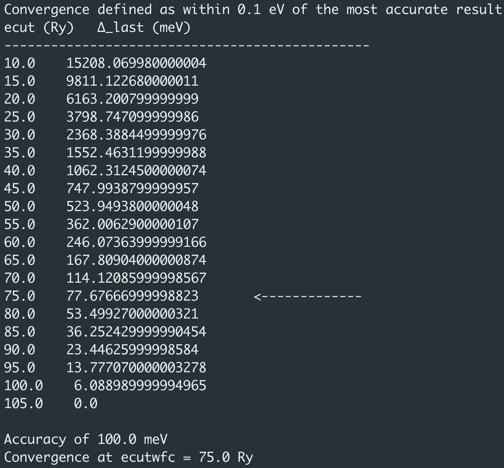

Convergence Tests
=====================================
This week we are going to continue looking at isolated molecules. Specifically, we will be focusing on finding out how well converged our results are. This is a necessary step to have any confidence in your results and should always be done before running calculations on new systems.

<div markdown="span" style="margin: 0 auto; text-align: center">
[Download the input files for this tutorial](./assets/lab03_input.zip){ .md-button .md-button--primary }
</div>

Before starting, if you can't remember how to do something from the command line, you can always refer back to [Lab 1](../lab01/readme.md).

-------------------------------------------------------------------------------------------

## Pseudopotentials
As discussed in lectures, we use pseudopotentials to approximate the core potential. For each atomic species in your calculations, we need a pseudopotential file describing the approximation you want the DFT code to use for that species.

Let's look at a brief view of an input file for CO2:

!!! tip annotate "Tip: In-code annotations"
    Click (1) to see notes on the input tags.

1. This is an annotation

```python
 &CONTROL
    pseudo_dir = '.' #(1)!
 /

 &SYSTEM
   ibrav = 1
   A = 10.0
   nat = 3
   ntyp = 2
   ecutwfc = 18.0
 /

 &ELECTRONS
 /

ATOMIC_SPECIES
 C  12.011  C.pz-vbc.UPF #(2)!
 O  15.9999  O.pz-rrkjus.UPF #(3)!

ATOMIC_POSITIONS angstrom
 C  0.0000  0.0000  0.0000
 O  0.0000  0.0000  1.1615
 O  0.0000  0.0000 -1.1615

K_POINTS gamma
```

1. We have specified to look for the pseudopotentials in the current directory
2. The pseudopotential we want to use to describe the core of Carbon
3. The pseudopotential we want to use to describe the core of Oxygen


!!! tip annotate "Tip: Pseudopotential Directory"
    It is useful to have a directory that stores all of your pseudopotentials as to not make many copies in our working directories. We can make a central pseudopotential directory and alter pseudo_dir to the correct file path (1).
1. Specified by `pseudo_dir = 'path/to/pseudo/directory'`

Open the input file for CO2 stored in `01_carbon_dioxide/CO2.in`.

As we can see, we have told the DFT code to look in a directory called `pseudo`. If we do `ls ..` we should see that directory.

The header of pseudopotential files contain valuable information about how the pseudopotential was generated, such as what states are included, and what approximations are used for exchange and correlation.

!!! example "Task 1 - Pseudopotential File"

    Run the input file for CO2. Take a look at the pseudopotential file we are using for Oxygen:

    - What level of approximation are we using?

        ??? success "Answer"
            LDA

    - What were the 'core' and 'valence' states used to generate the pseudopotential file??

        ??? success "Answer"
            The states listed in the PP file are the valence states, and thus these are:
            ```
            nl pn  l   occ               Rcut            Rcut US             E pseuo
            2S  0  0  2.00      0.00000000000      0.00000000000      0.00000000000
            2P  0  1  2.00      0.00000000000      0.00000000000      0.00000000000
            ```
            The core states are therefore 1S.
    - What is the valence charge on the oxygen after the core has been approximated?

        ??? success "Answer"
            The valence charge is 4. Found by identifying the line `4.00000000000 Z valence` in the information below:
            ```
            <PP_HEADER>
            0                      Version Number
            C                      Element
            NC                     Norm - Conserving pseudopotential
            F                      Nonlinear Core Correction
            SLA PZ NOGX NOGC PZ    Exchange-Correlation functional
            4.00000000000          Z valence
            0.00000000000          Total energy
            0.0000000  0.0000000   Suggested cutoff for wfc and rho
            0                      Max angular momentum component
            269                    Number of points in mesh
            2    1                 Number of Wavefunctions, Number of Projectors
            Wavefunctions          nl  l   occ
                                   2S  0  2.00
                                   2P  1  2.00
            </PP_HEADER>
            ```

## Plane-wave energy cut-off

Regardless of the type of system you're looking at, you'll need to check how
well converged your result is (whatever it is your calculating) with respect
to the plane-wave energy cut-off. This governs how many plane-waves are
used in the calculation.

Let's again look at our CO2 input file:

```python
 &CONTROL
    pseudo_dir = '.' 
 /

 &SYSTEM
   ibrav = 1
   A = 10.0
   nat = 3
   ntyp = 2
   ecutwfc = 18.0 #(1)!
 /

 &ELECTRONS
 /

ATOMIC_SPECIES
 C  12.011  C.pz-vbc.UPF
 O  15.9999  O.pz-rrkjus.UPF

ATOMIC_POSITIONS angstrom
 C  0.0000  0.0000  0.0000
 O  0.0000  0.0000  1.1615
 O  0.0000  0.0000 -1.1615

K_POINTS gamma
```

1. Plane-wave energy cutoff (Ry)

Note that:

- Different systems converge differently. You souldn't expect diamond and silicon to be converged to the same accuracy with the same energy cutoff despite having the same structure and same number of valence electrons.

- Different pseudopotentials for the same atomic species will also converge differently. Often pseudopotential files will suggest an energy cutoff as mentioned previously.

- Different calculated parameters will converge differently. 
	- If we want to calculate the lattice parameter of a material, don't expect it to be converged to the same accuracy as another parameter e.g. the bulk modulus.

!!! warning
    You should be particularly careful when calculating parameters that depend on volume, as the number of plane-waves for a given energy cut-off is directly proportional to the volume so this can introduce an additional variation. We'll see more about this later.

An example demonstrating the total energy convergence with respect to energy cutoff is shown in the [02_ecut/01_carbon_dioxide](02_ecut/01_carbon_dioxide) directory.
We have already set up a series of input files which are all identical except we systematically increase ***only*** the value of `ecutwfc`.

Examining [CO2_25.in](02_ecut/01_carbon_dioxide/CO2_25.in) we see some new parameters that should be explained.

```python
 &CONTROL
    pseudo_dir = '../../../pseudo' #(1)!
    disk_io = 'none' #(2)!
 /

 &SYSTEM
   ibrav = 1
   A = 10.0
   nat = 3
   ntyp = 2
   ecutwfc = 25.0 #(3)!
 /

 &ELECTRONS
    conv_thr = 1.0E-6 #(4)!
 /

ATOMIC_SPECIES
 C  12.011  C.pz-vbc.UPF
 O  15.9999  O.pz-rrkjus.UPF

ATOMIC_POSITIONS angstrom
 C  0.0000  0.0000  0.0000
 O  0.0000  0.0000  1.1615
 O  0.0000  0.0000 -1.1615

K_POINTS gamma
```

1. Central pseudopotential direcotry.
2. This supresses the generation of the wavefunction file and the folder with the charge density. At this point, we don't need to worry about these and it saves disk space :).
3. Plane-wave cutoff of 25 Ry.
4. This variable controls when the self consistency cycle finishes. When the `estimated energy error < conv_thr` the self consistency cycle (scf) stops. You should be aware of this variable, as there is little point in trying to converge to greater accuracy than we are converging self-consistently.

!!! tip annotate "Tip: Running Quantum Espressso"
    Make sure to have loaded the quantum espresso module and its dependencies using the command:

    `module load quantum-espresso`
    ***might need to change this depending on what the module is called***.

Now we want to run `pw.x` for each of these input files. It would be very tedious to do this manually, especially if we had more input files. This is where ***bash scripting*** comes in handy. We won't go too much into bash scripting, but if you are interested you are encouraged to spend some time understanding the bash scripts provided. Let's examine the simple script below:

```bash
#!/bin/bash

# Run pw.x for each input file sequentially
for i in {10..40..5}; #(1)!
do
	pw.x < CO2_$i.in &> CO2_$i.out #(2)!
done
```

1. For loop going from i=10 to i=40 in steps of 5.
2. Runs the command `pw.x < CO2_$i.in > CO2_$i.out` from i=10 to i=40.

We shouldn't need to do anything to these scripts. However, feel free to play around with them as you get better with the linux command line!

To run the bash file, we use the command `./run.sh`. After some time, the output files should be in your directory.


!!! example "Task 2 - Running Convergence Tests"

    Run the bash file using the command `./run.sh`. After some time, examine the output files in your directory.

    - Check the output file `CO2_10.out`. What is the converged total energy?

        ??? success "Answer"
            `!    total energy              =     -71.18353288 Ry`

    - Check the output file `CO2_20.out`. What is the converged total energy? Is this lower than `CO2_10.out`?

        ??? success "Answer"
            `!    total energy              =     -74.57951430 Ry`.
            This is lower than the total energy in `CO2_10.out`.

As you should see, the total energy decreases as we increase the plane-wave energy cutoff `ecutwfc`.
We could go through each of these input files and look for the final energy. However, this would be tedious and time consuming. We have provided another bash script `run_with_data_collect.sh` that collects the results for you and deposits them into a file called data.txt.

A quick look at the bash file:

```bash
#!/bin/bash

# Run pw.x for each input file sequentially
for i in {10..40..5};
do
        pw.x < CO2_$i.in &> CO2_$i.out
done

# Loop through files
for i in {10..40..5}; do
    # Extract 'ecutwfc' value from input molecule files
    ecutwfc_value=$(grep 'ecutwfc' CO2_$i.in | awk '{print $3}' | tr -d ', =') #(1)!

    # Extract 'Total Energy' value from input molecule files
    final_energy_value=$(grep '!' CO2_$i.out | awk '{print $5}') # Total energy (Ry) #(2)!

    # Multiply 'final_energy_value' by 13.6
    final_energy_value=$(echo "$final_energy_value * 13.6" | bc) # Converting final energy to eV

    # Append values to output file.
    echo "$ecutwfc_value $final_energy_value" >> data.txt
done

```

1. This line uses `awk`. Awk is a programming language that is designed for processing text-based data. We don't use most of its functionalities here. All we are using it for is printing out a column of the output of the grep command. Additionally, it uses tr -d which is a method of removing puncuation to keep the script from breaking if punctuation is included where it shouldn't be. 
2. The line with the converged total energy on starts with a '!', allowing for easy access using `grep`.


!!! example "Task 3 - Running Convergence Tests"

    Run the next bash file using the command `./run_with_data_collect.sh`. After some time the bash file will have run. Examine the file data.txt.
    
    - What is the structure of the data.txt file?

        ??? success "Answer"
            The first column is ecutwfc (Ry) and the second column is Total Energy (eV)

Through this course you will need to do many convergence tests. You have been provided with scripts that generate the input files for you, as well as helping to plot your results. In the direcory for methane, [02_ecut/02_methane](02_ecut/02_methane), we will go through how to use these scripts.

The first script we will use is named `file_builder.py`. This is a python file that will generate all of our input files.

```python
##############################################################################################################################################
##############################################################################################################################################
##############################################################################################################################################
#                           This is a python file that will generate multiple input files for a convergence test.                            #
#                                                                                                                                            #
#                   How to use: Copy and paste the text from your input file to common_content_template as shown below.                      #
#                               Make sure you are putting a space both sides of = sign when pasting.                                         #
#                                                                                                                                            #
#                                                   How to run: python3 ecut_build.py                                                        #
##############################################################################################################################################
##############################################################################################################################################
##############################################################################################################################################


# Directory where you want to create the files
output_directory = "./"

# Number of files to create
num_files = 10 #(1)!

# Common content template with a placeholder for the number
common_content_template = """

""" #(2)!

# Loop to create the files
for i in range(1, num_files + 1):
    # Define the content for each file with the number replaced
    calc = round(5+5*i) #(3)!
    content = common_content_template.format(calc)

    # Generate the file name
    file_name = f"{output_directory}/scf.mol.{str(i).zfill(3)}.in" #(4)!

    # Open and write to the file directly
    with open(file_name, 'w') as file:
        file.write(content)
```

1. Number of files you want to create. This can control the maximum cutoff that you are testing.
2. A blank template. Here you will paste the contents of your desired input file, but with `ecutwfc = {}`. Make sure to leave a space either side of the = sign here. If this is unclear, check the file file_builder_model.py.
3. Incrementing the cutoff from 10 Ry to the desired amount. Can also alter this for larger spacings.
4. Output files will be named scf.mol.001.in, scf.mol.002.in etc. 

To run this file, issue the command `python3 file_builder.py`. You should now have many input files generated. Examine them to make sure everything has been generated correctly.

Next, examine the `run.sh` file:

```bash
#!/bin/bash

# Run scf calculations.
for i in {001..010}; #(1)!
do
mpiexec pw.x < scf.mol.$i.in > scf.mol.$i.out #(2)!
done

# Loop through files
for i in {001..010}; do #(3)!
    # Extract 'ecutwfc' value from input molecule files
    ecutwfc_value=$(grep 'ecutwfc' scf.mol.$i.in | awk '{print $3}' | tr -d ', =')

    # Extract 'Total Energy' value from input molecule files
    final_energy_value=$(grep '!' scf.mol.$i.out | awk '{print $5}')

    # Multiply 'final_energy_value' by 13.6
    final_energy_value=$(echo "$final_energy_value * 13.6" | bc)

    echo "$ecutwfc_value $final_energy_value" >> data.txt
done
```

1. Looping from 001 to 010 in steps of 001.
2. Name of the files scf.mol.001.in, scf.mol.002.in etc.
3. Looping again from 001 to 010 in steps of 001.

!!! example "Task 4 - Running Convergence Tests With Scripts"

    In `convergence_processing.py` change `num_files` to  20. In `run.sh` change the for loop to go from 001 to 020. Generate the input files as described above. Run the bash file as before, using the command `./run.sh`. After some time the bash file will have run. Examine the file data.txt.
    
    - At what plane-wave cutoff is the total energy converged to within 0.1 eV of your most accurate run?

        ??? success "Result"
            ecutwfc = 75 Ry.

            $E_{T}^{\text{best}} = -218.23332303 \,\text{eV}$

            $E_{T}^{75} = -218.15563956 \,\text{eV}$

            $E_{T}^{\text{diff}} = -0.07768347000001086 \,\text{eV}$

Again, this is quite tedious to find by hand. You have been provided with another script `convergence_processing.py` which analyses the results stored in data.txt and shows where the calculation has converged to within a specified tolerance.
Let's take a quick look at this script:

```python
import numpy as np
import matplotlib.pyplot as plt
##############################################################################################################################################
##############################################################################################################################################
##############################################################################################################################################
#                               This script checks for converged results. Change the convergence parameter if needed.                        #
#                                                                                                                                            #
#                                               How to run: python3 convergence_processing.py                                                #
##############################################################################################################################################
##############################################################################################################################################
##############################################################################################################################################

def main():
    filename = "data.txt" #(1)!

    edata = np.loadtxt(filename, delimiter=' ') #(2)!
    ecut, etot = edata[:, 0], edata[:, 1]

    convergence_parameter = 0.01 #in eV #(3)!
    print(f"Convergence defined as within {convergence_parameter} meV of the most accurate result")
    flag = 0 # Flag for arrow

    print("ecut (Ry)", " ", "∆_last (meV)")
    print("-----------------------------------------------")
    for row in edata:
        diff = abs(abs(row[1])-abs(etot[-1]))*1000
        if (diff  <= convergence_parameter*1000 and flag==0):
            print(row[0],"  ", diff, "      <-------------")
            flag = 1
        else:
            print(row[0],"  ", diff)

    for i in range(0, len(ecut)):
        if abs(etot[i] - etot[-1]) <= convergence_parameter:
            value = ecut[i]
            print("")
            print(f"Accuracy of {convergence_parameter*1000} meV")
            print(f"Convergence at ecutwfc = {value} Ry")
            break
        else:
            continue
	...
```

1. Name of file that we have our data stored in.
2. Loading in the contents of the file.
3. Defining our convergence threshold. This value is in eV. Here, we define convergence as within 10 meV of our most accurate calculation.

!!! example "Task 5 - Running Convergence Tests With Scripts"

    Alter the convergence threshold in `convergence_processing.py` to be 0.1 eV and run the convergence script with the command:
    `python3 convergence_processing.py`

    - What is output on your terminal? What plane-wave cutoff gives us a result converged to within 0.1 eV of the most accurate calculation?

        ??? success "Result"
            ecutwfc = 75 Ry.
            <figure markdown="span">
            { width="500" }
            </figure>


#### System Size Considerations
Actually, we typically converge the total energy ***per atom*** (meV/atom). This is due to the scaling of the total energy with system size. 

If we have more atoms in our system, the magnitude of the total energy will naturally be larger i.e. the total energy scales with system size. However, the total energy per atom is a normalised quantity, providing a measure of the total energy that is independent of system size, and thus can be compared between systems to make sure you are converged to the same accuracy.

!!! Important "General Scripts"
    The scripts you have been provided in [02_ecut/02_methane](02_ecut/02_methane) are general. You can use them through the course. There are more like these in the [useful_scripts](../useful_scripts) directory.

## Plotting

### Python

Most of the plotting in this course can be done with Python. Scripts will be provided for you, but you are encouraged to play around with them to fit your needs if you want to test things out.

You will have noticed that at the end of the `convergence_processing.py` there is more python code. This uses matplotlib to plot the results stored in data.txt to visualise the convergence as ecutwfc is increased.
Later on in the course you will have python scripts to plot band structures and density of states.

For now, we will have a brief overview of the final few lines of `convergence_processing.py`.

```python
import numpy as np
import matplotlib.pyplot as plt
##############################################################################################################################################
##############################################################################################################################################
##############################################################################################################################################
#                               This script checks for converged results. Change the convergence parameter if needed.                        #
#                                                                                                                                            #
#                                               How to run: python3 convergence_processing.py                                                #
##############################################################################################################################################
##############################################################################################################################################
##############################################################################################################################################

def main():
    filename = "data.txt"

    edata = np.loadtxt(filename, delimiter=' ')
    ecut, etot = edata[:, 0], edata[:, 1]

    convergence_parameter = 0.1 #in eV
    print(f"Convergence defined as within {convergence_parameter} meV/atom of the most accurate result")
    flag = 0 # Flag for arrow

    print("ecut (Ry)", " ", "∆_last (meV/atom)")
    print("-----------------------------------------------")
    for row in edata:
        diff = abs(abs(row[1])-abs(etot[-1]))*1000
        if (diff  <= convergence_parameter*1000 and flag==0):
            print(row[0],"  ", diff, "      <-------------")
            flag = 1
        else:
            print(row[0],"  ", diff)

    for i in range(0, len(ecut)):
        if abs(etot[i] - etot[-1]) <= convergence_parameter:
            value = ecut[i]
            print("")
            print(f"Accuracy of {convergence_parameter*1000} meV")
            print(f"Convergence at ecutwfc = {value} Ry")
            break
        else:
            continue

    plt.figure(figsize=(8, 6)) #(1)!
    plt.scatter(ecut , etot, color='black', marker='o') #(2)!

    plt.ylabel("Total Energy (eV)")
    plt.xlabel("Energy Cutoff (Ry)")
    plt.title("Convergence Testing")
    plt.show() #(3)!

if __name__ == "__main__":
    main()
```

1. Initialising the size of our figure. Changing these will change the aspect ratio of the plot.
2. Scatter plot of ecut vs etot.
3. After giving python all of the plotting information, we tell it to plot.

!!! example "Task 6 - Convergence Plot"

    Uncomment the final few lines of the `convergence_processing.py` and run it again.

    - What do you expect the plot to look like?

    ??? success "Result"
        <figure markdown="span">
        { width="500" }
        </figure>


!!! example "Task 7 - Convergence of CO2 vs Methane"

    We have now done a convergence test using the scripts `file_builder.py` and `convergence_processing.py` for methane. Re-do your convergence for CO2 using these convergence scripts.

    - Which molecule has the lower plane-wave cutoff?

    ??? success "Answer"
        $E_{\text{cut}}^{\text{CO2}} = 65 \,\text{Ry}$

        $E_{\text{cut}}^{\text{Methane}} = 75 \,\text{Ry}$

        CO2 Has the lower plane-wave energy cutoff.

    - What do the convergence plots look like?

    ??? success "Result"
        <figure markdown="span">
        { width="500" }
        </figure>
        <figure markdown="span">
        { width="500" }
        </figure>

    - Is this a fair comparison?

    ??? success "Answer"
        No. If we want to compare the two we should have convegred the total energy per atom.


## Exchange & Correlation Functional

How we approximate the exchange and correlation between elections is a key part of DFT. The functional that we use determines how we approximate these many-body interactions.

By default, Quantum Espresso the exchange correlation functional are taken from the header of the pseudopotential file, as we saw earlier in Task 1.
It is possible to override this by using the `input_dft` variable in the &system section.

!!! Warning "Mixing Approximations"
    It is generally not a good idea to mix approximations. It is best to use the same approximation for the exchange correlation functional as was used to construct the pseudopotential.

As you might expect, the exchange correlation functional chosen can have a big impact on a number of parameters. When we change the exchange correlation functional, we are changing the level of theory our calculations are running at.

??? note "Levels of approximation"
    - Lowest level of approximation is the local density approximation (LDA)
    - Next highest level of approximation is the generalised gradient approximation (GGA)
    - More complicated functionals like 'meta-GGA', 'hybrid' etc.

    This is usually depicted in 'Jacob's ladder' of approximations, where the higher on the ladder you are, the more accurate the more accurate the description of exchange and correlation between the electrons are.
    <figure markdown="span">
    { width="500" }
    </figure>

In [03_argon](03_argon) we are going to investigate the change in the binding energy as we vary the bond length between an argon dimer using two different levels of theory.

!!! example "Task 8 - Argon Dimer"
    Examine and run the scripts `file_builder.py` and `run.sh` in [03_argon/01_lda](03_argon/01_lda).

    - What level theory is this at?

    ??? success "Answer"
        This is at the local density approximation (lda) level.

    - What are these script doing?

    ??? success "Answer"
        The script is generating multiple input files of varying bond length for the argon dimer and running a total energy calculation on them. The end of `run.sh` is collecting the relevant data for us and outputting it into a file called data.txt.
    
    Now examine and run the script `analysis.py`.

    - What is this script doing?

    ??? success "Answer"
        The script is looking through data.txt and finding the lowest energy. This is the 'optimal' distance between the two argon atoms.

    - At what distance does the argon dimer have the lowest energy?

    ??? success "Result"
        a = 3.4 Å gives the minimum energy of -1172.70049957 eV
        <figure markdown="span">
        { width="500" }
        </figure>

    Do the same for [03_argon/02_pbe](03_argon/02_pbe). This is at the GGA level, specifically using the pbe functional.

    - At what distance does the argon dimer have the lowest energy?

    ??? success "Result"
        a = 4.0 Å gives the minimum energy of -1173.06622887 eV
        <figure markdown="span">
        { width="500" }
        </figure>

## More Convergence Parameters

In this lab we have been dealing with isolated molecules. Quantum Espresso is a plane-wave DFT code, and thus deals with periodic unit cells. To model 'isolated' atoms, we make the unit cell very large compared to the size of the isolated molecule, effectively reducing any interaction with neighbouring periodic images. 
However, this is a parameter we should converge. A larger unit cell (volume) increases the computational cost, as the number of plane waves sales with the unit cell volume, so we don't want the unit cell too large. We should also have converged the total enegry versus the unit cell size.

Additionally, if we are dealing with crystals which are periodic, then we need to sample the Briouillin zone with 'k points'. This will be covered in [Lab 4](../lab04/readme.md). The number of k points used to sample the Briouillin zone should also be converged when dealing with periodic crystals.

------------------------------------------------------------------------------------

Summary
-------

In this lab we looked at defining pseudopotentials, checking the convergence of the total energy with respect to the plane-wave energy cutoff, and the effect of exchange and correlation functional.

- Convergence of any parameter is done by systematically varying the corresponding calculation parameter and looking at how the result changes.

We saw how we can use python and bash scripts to automate this process.

- We can use python scripts to generate multiple input files with systematically varied parameters.
- We can use a bash `for` loop to perform a calculation for a number of
  input files.
- We can use `grep` or `awk` to parse results or parameters from our
  output files.
- We can quickly generate a plot of a data file with pythons matplotlib.

------------------------------------------------------------------------------
