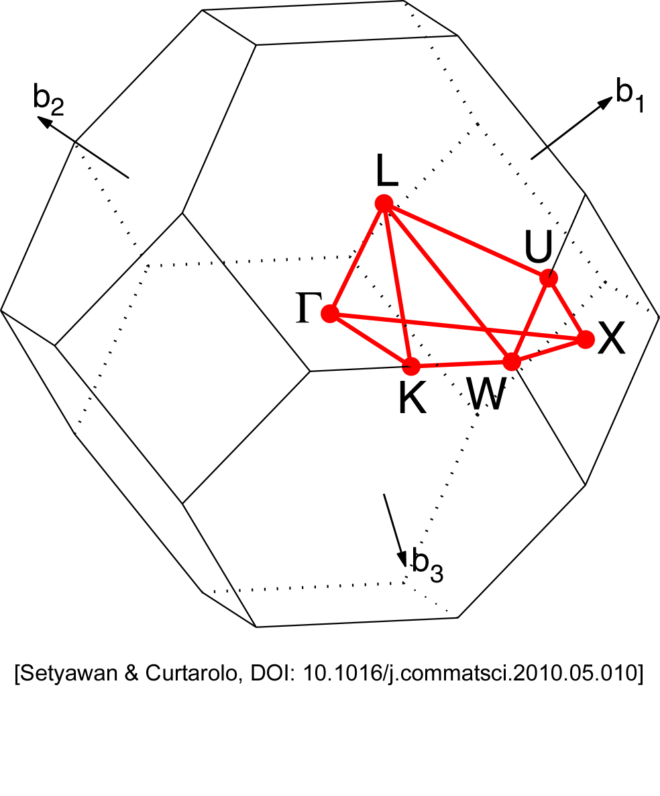
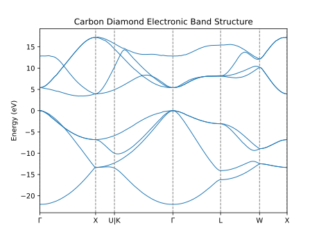

Crystals and the Electronic Band Structure
==========================================

This week we are going to start doing some calculations on solids, i.e.,
periodic crystals. Many of the principles will be the same, but as you will see
there are a few things that need to be done differently. 

As before, all the inputs and scripts you need can be found in
`/opt/MSE404-MM/docs/labs/lab04` and you should copy the folder to
your home directory.

<!-- <div markdown="span" style="margin: 0 auto; text-align: center"> -->
<!-- [Download the input files for this tutorial](./assets/lab04_input.zip){ .md-button .md-button--primary } -->
<!-- </div> -->

------------------------------------------------------------------------------

## Basic input for Diamond :material-diamond-outline:

As our first example of a crystalline solid we're going to look at diamond. You can
find the input file at [:link:C_diamond.in](01_carbon_diamond/C_diamond.in),
here I'll give a brief overview of it:

<!-- !!! tip annotate "Tip: In-code annotations"  -->
<!--     Click (1) to see notes on the input tags. -->
<!--  -->
<!-- 1.  This is an annotation. -->

```python hl_lines="25-26"

&CONTROL
   pseudo_dir = '.' 
   disk_io = 'none' 
/

&SYSTEM
   ibrav = 2 #(1)!
   A = 3.567
   nat = 2
   ntyp = 1
   ecutwfc = 20.0
/

&ELECTRONS
   conv_thr = 1.0E-6
/

ATOMIC_SPECIES
 C  12.011  C.pz-vbc.UPF

ATOMIC_POSITIONS crystal #(2)!
 C 0.00 0.00 0.00
 C 0.25 0.25 0.25

K_POINTS automatic #(3)!
  4 4 4 1 1 1
```

1.  `ibrav=2` specifies a FCC unit cell (for a complete list of `ibrav`, see
    [:link:input
    descriptions](https://www.quantum-espresso.org/Doc/INPUT_PW.html#idm226)).
2.  `crystal` specifies that the atomic positions are given in fractional
    coordinates of the unit cell vectors (defined by `ibrav` and
    [`A`](https://www.quantum-espresso.org/Doc/INPUT_PW.html#idm260)).
3.  We are using automically generated k-point grid with a 4$\times$4$\times$4
    grid size, `1 1 1` means to shift the grid by one half of a grid spacing in each direction. 

### k-points
One important difference between periodic crystals and molecules is that the electronic states are not localised and their wavefunction is given by Bloch's theorem: 

$$
\psi_{n\mathbf{k}}(\mathbf{r}) =
e^{i\mathbf{k}\cdot\mathbf{r}}u_{n\mathbf{k}}(\mathbf{r}),
$$

where the electronic states are labelled by both the band index $n$ and the
k-point $\mathbf{k}$. As discussed in the lecture, $\mathbf{k}$ lies in the
first Brillouin zone. 

The additional card `K_POINTS` in the input file specifies the k-point grid.
The first three numbers `4 4 4` represent how many k-points are generated along
each direction of the reciprocal lattice vectors. In real space, this
corresponds to size of the crystal we are modelling, i.e. a crystal that consists of $4 \times 4 \times 4$ unit cells. The fineness of the k-point grid is a convergence parameters. We must make sure that it is sufficiently fine such that physically meaningful results are obtained.


### Structure Parameters for Crystals
Now let's take a look at how the atomic positions in the unitcell are specified
in the input file.

As discussed in the lecture, absolute Cartesian coordinates $\mathbf{r}=[x,y,z]$
and fractional coordinates $\mathbf{r}_f=(x_f,y_f,z_f)$ are related by the three
lattce vectors $\mathbf{a},\mathbf{b},\mathbf{c}$ as follows:

$$
\begin{align} 
\mathbf{r} &= [\mathbf{a},\mathbf{b},\mathbf{c}] \cdot \mathbf{r}_f\\
&=x\mathbf{a} + y\mathbf{b} + z\mathbf{c} 
\end{align}
$$

For diamond, which has the same atomic structure as [:link:Zinc
Blende](https://en.wikipedia.org/wiki/Cubic_crystal_system#Zincblende_structure),
the primitive cell of diamond looks like the following:

<figure markdown="span">
  {width="200"}
  {width="200"}
</figure>


To specify the primitive cell shape, we first set `ibrav=2`, i.e. face-centred
cubic (fcc) Bravais lattice. Internally, with `ibrav=2`, Quantum ESPRESSO sets
the the fcc lattice vectors as:

$$
\begin{align*}
\mathbf{a} &= \frac{A}{2}(-1,0,1)\\
\mathbf{b} &= \frac{A}{2}(0,1,1)\\
\mathbf{c} &= \frac{A}{2}(-1,1,0)
\end{align*}
$$

!!! warning 
    Note that here we are using the experimentally measured lattice constant `A`
    of 3.567 Å which might not be the same as the DFT optimized value. In later
    labs we'll see how to find the lattice constant predicted by DFT.

Under this basis, the fractional coordinates of the two carbon atoms are (as we
see in the input file, indicated by `ATOMIC_POSITIONS crystal`):

$$
\begin{align*}
\mathbf{r}_f^{C1} &= (0,0,0) \\
\mathbf{r}_f^{C2} &= (\frac{1}{4},\frac{1}{4},\frac{1}{4})
\end{align*}
$$

Hence, the **absolute** Cartesian coordinates for the two carbon atoms are given
by:

$$
\begin{align*}
\mathbf{r}^{C1} &= \frac{A}{2}(-1,0,1) \times 0 + \frac{A}{2}(0,1,1) \times 0 +
\frac{A}{2}(-1,1,0) \times 0\\ 
&= (0,0,0)\\
\mathbf{r}^{C2} &= \frac{A}{2}(-1,0,1) \times \frac{1}{4} + \frac{A}{2}(0,1,1) 
\times \frac{1}{4}+
\frac{A}{2}(-1,1,0) \times \frac{1}{4} \\
&= (\frac{A}{4},\frac{A}{4},\frac{A}{4})
\end{align*}
$$

!!! example "Task 1 - Examining input & output files"

    Run `pw.x` for the carbon diamond inside the `01_carbon_diamond` directory.
    There are a couple of extra things to notice in the output file:
    
    - The output lists the automatically generated k-points. How many k-points 
      are there and why?

        ??? success "Answer"

            We requested a 4$\times$4$\times$4 grid but instead in the ouput
            file indicates 10 k-points are being calculated. This is because
            Quantum espresso uses crystal symmetries to relate certain k-points
            and to reduce the computational load.

    - What are the eigenvalues and occupations?

        ??? success "Answer"
            For periodic systems, we have a set of band energies for each 
            k-point. And these are given in the output file:
            ```
                  k =-0.1250 0.1250 0.1250 (   116 PWs)   bands (ev):
        
            -7.3461  11.5621  13.5410  13.5410
        
                  k =-0.3750 0.3750-0.1250 (   116 PWs)   bands (ev):
        
            -5.1246   6.0725   9.6342  12.3836
        
                  k = 0.3750-0.3750 0.6250 (   117 PWs)   bands (ev):
        
            -2.0454   1.1023   9.9094  10.6497
        
                  k = 0.1250-0.1250 0.3750 (   120 PWs)   bands (ev):
        
            -6.2574   8.8031  11.2205  12.0763
        
                  k =-0.1250 0.6250 0.1250 (   118 PWs)   bands (ev):
        
            -4.0419   6.4510   8.7237   9.1414
        
                  k = 0.6250-0.1250 0.8750 (   111 PWs)   bands (ev):
        
             0.0174   2.6697   5.4037   7.5509
        
                  k = 0.3750 0.1250 0.6250 (   115 PWs)   bands (ev):
        
            -2.9709   4.0228   7.6281   9.9651
        
                  k =-0.1250-0.8750 0.1250 (   114 PWs)   bands (ev):
        
            -0.7739   3.2191   6.5088   8.0627
        
                  k =-0.3750 0.3750 0.3750 (   114 PWs)   bands (ev):
        
            -4.0297   3.1416  11.7036  11.7036
        
                  k = 0.3750-0.3750 1.1250 (   114 PWs)   bands (ev):
        
            -1.0562   2.2032   6.0516   9.9570
            ```


## Convergence Tests for k-points
In task 1 we have already used a uniform 4$\times$4$\times$4 k-point sampling.
However, to really converge a periodic system, **an additional convergence test
with respect to the k-point sampling is necessary.**

To test the convergence of the k-point grid, we need to calculate the total
energy for different grid densities. Here, since the three lattice vectors are
related by a three-fold rotation symmetry, the density of k-points along the
three reciprocal lattice vecotrs should be identical and we can vary them all at
the same time.


!!! example "Task 2 - Convergence with respect to k-point sampling and cut-off energy"

    - The directory `02_convergence` contains input files to calculate the total
      energy, try modify them and vary the k-point grid density and see how the
      total energy changes. For example, perform a series of calculations with
      k-point grid set to `2 2 2`, `4 4 4`, `6 6 6`, ..., all the way to `30 30
      30` and see how the total energy changes. If you have any trouble doing
      so, you can always go back to [:link:lab03](../lab03/readme.md) for help.

        ??? success "Result"
            The sparsest converged k-grid (∆ ~10meV/atom) is around
            10$\times$10$\times$10.
            <figure markdown="span">
              { width="500" }
            </figure>

    - For every periodic system you simulate, you should converge **both** the
      cut-off energy and k-points. Usually people start with one parameter set
      to very high and varys the other one, then switch and repeat. Try do this
      yourself and find the best set of parameters for diamond.
    
        ??? success "Tips"
            Try starting with `ecutwfc` of ~60.0 Ry and converge the k-points. 
            Or start with k-points of 30$\times$30$\times$30 and converge the
            energy cutoff.

## The Electronic Band Structure

### What is the Electronic Band Structure?

We know that, while the electronic density obtained from DFT is meaningful, the
Kohn-Sham states are not strictly the electronic states of the system.
**Nonetheless, they are in practice often a good first approximation of the
electronic states of a system, so can be useful in understanding the properties
of a system.**

We have seen how to converge our calculations with respect to the sampled
k-point grid density (task 2), and have seen in task 1 that the calculated
eigenvalues are a bit different at each calculated k-point. Now we want to see
exatcly how these eigenvalues change as we move from one k-point to the next.

Examining how the Kohn-Sham energies change from one k-point to the next can
tell us useful things such as if a material is likely to have a direct or
indirect optical gap for example. For this we need to visualize how the energies
of the states vary with k-point. The usual way this is done is to plot the band
energies along lines between the various high-symmetry k-points in the Brillouin
zone. For example, a high symmetry path for a face-centred cubic (FCC) lattice
(see figure below) could be `Γ—X—U|K—Γ—L—W—X`:

<figure markdown="span">
  { width="250" }
</figure>

??? "Finding High Symmetry Points and Paths"
    The details of how such path can be found is beyond the scope of this 
    course, but an outline is given [:link:
    here](../extras/labs/high_symmetry_points/readme.md).

### Calculating the Electronic Band Structure
The directory `03_bandstructure` contains input files to calculate and plot the
band structure of diamond. This a four-step process:

#### Step 1 - SCF Calculation
The first step is to alculate a converged density with a standard
self-consistent field (SCF) calculation. In this step, the charge density is
optimized in order to minimize the total energy of the system. The input file
can be found at
[:link:01_C_diamond_scf.in](03_bandstructure/01_C_diamond_scf.in). 

!!! example "Task 3.1 - SCF Calculation"
    Run the input file
    [:link:01_C_diamond_scf.in](03_bandstructure/01_C_diamond_scf.in)
    to get the ground state charge density.
    ```
    pw.x < 01_C_diamond_scf.in > 01_C_diamond_scf.out
    ```
   
#### Step 2 - NSCF(bands) Calculation
The second step is to use the obtained charge density to construct Hamiltonian
at a certain set of k-points and diagonalize them obtain the Kohn-Sham
eigenvalues at those k-points. This is called a non-self-consistent field (NSCF)
calculation as the charge density is kept fixed. We choose a set of k-points
along a path in the Brillouin zone so that we can later visualize how the
eigenvalues change along this path.

A brief overview of the 
[:link:input file](03_bandstructure/02_C_diamond_nscf.in) is 
given below:

```python
&CONTROL
 pseudo_dir = '.'
 calculation = 'bands' #(1)!
/

&SYSTEM
   ibrav =  2
   A = 3.567
   nat =  2
   ntyp = 1
   ecutwfc = 30.0
   # Also add 4 additional bands (unoccupied states)
   nbnd = 8 #(2)!
/

&ELECTRONS
/

ATOMIC_SPECIES
 C  12.011  C.pz-vbc.UPF

ATOMIC_POSITIONS crystal
 C 0.00 0.00 0.00
 C 0.25 0.25 0.25

# Path here goes: Γ X U|K Γ L W X
K_POINTS crystal_b #(3)!
  8
  0.000 0.000 0.000 30 Γ
  0.500 0.000 0.500 30 X
  0.625 0.250 0.625 00 U
  0.375 0.375 0.750 30 K
  0.000 0.000 0.000 30 Γ
  0.500 0.500 0.500 30 L
  0.250 0.500 0.750 30 W
  0.500 0.500 1.000 00 X
```

1.  `calculation = 'bands'` specifies that we are calculating the band
    structure.
2.  `nbnd = 8` specifies that we want to calculate 8 bands. 4 more bands than
    the default value of 4. We add these bands so that we can calculate the band
    gap later.
3.  `K_POINTS crystal_b` specifies that we are using the high symmetry k-points
    in the reciprocal lattice coordinates. The number of high symmetry points
    is given as 8, followed by the coordinates of each point and the number of
    points to generate between it and the next point.

Since diamond has a face-centred cubic (FCC) lattice, we have chosen the path
`Γ-X-U|K-Γ-L-W-X` where `U|K` means no k-point is sampled between `U` and `K`.


!!! example "Task 3.2 - NSCF Calculation"
    Run the input file
    [:link:02_C_diamond_nscf.in](03_bandstructure/02_C_diamond_nscf.in)
    to get the eigenvalues of each band at each k-point.
    ```
    pw.x < 02_C_diamond_nscf.in > 02_C_diamond_nscf.out
    ```
    Take a look at the output, can you find where it says the charge density is
    read?
    ??? success "Answer"
        ```
        The potential is recalculated from file :
        ./pwscf.save/charge-density
        ```

#### Step 3 - Extracting Band Energies
Now we need to extract the energies from this calculation and convert it to a
dataset we can plot.

To do this, we use the `bands.x` tool from the Quantum Espresso package.
The [:link:input file](03_bandstructure/03_C_diamond_bands.in)
for `bands.x` contains only a `BANDS` section. For more fine-grained control
please refer to 
[:link:bands.x input description](https://www.quantum-espresso.org/Doc/INPUT_BANDS.html).

!!! example "Task 3.3 - Extracting band energies"
    Run the input file
    [:link:03_C_diamond_bands.in](03_bandstructure/03_C_diamond_bands.in) with
    `bands.x`to extract and organize the eigenvalues calculated by the last
    step. 
    ```
    bands.x < 03_C_diamond_bands.in > 03_C_diamond_bands.out
    ```


#### Step 4 - Plotting the Band Structure 
Finally, we are ready  to plot the band structure. The band structure is
typically plotted with the energy on the y-axis and the high symmetry points on
the x-axis. The energy is usually shifted so that the valence band maximum is at
0 eV. The directory `03_bandstructure` contains python script
(`plotband_shifted.py`) that can be used to plot the band structure.


!!! example "Task 3.4 - Plotting the band structure"
    Run the python script to plot the band
    structure of carbon diamond. 
    ```
    python plotband_shifted.py
    ```
    Is carbon diamond a metal or an insulator? Where is the valence band maximum
    and the conduction band minimum? how big is the band gap?

    ??? success "Final result"
        <figure markdown="span">
          { width="500" }
        </figure>

        From the final result we can see that the valence band max is at Γ (the
        first point on our path), the conduction band min is located between Γ
        and X and the band gap is around 4 eV. We could read the value of the
        energy at this point from one of the other output files, `bands.out`.
        Note that here we have shifted the entire spectrum so that this point is
        at 0 eV.


Summary
-------

- In this lab we looked at how to:
    - reach k-point convergence in solids.
    - calculate the electronic band structure of a solid.
- We have seen how several calculations may be chained together where the
  output of one is used as an input for a subsequent calculation.
- We should always keep in mind that the Kohn-Sham eigenvalues as obtained
  from a DFT calculation do not correspond to the real interacting electron
  energy levels, but are often useful as a first approximation.

