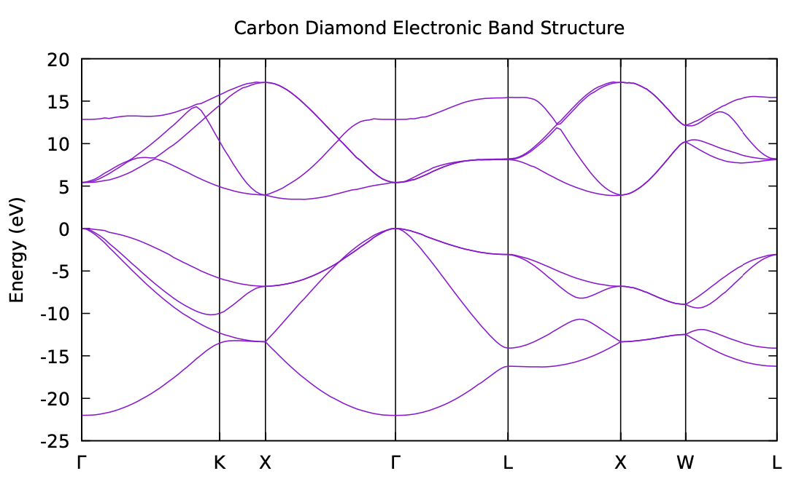
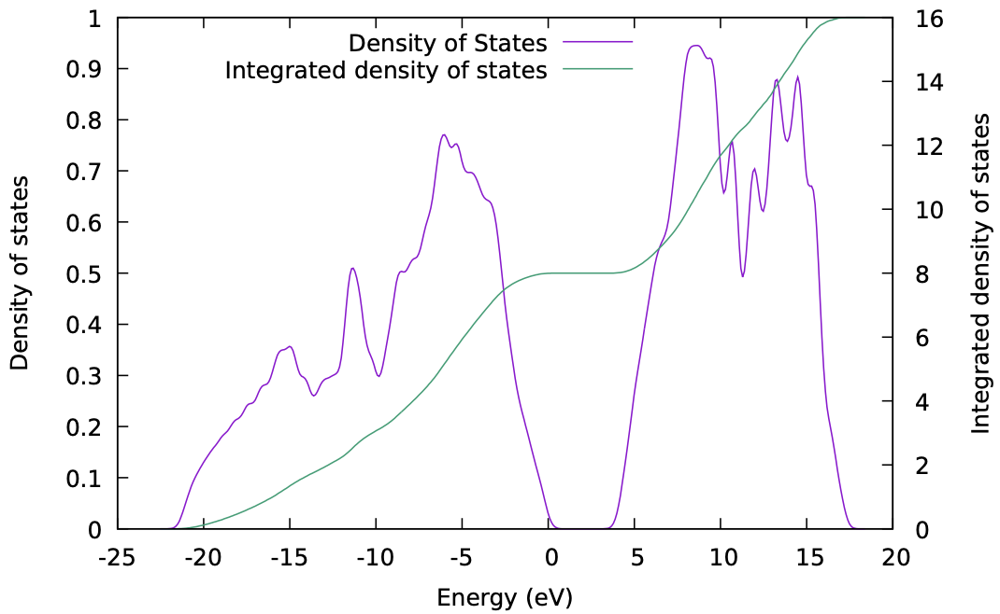

Crystals and Electronic Band Structures
=======================================

This week we are going to start doing some calculations on solids, i.e.,
periodic crystals. Many of the principles will be the same, but as you will see
there are a few things that need to be done differently.

<div markdown="span" style="margin: 0 auto; text-align: center">
[Download the input files for this tutorial](./assets/lab04_input.zip){ .md-button .md-button--primary }
</div>

------------------------------------------------------------------------------

## Structure and Basic input for Diamond :material-diamond-outline:

As our first example of a solid we're going to look at diamond. You can find an
annotated input file at [:link:
C_diamond_detailed.in](01_carbon_diamond/C_diamond_detailed.in), here I'll give
a brief overview of the input file:

<!-- !!! tip annotate "Tip: In-code annotations"  -->
<!--     Click (1) to see notes on the input tags. -->
<!--  -->
<!-- 1.  This is an annotation. -->

```python
&CONTROL
   pseudo_dir = '.' 
   disk_io = 'none' 
/

&SYSTEM
   ibrav = 2 #(1)!
   A = 3.567
   nat = 2
   ntyp = 1
   ecutwfc = 20.0
/

&ELECTRONS
   conv_thr = 1.0E-6
/

ATOMIC_SPECIES
 C  12.011  C.pz-vbc.UPF

ATOMIC_POSITIONS crystal #(2)!
 C 0.00 0.00 0.00
 C 0.25 0.25 0.25

K_POINTS automatic #(3)!
  4 4 4 1 1 1
```

1.  `ibrav=2` specifies a FCC unit cell (for a complete list of `ibrav`, see
    [:link:input
    descriptions](https://www.quantum-espresso.org/Doc/INPUT_PW.html#idm226)).
2.  `crystal` specifies that the atomic positions are given in fractional
    coordinates of the unit cell vectors (defined by `ibrav` and
    [`A`](https://www.quantum-espresso.org/Doc/INPUT_PW.html#idm260)).
3.  We are using automically generated k-point grid with a 4$\times$4$\times$4
    grid size (`1 1 1` means to shift the grid by 1 grid point in each
    direction).

## Periodic Boundary Conditions and Atomic Positions

Now we are going to look at how the atomic positions in the input file are
specified. 

Absolute Cartesian coordinates $\mathbf{r}=[x,y,z]$ and fractional coordinates 
$\mathbf{r}_f=(x_f,y_f,z_f)$ are related by the three lattce vectors
$\mathbf{a},\mathbf{b},\mathbf{c}$ as follows:

$$
\begin{align*}
\mathbf{r}_f &= \mathbf{r} \cdot [\mathbf{a},\mathbf{b},\mathbf{c}]\\
&=x\mathbf{a} + y\mathbf{b} + z\mathbf{c} 
\end{align*}
$$

For diamond, which has the same atomic structure as Zinc Blende, the primitive
cell of diamond looks like the following:

<figure markdown="span">
  { width="200" }
  { width="200" }
</figure>


To specify the primitive cell shape, we first set `ibrav=2`, i.e. face-centred
cubic (fcc) Bravais lattice. Internally, with `ibrav=2`, Quantum ESPRESSO sets
the the fcc lattice vectors as:

$$
\begin{align*}
\mathbf{v}_1 &= \frac{A}{2}(-1,0,1)\\
\mathbf{v}_2 &= \frac{A}{2}(0,1,1)\\
\mathbf{v}_3 &= \frac{A}{2}(-1,1,0)
\end{align*}
$$

!!! warning 
    Note that we've just used the measured lattice constant `A` which might not
    be the same as teh DFT optimized value. In later labs we'll see how to find
    the lattice constant predicted by DFT.

Under this basis, the fractional coordinates of the two carbon atoms are:

$$
\begin{align*}
\mathbf{r}_f^{C1} &= (0,0,0) \\
\mathbf{r}_f^{C2} &= (\frac{1}{4},\frac{1}{4},\frac{1}{4})
\end{align*}
$$

Hence, the **absolute** Cartesian coordinates for the two carbon atoms are given
by:

$$
\begin{align*}
\mathbf{r}^{C1} &= \frac{A}{2}(-1,0,1) \times 0 + \frac{A}{2}(0,1,1) \times 0 +
\frac{A}{2}(-1,1,0) \times 0\\ 
&= (0,0,0)\\
\mathbf{r}^{C2} &= \frac{A}{2}(-1,0,1) \times \frac{1}{4} + \frac{A}{2}(0,1,1) 
\times \frac{1}{4}+
\frac{A}{2}(-1,1,0) \times \frac{1}{4} \\
&= (\frac{A}{4},\frac{A}{4},\frac{A}{4})
\end{align*}
$$

!!! example "Task 1 - Examining input & output files"

    Run the input file for diamond. There are a couple of extra things to notice
    in the output file:
    
    - The output lists the automatically generated k-points. How many k-points 
      are there and why?

        ??? success "Answer"
            We requested a 4x4x4 grid but instead in the ouput file indicates 10
            k-points are being calculated. This is because Quantum espresso uses
            crystal symmetries to relate certain k-points and to reduce the
            computational load.

    - What are the eigenvalues and occupations?

        ??? success "Answer"
            For periodic systems, we have a set of band energies for each 
            k-point. And these are given in the output file:
            ```
                  k =-0.1250 0.1250 0.1250 (   116 PWs)   bands (ev):
        
            -7.3461  11.5621  13.5410  13.5410
        
                  k =-0.3750 0.3750-0.1250 (   116 PWs)   bands (ev):
        
            -5.1246   6.0725   9.6342  12.3836
        
                  k = 0.3750-0.3750 0.6250 (   117 PWs)   bands (ev):
        
            -2.0454   1.1023   9.9094  10.6497
        
                  k = 0.1250-0.1250 0.3750 (   120 PWs)   bands (ev):
        
            -6.2574   8.8031  11.2205  12.0763
        
                  k =-0.1250 0.6250 0.1250 (   118 PWs)   bands (ev):
        
            -4.0419   6.4510   8.7237   9.1414
        
                  k = 0.6250-0.1250 0.8750 (   111 PWs)   bands (ev):
        
             0.0174   2.6697   5.4037   7.5509
        
                  k = 0.3750 0.1250 0.6250 (   115 PWs)   bands (ev):
        
            -2.9709   4.0228   7.6281   9.9651
        
                  k =-0.1250-0.8750 0.1250 (   114 PWs)   bands (ev):
        
            -0.7739   3.2191   6.5088   8.0627
        
                  k =-0.3750 0.3750 0.3750 (   114 PWs)   bands (ev):
        
            -4.0297   3.1416  11.7036  11.7036
        
                  k = 0.3750-0.3750 1.1250 (   114 PWs)   bands (ev):
        
            -1.0562   2.2032   6.0516   9.9570
            ```


## Convergence Tests

One important difference between periodic crystals and molecules is that, due to
periodic boundary conditions, the electronic states are not localised and need
to be expressed in a Bloch form: 

$$
\psi_{n\mathbf{k}}(\mathbf{r}) =
e^{i\mathbf{k}\cdot\mathbf{r}}u_{n\mathbf{k}}(\mathbf{r}),
$$

where the electronic states are labelled by both the band index $n$ and the
k-point $\mathbf{k}$. $\mathbf{k}$ needs sample the entire Brillouin zone. In
task 1 we have already used a uniform 4x4x4 k-point sampling. However, to relly
converge a system, **an additional convergence test with respect to the k-point
sampling is necessary for periodic systems.**

To test the convergence with respect to the k-point sampling, we need to
calculate the total energy for different k-point grid densities. The directory
`02_convergence` contains input files and scripts that does the job.

!!! example "Task 2 - Convergence with respect to k-point sampling and cut-off energy"

    - Understand and run the script (for more
      information, read the [`README.md`](02_convergence/README.md)), and plot
      the convergence of total energy with respect to k-point sampling.

        ??? success "Result"
            <figure markdown="span">
              { width="500" }
            </figure>

    - For every periodic system you simulate, you should converge **both** the
      cut-off energy and k-points. Usually people start with one parameter set
      to very high and vary the other one, then switch and repeat. Try do this
      yourself and find the best set of parameters for diamond.
    
        ??? success "Tips"
            Start with E_cut of ~50.0 Ry and k-points of 4x4x4

    <!-- - For every periodic system you simulate, you should converge **both** the -->
    <!--   cut-off energy and k-points. Try adapting one of the scripts to also -->
    <!--   converge the energy of silicon with respect to the cut-off energy. How -->  
    <!--   does the convergence behaviour of the two parameters compare? -->

    <!--     ??? success "Answer" -->
    <!--         An example Bash script to does this is given below: -->

    <!--         ```bash -->
    <!--         #!/bin/bash -->
    <!--         
    <!--         template="C_diamond_base_kE.in" -->
    <!--         repstr_k="xxxx" -->
    <!--         repstr_E="eeee" -->
    <!--         
    <!--         for val_k in {02..10..2} #(1)! -->
    <!--         do -->
    <!--         for val_E in {20..100..20} #(2)! -->
    <!--         do -->
    <!--           echo "Running for k = $val_k and E = $val_E" -->
    <!--           inp="C_diamond_${val_k}_${val_E}.in" -->
    <!--           sed "s/$repstr_k/$val_k/g" $template > $inp #(3)! -->
    <!--           sed -i "s/$repstr_E/$val_E/g" $inp -->
    <!--           pw.x < $inp &> ${inp%.*}.out_conv_kE -->
    <!--         done -->
    <!--         done -->
    <!--         
    <!--         awk '/number of k points/{nkpt=$5}/kinetic-energy cutoff/{ekin=$4} -->
    <!--              /^!.*total/{print nkpt, ekin, $5}' *out_conv_kE > etot_v_nkpt_ekin.dat -->
    <!--         ``` -->

    <!--         1.  This loop will run for k-points from 2 to 10 in steps of 2. -->
    <!--         2.  This loop will run for cut-off energies from 20 to 100 in steps -->
    <!--             of 20. -->
    <!--         3.  `g` here means to replace every entry on the line (global). -->

    <!--         You can change the range of k-points and cut-off energies yourself. -->
    <!--         You can also try to adapt this script using Python. -->

## The Electronic Band Structure

While the electronic density obtained from DFT is meaningful, the Kohn-Sham
states are not strictly the electronic states of the system. Nonetheless, they
are in practice often a good first approximation of the electronic states of a
system, so can be useful in understanding the properties of a system.

We have now seen how to converge our calculations with respect to the
sampled k-point grid density. And you'll have seen in the calculations you
have done that the calculated eigenvalues are a bit different at each
calculated k-point. 

Examining how the state energies change from one k-point to the next can tell us
useful things such as if a material is likely to have a direct or indirect
optical gap for example. For this we need to visualize how the energies of the
states vary with k-point. The usual way this is done is to plot the band
energies along lines between the various high-symmetry k-points in the Brillouin
zone. The details of how this can be done is beyond the scope of this course,
but an outline is given [:link:
here](../extras/labs/high_symmetry_points/readme.md).

The directory `03_bandstructure` contains input files to calculate and plot the
band structure of diamond. This a four-step process:

### Step 1 - SCF Calculation
Calculate a converged density with a standard  self-consistent field (SCF)
calculation. In this step, the charge density is optimized in order to
minimize the total energy of the system. The input file can be found at
[:link:01_C_diamond_scf.in](03_bandstructure/01_C_diamond_scf.in). 

!!! example "Task 3.1 - SCF Calculation"
    Run the input file
    [:link:01_C_diamond_scf.in](03_bandstructure/01_C_diamond_scf.in)
    to get the ground state charge density.
   
### Step 2 - NSCF(bands) Calculation
Use that density to perform a non self-consistent (NSCF) calculation for
k-points along chosen high-symmetry lines. In an NSCF calculation, the energy
is not minimised as the charge density is read-in and kept fixed. Instead 
the Kohn-Sham energies and states for a particular k-point are calculated by
diagonalizing the Hamiltonian generated by the charge density. 

For this to work, we need to choose a set of high symmetry k-points for
carbon diamond. Since diamond has a face-centred cubic (FCC) lattice, we have
chosen the path `Γ-K-X-Γ'-L-X-W-L` where `Γ'` indicates the gamma point in a
different Brillouin zone.

A brief overview of the 
[:link: input file](03_bandstructure/02_C_diamond_nscf.in) is 
given below:

```python
&CONTROL
 pseudo_dir = '.'
 calculation = 'bands' #(1)!
/

&SYSTEM
   ibrav =  2
   A = 3.567
   nat =  2
   ntyp = 1
   ecutwfc = 30.0
   # Add 4 conduction bands also
   nbnd = 8 #(2)!
/

&ELECTRONS
/

ATOMIC_SPECIES
 C  12.011  C.pz-vbc.UPF

ATOMIC_POSITIONS crystal
 C 0.00 0.00 0.00
 C 0.25 0.25 0.25

# Path here goes: G K X G' L X W L
K_POINTS crystal_b #(3)!
  8
  0.000 0.000 0.000 30
  0.375 0.375 0.750 10
  0.500 0.500 1.000 30
  1.000 1.000 1.000 30
  0.500 0.500 0.500 30
  0.000 0.500 0.500 30
  0.250 0.500 0.750 30
  0.500 0.500 0.500 0
```

1.  `calculation = 'bands'` specifies that we are calculating the band
    structure.
2.  `nbnd = 8` specifies that we want to calculate 8 bands. 4 more bands than
    the default value of 4.
3. `K_POINTS crystal_b` specifies that we are using the high symmetry k-points
    in the reciprocal lattice coordinates. The number of high symmetry points
    is given as 8, followed by the coordinates of each point and the number of
    points to generate between it and the next point.

!!! example "Task 3.2 - NSCF Calculation"
    Run the input file
    [:link:02_C_diamond_nscf.in](03_bandstructure/02_C_diamond_nscf.in)
    to get the eigenvalues of each band at each k-point. Note that the total
    charge density is fixed in this step.

### Step 3 - Extracting Band Energies
Extract the energies from this calculation and convert it to a dataset we can 
plot.

To do this, we use the `bands.x` tool from the Quantum Espresso package.
The [:link: input file](03_bandstructure/03_C_diamond_bands.in)
for this contains only a `BANDS` section. For more fine-grained control
please refer to 
[:link: bands.x input description](https://www.quantum-espresso.org/Doc/INPUT_BANDS.html).

!!! example "Task 3.3 - Extracting band energies"
    Run the input file
    [:link:03_C_diamond_bands.in](03_bandstructure/03_C_diamond_bands.in)
    to extract and organize the eigenvalues calculated by the last step.

### Step 4 - Plotting the Band Structure
Plot the band structure. The band structure is usually plotted with the energy
on the y-axis and the high symmetry points on the x-axis. The energy is usually
shifted so that the valence band maximum is at 0 eV. The directory
`03_bandstructure` contains a gnuplot and a python script that can be used to 
plot the band structure:

The valence band max was at gamma (the first point on our path), we could read
the value of the energy at this point from one of the other output files,
`bands.out`. And here we shift the entire spectrum so that this point is at 0
eV.

!!! example "Task 3.4 - Plotting the band structure"
    Run either the gnuplot or the python script to plot the band structure of 
    diamond.

    ??? success "Final result"
        <figure markdown="span">
          { width="500" }
        </figure>

<!-- ## Density of States -->
<!--  -->
<!-- Now let's analyse the electronic states by computing the density of states -->
<!-- (DOS). This is a little easier to visualise and shows how many electronic states -->
<!-- (in fact Kohn-Sham states for our DFT calculation) are at a given energy. More -->
<!-- precisely, the DOS tells us how many electronic states, for a system of volume -->
<!-- V, can be occupied in a small (infinitesimal) energy range near a specific -->
<!-- energy.  -->
<!--  -->
<!-- The DOS should be directly related to the band structure as: -->
<!--  -->
<!-- $$ -->
<!-- \mathrm{DOS}(E) = \sum_{n} \int  \delta(E - \epsilon_{n\mathbf{k}}) d\mathbf{k} -->
<!-- $$ -->
<!--  -->
<!-- where $\epsilon_{n\mathbf{k}}$ are the Kohn-Sham eigenvalues for band $n$ and -->
<!-- k-point $\mathbf{k}$. The only thing to note here is that an accurate density of -->
<!-- states calculation requires a dense-sampled Brillouin zone. -->
<!--  -->
<!-- Intuitively, bands with large energy dispersion in the Brillouin zone result -->
<!-- in low DOS, whereas less dispersive (more flat) bands result in high DOS. In -->
<!-- insulators and semiconductors the DOS is zero inside the band gap, as there are -->
<!-- no available states in that energy range.  -->
<!--  -->
<!-- ### Smearing -->
<!-- However, since we can only have a finite sampling of the Brillouin zone we -->
<!-- need to interpolate the results in some sensible way if we turn this into a -->
<!-- count of the total number of states at an arbitrary energy. -->
<!--  -->
<!-- The most common way this is done is to use some energy broadening scheme, i.e., -->
<!-- boradening the delta function. Doing this, we can include some contributions -->
<!-- from k-points that we missed. In practice this is quite fast and -->
<!-- straight-forward, although you'll need to tune the broadening energy so that -->
<!-- your calculated density of states is smooth in the correct way:  -->
<!--  -->
<!-- - If you use too large a broadening, you may smear out important -->
<!--   features. -->
<!-- - If you use too small a broadening you may introduce spurious features -->
<!--   and your density of states plot will look very bumpy/spikey. -->
<!-- - In principle you would want the smearing to be comparable to the -->
<!--   typical change in energy of a state from a k-point to its neighbours. -->
<!--   In practice though it's easiest to just try different values until it -->
<!--   looks right. -->
<!--  -->
<!--  -->
<!-- ??? note "Tetrahedron Method" -->
<!--     The other way to interpolate is to use the so-called tetrahedron method. -->
<!--     Essentially this corresponds to doing a three dimensional linear -->
<!--     interpolation from a regular grid of values. This calculation can be -->
<!--     noticeably slower than using a broadening but there is no need to to worry -->
<!--     about using the correct smearing. The density of states will simply become -->
<!--     more finely featured as you increase the density of the k-point grid in the -->
<!--     non-self-consistent calculation. -->
<!--  -->
<!--     It's important to note that in a real measurement of the density of -->
<!--     states of a system, there is an implicit broadening that comes from -->
<!--  -->
<!--       1. Electron-phonon coupling: the states are not simply at a fixed -->
<!--       energy, but will have some distribution as the atoms vibrate. -->
<!--  -->
<!--       2. Any measurement probe will have a finite energy width associated -->
<!--       with it, which will limit how finely it can resolve density of states -->
<!--       features. -->
<!--  -->
<!--     So while tetrahedron may seem the more accurate approach, you shouldn't -->
<!--     necessarily think of it as a more correct representation of a real -->
<!--     system. -->
<!--  -->
<!-- ### Steps to Calculate the DOS -->
<!-- In a similar way to the electronic band structure, we produce the density of  -->
<!-- states plot in three steps. -->
<!--  -->
<!-- #### Step 1 - SCF Calculation -->
<!-- Perform a self consistent calculation as before, producing a converged -->
<!-- charge density. -->
<!--  -->
<!-- !!! example "Task 4.1 - SCF Calculation" -->
<!--     Run the input file -->
<!--     [:link:01_C_diamond_scf.in](04_densityofstates/01_C_diamond_scf.in) -->
<!--     for diamond. -->
<!--  -->
<!-- #### Step 2 - NSCF Calculation -->
<!-- Take the density calculated in the previous step and use it to -->
<!-- perform a non-self-consistent calculation on a more dense grid of k-points. -->
<!-- We want a good representation of how the state energies vary as we move -->
<!-- around the Brillouin zone so we use a much denser grid here than we need -->
<!-- to obtain a converged density in the previous step. -->
<!--  -->
<!-- The difference between this and the band structure calculation is that here -->
<!-- we use a uniform sampling of the Brillouin zone, rather than a path between -->
<!-- k-points. The input file for this calculation can be found at -->
<!-- [:link:02_C_diamond_nscf.in](04_densityofstates/02_C_diamond_nscf.in): -->
<!--  -->
<!-- ```python -->
<!--  &CONTROL -->
<!--     pseudo_dir = '.' -->
<!--     calculation = 'nscf' #(1)! -->
<!--  / -->
<!--  -->
<!--  &SYSTEM -->
<!--     ibrav =  2 -->
<!--     A = 3.567 -->
<!--     nat =  2 -->
<!--     ntyp = 1 -->
<!--     ecutwfc = 60.0 -->
<!--     # Add 4 conduction bands also -->
<!--     nbnd = 8 #(2)! -->
<!--  / -->
<!--  -->
<!--  &ELECTRONS -->
<!--  / -->
<!--  -->
<!-- ATOMIC_SPECIES -->
<!--  C  12.011  C.pz-vbc.UPF -->
<!--  -->
<!-- ATOMIC_POSITIONS crystal -->
<!--  C 0.00 0.00 0.00 -->
<!--  C 0.25 0.25 0.25 -->
<!--  -->
<!-- K_POINTS automatic #(3)! -->
<!--   20 20 20  0 0 0 -->
<!-- ``` -->
<!--  -->
<!-- 1.  `calculation = nscf` specifies that we are calculating the  -->
<!--     non-self-consistent calculation. -->
<!-- 2.  `nbnd = 8` specifies that we want to calculate 8 bands. -->
<!-- 3.  `K_POINTS automatic` specifies that we are using an automatically generated -->
<!--     k-point grid. We've increased the k-point sampling to a 20x20x20 grid, and  -->
<!--     we have removed the shift. Many systems have a valence band maximum or -->
<!--     conduction band minimum at the gamma point, so it is good to ensure it's -->
<!--     explicitly included in the grid. -->
<!--  -->
<!-- !!! example "Task 4.2 - NSCF Calculation" -->
<!--     Run the input file -->
<!--     [:link:01_C_diamond_scf.in](04_densityofstates/02_C_diamond_nscf.in) -->
<!--     for diamond. -->
<!--  -->
<!-- #### Step 3 - Density of States Calculation -->
<!-- Convert the state energies calculated on this dense k-point grid to a -->
<!-- density of states using `dos.x`.  -->
<!-- [:link:03_C_diamond_dos.in](04_densityofstates/03_C_diamond_dos.in) -->
<!-- is the input file for `dos.x`. This code input file requires just a `DOS` -->
<!-- section: -->
<!--  -->
<!-- ```python -->
<!--  &DOS -->
<!--   degauss = 0.03 #!(1)! -->
<!--   DeltaE = 0.1 #(2)! -->
<!--  / -->
<!-- ``` -->
<!--  -->
<!-- 1.  `degauss` specifies the Gaussian broadening to use in the density of states -->
<!--     calculation. This is in Rydberg. -->
<!-- 2.  `DeltaE` specifies the spacing between points in the output file, in eV. -->
<!--  -->
<!-- !!! note -->
<!--     we've picked values for these of similar magnitude despite their different  -->
<!--     units. In fact if `degauss` is not specified, and no broadening scheme is  -->
<!--     used in the DFT calculation, `degauss` will take the value of `DeltaE` by  -->
<!--     default. You can check the documentation file `INPUT_DOS.txt` for more  -->
<!--     details. -->
<!--  -->
<!-- !!! example "Task 4.3 - Density of States Calculation" -->
<!--     Run the input file -->
<!--     [:link:03_C_diamond_dos.in](04_densityofstates/03_C_diamond_dos.in) -->
<!--     for diamond. -->
<!--  -->
<!-- [> Now we need to run all three inputs, the first two with `pw.x` and the third <] -->
<!-- [> with `dos.x`. There's a simple script to do these three steps explicitly <] -->
<!-- [> in [`run_all.sh`](04_densityofstates/run_all.sh). <] -->
<!--  -->
<!-- The final step produces a file named `pwscf.dos` by default. This is a -->
<!-- simple text file you can plot in whatever software you like. It has three -->
<!-- columns: -->
<!--  -->
<!-- 1. Energy (eV) -->
<!-- 2. Density of States (states/eV) -->
<!-- 3. Integrated Density of States (states) -->
<!--  -->
<!-- It is customary to shift the x-axis in the plot such that the Fermi energy -->
<!-- or valence band max is at 0. While a value for the Fermi level is given in -->
<!-- the file header of the generated `pwscf.dos`, this is determined in a simple -->
<!-- way from the integrated density of states. It may be worth obtaining this from -->
<!-- a separate calculation using a relatively small broadening if you're looking a -->
<!-- metallic system, while for semiconductors and insulators you could find the -->
<!-- maximum valence band state energy manually.  -->
<!--  -->
<!-- The directory `04_densityofstates` contains a gnuplot and a python script that  -->
<!-- can be used to plot the shifted DOS along with the integrated DOS: -->
<!--  -->
<!-- !!! example "Task 4.4 - Density of States Calculation" -->
<!--     Plot the density of states using the script provided. -->
<!--  -->
<!--     ??? success "Final result" -->
<!--         <figure markdown="span"> -->
<!--           { width="500" } -->
<!--         </figure> -->
<!--  -->
<!-- ------------------------------------------------------------------------------ -->

Summary
-------

- In this lab we looked at how to calculate:
    - k-point convergence in solids.
    - the electronic band structure of a solid.
    <!-- - the electronic density of states of a solid. -->
- We have seen how several calculations may be chained together where the
  output of one is used as an input for a subsequent calculation.
<!-- - We have used the `bands.x` and `dos.x` codes from the Quantum Espresso -->
<!--   package. -->
<!-- - We have done some more plotting in gnuplot. -->
- We should always keep in mind that the Kohn-Sham eigenvalues as obtained
  from a DFT calculation do not correspond to the real interacting electron
  energy levels, but are often useful as a first approximation.

