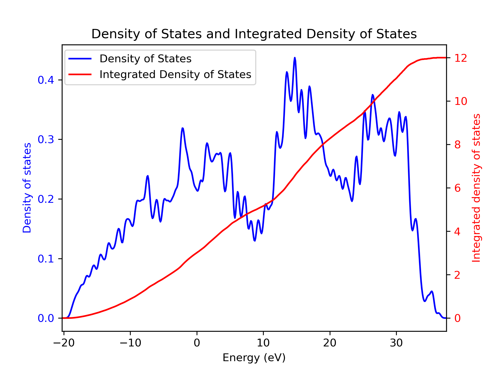
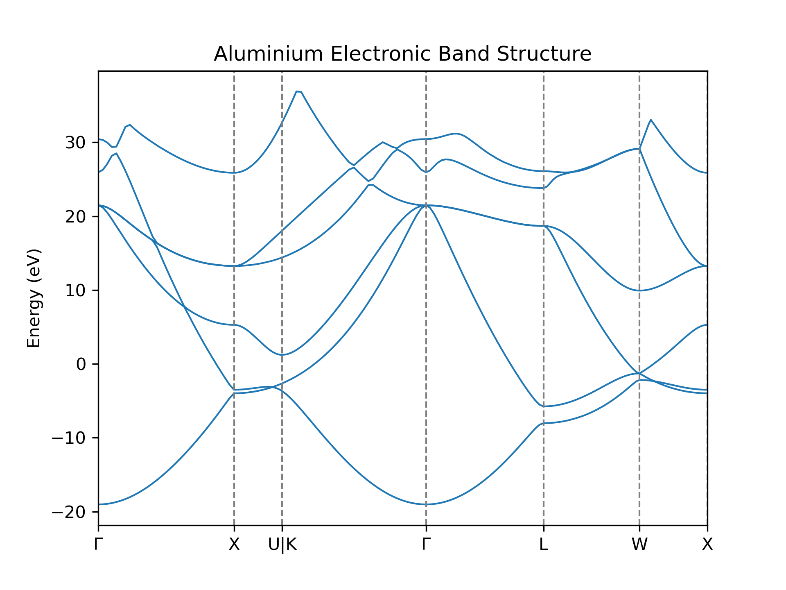

Metals and the Density of States
================================

This week we will study the electronic structure of metals and the electronic
density of states. Solving the Kohn-Sham equation for metals requires some
additional considerations compared to the case of semiconductors and insulators
which we studied in the last lab.

As before, all the input files and scripts you need can be found in
`/opt/MSE404-MM/docs/labs/lab05` and you should copy this folder to
your home directory.

<!-- <div markdown="span" style="margin: 0 auto; text-align: center"> -->
<!-- [Download the input files for this tutorial](./assets/lab10_input.zip){ .md-button .md-button--primary } -->
<!-- </div> -->

-------------------------------------------------------------------------------

## Density of States

The electronic density of states (DOS) contains information about the number of
electronic states with certain energies. Mathematically, it is defined as 

$$ 
\mathrm{DOS}(E) = \sum_{n} \sum_{\mathbf{k}} w_{\mathbf{k}}
                  \delta(E - \epsilon_{n\mathbf{k}}),
$$

where $\epsilon_{n\mathbf{k}}$ are the Kohn-Sham eigenvalues for band $n$ and
k-point $\mathbf{k}$, $w_{\mathbf{k}}$ is the k-point weight to keep the total
integrated DOS to be the number of bands. I.e., 

$$
\int_{-\infty}^{\infty} \mathrm{DOS}(E) dE = \#\mathrm{bands}
$$

Note that the sum over k-points can be replaced by an integral if the grid is
sufficiently fine.

For a molecular system, the DOS consists of a series of discrete peaks at the
energies of the molecular Kohn-Sham orbitals, since we only use one k-point (the
$\Gamma$ point) for DFT calculations of isolated molecules. In contrast, for DFT
calculations of crystals, we use many k-points to sample the first Brillouin
zone and in this case the discrete peaks merge to form a continous curve. For
example, here are graphs of the DOS of a water molecule (isolated molecule) and
carbon diamond (periodic crystal):

<figure markdown="span">
   
</figure>


The shape of the DOS is intimately connected to the band structure of a crystal:
bands with a strong dispersion (i.e. the Kohn-Sham energies change rapidly along
a path in k-space) result in low DOS spread over a large interval, whereas less
dispersive (i.e. flatter) bands result in high DOS in a smaller energy interval. 

For insulators and semiconductors, the DOS is zero inside the band gap, as there
are no Kohn-Sham states in that energy range. Hence, the DOS allows us to
determine the band gap of a crystal (unlike a band structure plot which only
shows the KS energies along a specific path in the Brillouin zone, the DOS
contains information about the KS energies at all k-points in the first
Brillouin zone).

### Smearing

To evaluate the equation for the DOS of a crystal numerically, we have to
replace the delta-functions by functions with a finite width, such as a Gaussian
(otherwise the DOS will always look like a set of sharp peaks). This is called
"smearing". 

<figure markdown="span">
  
</figure>

The width of the Gaussian is a parameter that needs to be tuned to ensure that a
physically meaningful result is obtained: 

- If the broadening is too large, you may smear out important
  features of the DOS.
- If the broadening is too small, you will see some unphysical peaks in the DOS
  and it will look very spikey.
- In principle you want the smearing to be comparable to the **typical
  difference of Kohn-Sham energies at neighboring k-points**. In practice,
  however, it is often easier to just try different values for the broadening
  until the DOS looks physically meaningful.

??? note "Tetrahedron Method"
    Another way to obtained an accurate DOS is to linearly interpolate the
    calculated Kohn-Sham energies using the so-called tetrahedron method. Such a
    calculation is noticeably slower than using a broadening but there is no
    need to to worry about using the correct smearing. Your only convergence
    parameter is the fineness of the k-point grid you use which determines how
    accurate the interpolation is.

    It's important to note that in a real measurement of the density of states
    of material (for example, using photoemission spectroscopy), there is always
    some broadening coming from

      1. Electron-phonon coupling: since the atoms in a real material vibrate
         around their equilibrium positions, the energies of the electronic
         states will be smeared out.

      2. Any measurement apparatus will have a finite energy resolution which
         will further broaden the measured DOS. 
      

### Calculating the DOS
In a similar way to the electronic band structure, we produce the density of 
states plot in three steps.

#### Step 1 - SCF Calculation
Perform a self-consistent calculation as before to produce a converged
charge density.

!!! example "Task 1.1 - SCF Calculation"
    Run `pw.x` using the input file
    [:link:01_C_diamond_scf.in](01_densityofstates/01_C_diamond_scf.in)
    for diamond.
    ```
    pw.x < 01_C_diamond_scf.in > 01_C_diamond_scf.out
    ```

#### Step 2 - NSCF Calculation
Take the density calculated in the previous step and use it to
perform a non-self-consistent calculation on a denser k-point grid.
We want an accurate description of how the KS energies vary as we move
around the Brillouin zone so we use a much denser grid here than we need
to obtain the converged density in the previous step.

The difference between this and the band structure calculation is that here
we use a uniform sampling of the Brillouin zone, rather than a path between
k-points. The input file for this calculation can be found at
[:link:02_C_diamond_nscf.in](01_densityofstates/02_C_diamond_nscf.in):

```python
 &CONTROL
    pseudo_dir = '.'
    calculation = 'nscf' #(1)!
 /

 &SYSTEM
    ibrav =  2
    A = 3.567
    nat =  2
    ntyp = 1
    ecutwfc = 60.0
    # Add 4 conduction bands
    nbnd = 8 #(2)!
 /

 &ELECTRONS
 /

ATOMIC_SPECIES
 C  12.011  C.pz-vbc.UPF

ATOMIC_POSITIONS crystal
 C 0.00 0.00 0.00
 C 0.25 0.25 0.25

K_POINTS automatic #(3)!
  20 20 20  0 0 0
```

1.  `calculation = nscf` specifies that we are calculating the 
    non-self-consistent calculation.
2.  `nbnd = 8` specifies that we want to calculate 8 bands.
3.  `K_POINTS automatic` specifies that we are using an automatically generated
    k-point grid. We've increased the k-point sampling to a 20x20x20 grid, and
    we have removed the shift (without a shift, Quantum Espresso uses the
    convention that the gide always includes the origin, for more information
    see [:link:this](https://www.c2x.org.uk/mp_kpoints.html)). Many systems have
    a valence band maximum or conduction band minimum at the gamma point, so it
    is good to ensure it's explicitly included in the grid.

!!! example "Task 1.2 - NSCF Calculation"
    Run `pw.x` using the input file
    [:link:02_C_diamond_nscf.in](01_densityofstates/02_C_diamond_nscf.in)
    for diamond.
    ```
    pw.x < 02_C_diamond_nscf.in > 02_C_diamond_nscf.out
    ```

#### Step 3 - Density of States Calculation

From the Kohn-Sham energies calculated on the dense k-point grid we then
calculate the density of states using `dos.x`.
[:link:03_C_diamond_dos.in](01_densityofstates/03_C_diamond_dos.in) is the input
file for `dos.x` and contains just a `DOS` section. What this input file
instruct `dos.x` to do is to discritise an [:link:energy
range](https://www.quantum-espresso.org/Doc/INPUT_DOS.html#idm33) using a
interval of
[:link:`DeltaE`](https://www.quantum-espresso.org/Doc/INPUT_DOS.html#idm37) and
at each energy calculate the DOS using [:link:the formula given
above](#density-of-states). Each delta function is replaced using a gaussian
function (which can be replace by other functions using
[:link:`ngauss`](https://www.quantum-espresso.org/Doc/INPUT_DOS.html#idm26) tag)
with a width of
[:link:`degauss`](https://www.quantum-espresso.org/Doc/INPUT_DOS.html#idm30).

```python
 &DOS
  degauss = 0.03 #!(1)!
  DeltaE = 0.1 #(2)!
 /
```

1.  `degauss` specifies the Gaussian broadening (in Rydberg) to use in the
    density of states calculation.
2.  `DeltaE` specifies the spacing between energies at which the DOS is
    calculated, in eV.

!!! note
    We have picked similar values for `degauss` and `DeltaE` (after converting
    them to the same units). In fact if `degauss` is not specified, and no
    broadening scheme is used in the DFT calculation, `degauss` will take the
    value of `DeltaE` by default. You can check the documentation [:link:
    INPUT_DOS](https://www.quantum-espresso.org/Doc/INPUT_DOS.html) for more
    details.

!!! example "Task 1.3 - Plotting Density of States"
    Run `dos.x` using the input file
    [:link:03_C_diamond_dos.in](01_densityofstates/03_C_diamond_dos.in)
    for diamond.
    ```
    dos.x < 03_C_diamond_dos.in > 03_C_diamond_dos.out
    ```

The final step produces a file named `pwscf.dos` by default. This is a simple
text file you can plot. It has three columns: Energy (eV), Density of States
(states/eV), and Integrated Density of States (states) up until that energy. And
in the first line, the estimated Fermi energy is also given.

```python
#  E (eV)   dos(E)     Int dos(E) EFermi =   13.180 eV 
  -9.334  0.2778E-06  0.2778E-07
  -9.234  0.1274E-05  0.1552E-06
  -9.134  0.5226E-05  0.6778E-06
  -9.034  0.1919E-04  0.2597E-05
  ...
```

It is customary to shift the x-axis in the plot such that the Fermi energy
or valence band maximum is at 0. A value for the Fermi level is given in
the file header of `pwscf.dos`. This value is determined in a simple way from
the integrated density of states. Sometimes, it may be worth calculating the
Fermi level in a separate calculation using a relatively small broadening if
you're studying a metallic system (as we shall see later). For semiconductors
and insulators you can determine the valence band maximum energy from the output
file. 

??? note "Fermi Energy From The Integrated Density of States"
    The integrated density of states is the number of states up to a certain
    energy. I.e., $\int_{-\infty}^{E_1} DOS(E) d(E)$. One can easily found the
    Fermi energy by looking at the energy where the integrated density of states
    is equal to the number of electrons in the system. However, it is worth
    noting that since we are using a smearing scheme and a denser k-point grid
    in the NSCF step (which is not the case for the SCF calculation), the Fermi
    energy calculated in this way may not be accurate. For accurate Fermi
    energy, one should always refer to the output of the SCF calculation.

The directory `03_densityofstates` contains a python script that can be used to
plot the shifted DOS together with the integrated DOS.

!!! example "Task 1.4 - Density of States Calculation"
    Plot the density of states using the script provided.
    ```
    python plotdos_shifted.py
    ```

    ??? success "DOS Plot"
        <figure markdown="span">
          { width="500" }
        </figure>

    Now try re-running Tasks 1.3 and 1.4 with different `degauss` values and see
    how the DOS plots change. Does the change match your expectations?

------------------------------------------------------------------------------

## Metals

Metals have a Fermi surface in k-space which separates the occupied from the
unoccupied Kohn-Sham states. The shape of the Fermi surface can be quite
complicated and is not known a priori. This means that in contrast to insulators
or semiconductors where every k-point has the same number of **occupied**
states, **in a metal the number of occupied states can vary from k-point to
k-point**. This makes it more difficult to calculate the electron density which
involves a summation of the squared magnitudes of the wavefunctions of all
**occupied states**. 


### Tackling Discontinuities

Generally, there are two things that we typically do for metals to help with the
convergence of the SCF calculation:

1.  Use a denser k-point grid than you would need for a semiconductor or
    insulator. This allows us to have a better description of the complex Fermi
    surface that metals have.
    
2.  Use a smearing scheme for the calculation of the **occupation number** of
    Kohn-Sham states at each k-point. Instead of having a integer occupation
    number of each band (0 or 1), we now allow a fractional occupation number so
    that the occupation number varies smoothly across k-points. 

    ??? note "Charge Sloshing Effect"
        Without occupation smearing, each band is either fully occupied or
        unoccupied. At each step of the SCF loop, bands may switch between being
        occupied and occupied, leading to a large change in the electron
        density which can slow down the convergence of the SCF calculation.

    One way to obtain smeared occupation numbers is to calculate them using the
    Fermi-Dirac distribution $f_T(\epsilon_{n\mathbf{k}})$ at a finite
    temperature $T$

    $$
    f_T(E) = \frac{2}{e^\frac{E-E_F}{k_B T} + 1},
    $$

    where $E_F$ denotes the Fermi energy which we set to the energy of the
    highest occupied Kohn-Sham state and the factor of 2 results from the Pauli
    principle. We can calculate the Fermi level using the condition that the sum
    over all occupation numbers must be equal to the total number of electrons
    $N_e$ in the cell($w_\mathbf{k}$ is the weight of the k-point):

    $$
    N_e = \sum_n \sum_\mathbf{k} w_\mathbf{k} f_T(\epsilon_{n\mathbf{k}}).
    $$

    At low temperatures, the Fermi-Dirac distribution becomes a discontinous
    step function. So we must choose the temperature to be sufficiently high to
    ensure smooth occupation numbers near the Fermi surface (using the tag
    `degauss` in the input file). It is worth noting that other smearing
    methods, such as Gaussian smearing.

    Using a smearing scheme for the occupation numbers helps significantly in
    achieving a smooth SCF convergence for metals, as otherwise a small change
    in the energy of a KS state from one self-consistent iteration to the next
    one could lead to a very large change in its occupation number and to the
    electron density. We set the smearing scheme (for both DOS and occupation
    function) and width with the `occupations` and `degauss` variables in the
    input file.

    !!! tip "Additional read"
        For a thorough review of the most typical smearing method used in DFT,
        have a read at [:link:this
        paper](https://doi.org/10.1103/PhysRevB.107.195122). 
    

### Example: Aluminium

Aluminium has an FCC crystal structure with one atom per unit cell, which
we know how to deal with at this point. The thing about Aluminium that makes it
more complicated within DFT is that it is a metal.

Here is an example input file for a SCF calculation of Aluminium:

```python hl_lines="11-13"
 &CONTROL
    pseudo_dir = '.'
 /

 &SYSTEM
    ibrav =  2
    A = 2.863
    nat =  1
    ntyp = 1
    ecutwfc = 18.0
    occupations = 'smearing' #(1)!
    smearing = 'fermi-dirac' #(2)!
    degauss = 0.1d0 #(3)!
 /

 &ELECTRONS
 /

ATOMIC_SPECIES
 Al  26.982  Al.pz-vbc.UPF

ATOMIC_POSITIONS crystal
 Al 0.00 0.00 0.00

K_POINTS automatic
  8 8 8 1 1 1
```

1.    The `occupations` variable is set to `smearing` to tell Quantum Espresso
      to use a smearing scheme [:link:input 
      description](https://www.quantum-espresso.org/Doc/INPUT_PW.html#idm362).
2.    The `smearing` variable is set to `fermi-dirac` to tell Quantum Espresso
      to use a Fermi-Dirac smearing scheme. [:link:input
      description](https://www.quantum-espresso.org/Doc/INPUT_PW.html#idm404). 
3.    The `degauss` variable is set to 0.1d0 to set the width of the smearing.
      see [:link:input
      description](https://www.quantum-espresso.org/Doc/INPUT_PW.html#idm401).


!!! example "Task 2.1 - Smearing for Metals"

    First, run the `pw.x` calculation with the supplied input file in
    [:link:02_aluminium/Al.in](02_aluminium/Al.in).
    
    Then, take a look at the `pwscf.xml` file and find the various `ks_energies`
    entries towards the end. These give the various k-points used in the
    calculation as well as the KS energies and **occupations** of each state for
    this k-point. 

    ??? success "Example" 
        ```
              <ks_energies>
                <k_point weight="7.812500000000000E-003">-6.250000000000000E-002  6.250000000000000E-002  6.250000000000000E-002</k_point>
                <npw>59</npw>
                <eigenvalues size="6">
          1.315972343567215E-001  1.505697520824042E+000  1.607697079464305E+000
          1.607697714947740E+000  1.834366371282428E+000
          1.952726961146777E+000
                </eigenvalues>
                <occupations size="6">
          9.999990177787399E-001  1.181697427742303E-006  1.536561074875367E-007
          1.536541545820267E-007  1.650917762173208E-009
          1.547598926179030E-010
                </occupations>
              </ks_energies>
         ... 
        ```

    For a metal the default number of bands that are used in the SCF calculation
    is at least four more than are needed to accommodate all electrons (even
    without us setting the `nband` tag). The pseudopotential we have used for
    aluminium has 3 valence electrons, which could be accommodated in two bands.
    Adding the four extra bands, this gives a total of 6 bands which are used in
    the calculation. 
    
    <!-- Now, try to remove the `occupations` and `degauss` variables from the input -->
    <!-- file and see what happens when you re-run the calculation. -->
    <!--  -->
    <!-- ??? success "Example"  -->
    <!--     The calculation will fail with the following error message: -->
    <!--     ``` -->
    <!--     %%%%%%%%%%%%%%%%%%%%%%%%%%%%%%%%%%%%%%%%%%%%%%%%%%%%%%%%%%%%%%%%%%%%%%%%%%%%%% -->
    <!--          Error in routine electrons (1): -->
    <!--          charge is wrong: smearing is needed -->
    <!--     %%%%%%%%%%%%%%%%%%%%%%%%%%%%%%%%%%%%%%%%%%%%%%%%%%%%%%%%%%%%%%%%%%%%%%%%%%%%%% -->
    <!--     ``` -->

     Now, try to play around with the `degauss` value and see how the
     occupations change. Does it match your expectations?

Now you know how to use smearing to help with the convergence of a metal, you
can obtain the density of states and band structure of a metal just as easy. 

!!! example "Task 2.2 - DOS of Aluminium"

    Try calculating the density of states of Aluminium by following Tasks 1.1 to
    1.4. Remember to change the Fermi energy in the python script to the correct
    value. Can you find an energy gap? Where does the Fermi level lie?

    ??? success "DOS Plot"
        <figure markdown="span">
          { width="500" }
        </figure>


!!! example "Task 2.3 - Band Structure of Aluminium"

     Try calculate the band structure of Aluminium following the path of:
     ```python
     # Path here goes: Γ X U|K Γ L W X
     K_POINTS crystal_b
     0.0000000000     0.0000000000     0.0000000000 30    Γ
     0.5000000000     0.0000000000     0.5000000000 30    X 
     0.6250000000     0.2500000000     0.6250000000 00    U 
     0.3750000000     0.3750000000     0.7500000000 30    K 
     0.0000000000     0.0000000000     0.0000000000 30    Γ
     0.5000000000     0.5000000000     0.5000000000 30    L 
     0.5000000000     0.2500000000     0.7500000000 30    W 
     0.5000000000     0.0000000000     0.5000000000 00    X 
     ```
     You can always refer back to [lab04](../lab04/readme.md) for
     reference. Remember to change the number of bands to and the Fermi energy
     in the plotting script.

    ??? success "Band Structure Plot"
        <figure markdown="span">
          { width="500" }
        </figure>

------------------------------------------------------------------------------

Summary
-------

In this tutorial, we have learned:

- How to use the `dos.x` code from the Quantum Espresso package.
- How to treat a metallic system.
