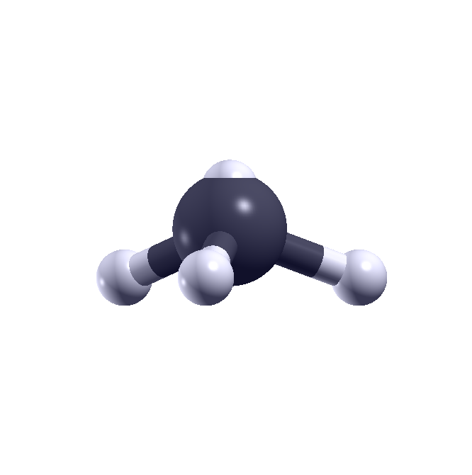
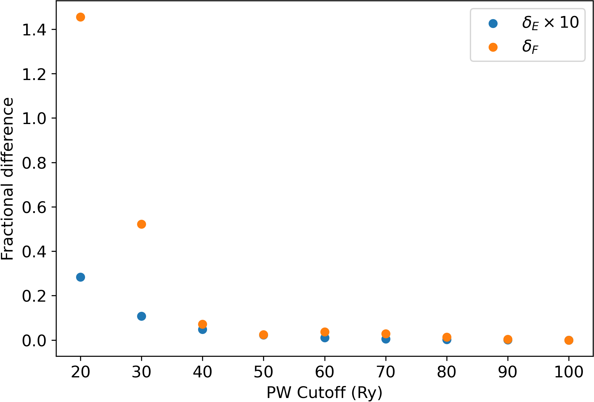
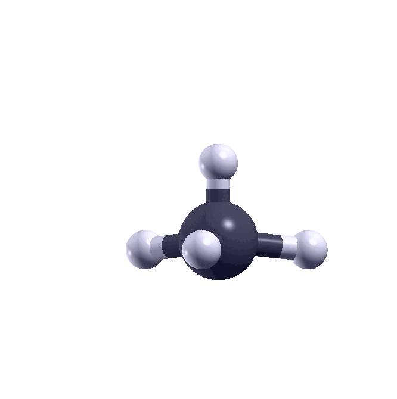
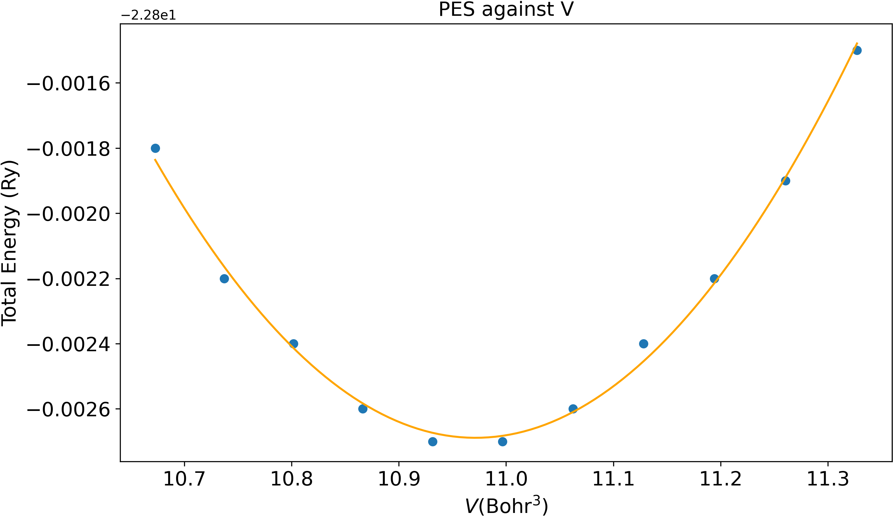

Structural Optimisation
===============================
This week, we will focus on predicting the atomic structure of materials and molecules. In particular, we will study techniques that allow us to find the atomic structure with the lowest energy. We will begin by briefly reviewing the very important concept of a potential energy surface (PES). 

## The potential energy surface
The potential energy surface (PES) gives the total energy of a molecule or crystal (excluding the kinetic energy of the nuclei, hence the name **potential** energy surface) as function of the nuclear positions. It is commonly denoted as $U(\{\mathbf{R}\})$, where $\mathbf{R}$ represents the set of nuclear positions. Many useful quantities, such as the forces acting on the nuclei or the stress in a crystal, can be calculated by evaluating the relevant derivatives of the PES.  

## Ground state structure of molecules 
The ground state structure of a molecule simply refers to the structure with the lowest total energy. This atomic structure is also called the optimal, equilibrium, or stablest structure of the molecule. Mathematically, this structure is associated with the **global** minimum of the PES. Therefore, the atomic forces in this structure will all vanish.  

Most DFT codes, like Quantum Espresso, move the nuclei by moving them in the direction of the forces that act on them until the atomic forces "vanish", i.e. become lower than some cutoff value. This process is called **relaxation** or **structural optimisation**. The resulting structure obtained from this procedure is called the relaxed structure. 

In the first part of the lab, we will demonstrate how to calculate the forces and find the optimal structure of a molecule in Quantum Espresso. 

!!! danger "Danger: metastable structures"
    When relaxing large molecules, there might be other **local** minima in the PES. These local minima are associated with atomic structures which are higher in the total energy, but the the forces also vanish. These structures are called **metastable** structures.

    When searching for the stablest structures using DFT, there is always a possibility that your calculation is "trapped" in one of these metastable structures. Whereas this is less likely to happen for small molecules, this can happen with large molecules. You will have to be careful! 

!!! Question
    How can we reduce the risk of mistaking a metastable structure as the ground state structure? 
    ??? success "Answer"
        After obtaining a relaxed structure, add some small (but not too small) random displacement to the nuclei and then redo the relaxation. If the displacement is sufficiently large, your structure can now relax to a different minimum of the PES. 

### Forces in molecules
The force acting on a nucleus, $\mathbf{F}$, is defined as the first derivative of the PES, $U$, with respect to the position of that nucleus, $\mathbf{R}$. Mathematically,
$$
\mathbf{F} = -\nabla_\mathbf{R} U.
$$

In following tasks, we will go through how the atomic forces are calculated in Quantum Espresso. We have prepared a distorted methane molecule, $\mathrm{CH_4}$, where one of the hydrogen atoms (the one sitting on the z-axis above the $\mathrm{C}$ atom) is pushed closer to the carbon atom than others. 

This is how the distorted methane molecule looks like. The white atoms are the hydrogen atoms, and the black atom is the carbon atom. Notice how the top hydrogen atom is so close to the carbon atom that it gets merged into the carbon atom in the visualisation.  

{width=400}

!!! example "Task 1 - Examining atomic forces in the output file"
    - Go to the directory `01_ch4_scf`. 
    - Read input file `CH4.in`. The most important section of the file is shown below. 
    ``` python 
     &CONTROL
        pseudo_dir = '.'  
        disk_io = 'none'  
        tprnfor = .true.   #(1)!
     /
    ...
    
    K_POINTS gamma         #(2)!

    ```
        1. `tprnfor` asks Quantum Espresso to print the forces.
        2.  We only use the $\Gamma$-point since we are modelling a molecule. 
    - Run the command `pw.x < CH4.in > CH4.out`.
    - When the calculation is finished, search the output file for the line saying `Forces acting on atoms`. This should be written just before the timing information. 

    - You should find a section that looks like the following: 
    ```python 
     Forces acting on atoms (cartesian axes, Ry/au):

     atom    1 type  1   force =     0.00015533    0.00000000  -22.80532399
     atom    2 type  2   force =    -0.00015700    0.00000000   22.78015891
     atom    3 type  2   force =    -0.04291717    0.00000000    0.00839216
     atom    4 type  2   force =     0.02145942    0.03717243    0.00838646
     atom    5 type  2   force =     0.02145942   -0.03717243    0.00838646

     Total force =    32.233898     Total SCF correction =     0.000310
    ```
    - Why are these atomic forces expected for this distorted methane molecule? 
    ??? success "Answer"
        Since the $\mathrm{H}$ atom (atom 2) above the $\mathrm{C}$ atom (atom 1) is pushed closer to the $\mathrm{C}$ atom, the covalent $\mathrm{C}-\mathrm{H}$ bond between these two atoms is compressed. The two atoms will repel each other to uncompress the bond. Atom 2 should experience an upward force and atom 1 should experience a downward force, and this pair should be approximately equal and opposite. This is indeed the case in the output file.  


    - What are the units of atomic forces in Quantum Espresso? 
    ??? success "Answer"
        Ry/Bohr. 1 Ry/Bohr is equivalent to 25.7 eV/Å, check this yourself!

    ??? Note  "Understanding the units better"
        In this task, the $z$-component of the force acting on the $\mathrm{H}$ atom is 22.80 Ry/Bohr. This means that moving the $\mathrm{H}$ atom along the positive $z$-direction by 0.01 Bohr reduces the total energy by about 0.28 Ry, or 3.81 eV. This is a large gain in energy. This is because the covalent bond is strong, and the size of compression is large. So pushing the H atom away from the C atom by any small amount will lead to a large gain in energy.  

!!! Note 
    The `Total force` listed here is the square root of the sum of _all_ of the force components squared

    $$
    F = \sqrt{\sum_{i\in\mathrm{atoms}}|\mathbf{F}_{i}|^2}     
    $$

    If the `Total SCF correction` is comparable to the `Total force` it usually means you need to try to better converge the SCF cycle (via `conv_thr`).

### Convergence test 
Just as we have to check the convergence of the total energy against the plane-wave cutoff, we have to check the convergence of the atomic forces against the plane-wave cutoff, too. Note that you might need a different cutoff to convergence the forces than for the total energy! To save a bit of time, we simply show you the result of such a convergence study for the methane molecule below. 

{width=400}

In the figure, $\delta_E=(E^{\mathrm{tot}}_{\mathrm{best}}-E^{\mathrm{tot}}_{\mathrm{PW_cutoff}})/E^{\mathrm{tot}}_{\mathrm{best}}$, the fractional difference in total energy you have calculated in lab 3, and $\delta_F=(F^{\mathrm{tot}}_{\mathrm{best}}-F^{\mathrm{tot}}_{\mathrm{PW_cutoff}})/F^{\mathrm{tot}}_{\mathrm{best}}$, the same fractional difference for the total force (we have scaled the energy curve by a factor of 10 for visual clarity). You will notice that the magnitude of $\delta_E$ is much smaller than that of  $\delta_F$. This shows that the total force converges slower with respect to the plane-wave cutoff than to the total energy. So if you want to find the stablest structure of a material or molecule, make sure the force is converged with respect to the plane-wave cutoff! 


<!-- !!! example "Task 2 - Examining convergence" 
    In this task, multiple input files of the same distorted methane molecule are prepared. Each input file is labelled by their PW cutoff. 
    
    - Go to the directory `02_ch4_convergence`. 


    - Similar to what you have done in Lab 3, make 9 copies of the input file `CH4_20.in` and name them `CH4_i.in`, where `i` runs from 30 to 100 in steps of 10. Edit each input file so that the value of `ecutwfc` is `i` Ry. 
    - Run `python3 ecutwfc_file_build.py` script to produce a list of input files. This script is very similar to the one used in Lab 3. This will create input files with PW cutoffs from 10 to 100 Ry.  
    
    - Use the script `tbd` to run `pw.x` to perform a DFT calculation for each input files.

    - Create a file named `data.txt` that records the values of PW cutoff in the first column, and the values of `Total force` in the second column. 
     - Run `bash ecutwfc_force.sh` to run all the `pw.x` calculations as in Lab 3. 

    - Which quantities are being plotted by the script for determining the convergence? 

    ??? success "Answer" 
        The script plots the fractional difference of the total force with respect to the best-converged total force $(F^{\mathrm{tot}}_{\mathrm{best}}-F^{\mathrm{tot}}_{i})/F^{\mathrm{tot}}_{\mathrm{best}}$.   
    
    - How does the convergence curves look like? 
    ??? success "Answer" -->  
    

### Optimisation of molecular geometry 
Now that we have seen how to calculate the forces associated with a particular atomic structure, we can use Quantum Espresso to optimise the structure of molecules.

!!! example "Task 2 - Optimising the molecular structure"
    - Go to the directory `02_ch4_opt`. 
    - Read the input file `CH4_opt.in`, the important parts are shown below. 
    ```python
     &CONTROL
        calculation = 'relax'   #(1)! 
        pseudo_dir = '.'
        disk_io = 'none'
        tprnfor = .true.
        forc_conv_thr = 1.0D-4    #(2)!
     /
    
     &SYSTEM
        ibrav =  1
        A = 20.0
        nat = 5
        ntyp = 2
        ecutwfc = 80
     /
    
     &ELECTRONS
     /
    
     &IONS        #(3)!
     / 
    ...
    ```
        1. Tells Quantum Espresso to carry out a structure optimisation.   
        2. Set convergence criterion for forces in units of Ry/Bohr.   
        3. You'll need to add an `IONS` section to the input. This is needed when `calculation=relax`. There are many other variables you can add for the IONS section. These include the algorithm of relaxation. If you are interested, you can read about it in the input description of `pw.x`.


    - Run `pw.x < CH4_opt.in > CH4_opt.out`.  
    - In the output file, navigate to the line that says `End of BFGS Geometry Optimization`. The important sections above the end of the output file are shown below. 
    ```python
     ...

     number of scf cycles    =  17  #(1)!
     number of bfgs steps    =  15  #(2)!
     
     ... 

     Forces acting on atoms (cartesian axes, Ry/au):

     atom    1 type  1   force =    -0.00000168    0.00000000    0.00000028   #(3)! 
     atom    2 type  2   force =     0.00000060    0.00000000    0.00009975
     atom    3 type  2   force =    -0.00001049    0.00000000   -0.00003770
     atom    4 type  2   force =     0.00000578    0.00000471   -0.00003116
     atom    5 type  2   force =     0.00000578   -0.00000471   -0.00003116

     Total force =     0.000116     Total SCF correction =     0.000046 

    ... 

     bfgs converged in  18 scf cycles and  15 bfgs steps  #(4)! 
        
    Begin final coordinates
    
    ... 

    ATOMIC_POSITIONS (angstrom)
    C                0.0000041368        0.0000000000       -0.1580814281
    H                0.0000879609        0.0000000000        0.9402289196
    H                1.0356035232        0.0000000000       -0.5241329179
    H               -0.5178483105       -0.8968828453       -0.5240072869
    H               -0.5178483105        0.8968828453       -0.5240072869
    End final coordinates #(5)!
    ```
        1. The latest number of scf cycles is shown after each scf cycle. 
        2. The latest number of relaxation steps is shown after each relaxation step. Here, a relaxation step is called a "bfgs step" in our calculation. This is just the name of our relaxation algorithm.
        3. The components of the force on each atom are almost zero. 
        4. The total number of scf cycles is 18, and the number of relaxation steps taken is 15. 
        5. Atomic coordinates of the relaxed structure. 
    

    ??? success "What is the equilibrium bond length?"
        By taking the difference between the $z$-coordinates of atoms 2 and 1, the bond length is found to be 1.10 Å. The experimental value is 1.09 Å so this is in good agreement. You can check that all the bond lengths are the same.  

The animation below visualises the motion of the atoms during the relaxation. You can clearly see how in the first step, the top hydrogen atom is pushed away from the carbon atom.   
{width=400}


## Ground state structure of crystals 
We have seen how the stablest structures of molecules can be determined by finding the atomic positions for which the forces vanish. In contrast to a molecule, the atomic structure of a crystal is specified by the atomic positions of the atoms inside the unit cell and also by the shape and size of the unit cell. To find the stablest atomic structure of a crystal, a few additional concepts are needed.

### Stress and pressure in crystals
Mathematically, the stress is a rank-2 tensor, i.e. a matrix, $\sigma_{ij}$, defined through the relation  

$$
F_{i} =  \sigma_{ij}\epsilon_{j}
$$

??? tip "Tip: what does stress measure and why is it a matrix?"
    Stress is the ratio between the $i$-th component of the induced force (e.g. this could be the $x$-component), $F_{i}$, due to a deformation along the $j$-th direction (e.g. in the $x$- or $z$-direction), $\epsilon_{j}$. So it measures how favourable or unfavourable it is to distort the crystal along a certain direction in terms of the induced force along different directions. 

    This is also why it is a matrix, you need to specify two pieces of information before reading the stress tensor. You need to decide which distortion direction, and which component of the induced force you would like to know from the stress tensor. 

Whereas stress describes the force induced on a crystal due to a distortion along a certain direction, the pressure, $P$, of a crystal measures the change in total energy due to contraction or expansion. The pressure is defined as the negative of the derivative of the PES with respect to the volume, $V$. It measures the tendency of the crystal to expand or contract. Mathematically,  

$$
P = -\frac{dU}{dV}.
$$

??? tip "Tip: what does it mean to have a structure with a negative or positive pressure?"
    If the pressure is negative, the crystal structure is unstable and will contract. If the pressure is positive, the crystal structure is also unstable but it will expand. The structure is only stable when the pressure is close to zero, as first derivatives of the PES vanish at the equilibrium structure.  

Having introduced these useful quantities, we can try to calculate these quantities using Quantum Espresso. In the following tasks, we will look at carbon diamond. The unit cell of this crystal contains two carbon atoms. We will first run a single-point calculation for this crystal.  

!!! example "Task 3 - calculating stress and pressure of crystals"
    - Go to the directory `03_cd_strpr`. Read the input file `CD_scf.in`. The important parts are shown below.  
        ```python 
         &CONTROL
            pseudo_dir = '.'
            prefix = 'CD'
            disk_io = 'low'
            tprnfor = .true.
            tstress = .true.    #(1)!
         /
        
        ... 

        ATOMIC_POSITIONS crystal   #(2)!
         C 0.00 0.00 0.00
         C 0.25 0.25 0.25
        
        K_POINTS automatic        #(3)!
        8 8 8 0 0 0
        
        ```
        1. This tells Quantum Espresso to print the stress.  
        2. Fractional (or crystal) coordinates are used to specify the atomic positions.      
        3. A k-grid must be specified since we are modelling a crystal.    

    - Run `pw.x < CD_scf.in > CD.out`. 
    - Once the job has finished, look for the line saying "total   stress" in the output file. You should see something like this:
        ```python 
             Computing stress (Cartesian axis) and pressure
        
                  total   stress  (Ry/bohr**3)                   (kbar)     P=     1325.29
           0.00900912  -0.00000000   0.00000000         1325.29       -0.00        0.00
           0.00000000   0.00900912   0.00000000            0.00     1325.29        0.00
           0.00000000   0.00000000   0.00900912            0.00        0.00     1325.29
        ```
    
    - What are the units for the stress tensor?
    ??? success "Answer"
        Ry/Bohr^3. The dimension of this unit is energy per volume, which is the same dimension as pressure. 

    - What is the total pressure? 
    ??? success "Answer"
        1325.29 kbar. Note that kbar is one of the common units for pressure.  

    - Is the lattice constant optimised? Why? If not, does it want to expand or contract? 
    ??? success "Answer"
        No. The evidence is that $P$ is 1325.29 kbar, which is very large (atmospheric pressure is only 1 bar). Since the sign is positive, the lattice wants to expand. 

    !!! note "Note"
        When simulating molecules (or 2D crystals), we use a large supercell with lots of vacuum to avoid artificial interactions between periodic images. When you calculate the stress for such a supercell, you often find that it is large and negative along the direction which separates the periodic images. Of course, this stress is not physically meaningful and should be ignored.  

### Optimizing lattice parameters of unit cells
We will now carry out the structural optimisation in carbon diamond to find the equilibrium lattice parameter.      
!!! note "Note on choice of plane-wave cutoff"
    Keep in mind that you might need a higher plane-wave cutoff to converge the force or the stress (as we saw at the start of this lab). Also, the number of plane waves in your calculation depends on the unit cell volume. So if during the course of the calculation we change the unit cell volume, we also change the number of plane waves; or if we fix the number of plane waves, we are changing the plane-wave cut-off (Quantum Espresso does the latter, but different DFT codes handle this differently). So you need to be quite careful when optimizing lattice vectors.

!!! example "Task 4 - Optimising the unit cell"
    - Go to the directory `04_cd_opt` and read the input file `CD_opt.in`. You'll notice in addition to the inputs mentioned, there's also a fairly high energy cut-off, and we've lowered the SCF convergence threshold from the default. Run this now with `pw.x`.
    ```python 
     &CONTROL
        pseudo_dir = '.'
        prefix = 'CD'
        disk_io = 'low'
        calculation = 'vc-relax'    #(1)!
        etot_conv_thr = 1.0D-9     #(2)!
        forc_conv_thr = 1.0D-6     #(3)!
     /
     ...
     &IONS              #(4)!
     /
    
     &CELL     #(5)!
     /
    ``` 
        1. Tells Quantum Espresso to do a variable-cell (vc) relaxation. 
        2. The energy tolerance is stricter than usual. 
        3. Specifies the force tolerance. 
        4. The IONS section is needed for vc-relaxation too.  
        5. The CELL section is also needed for vc-relaxation.  

    - Now inspect the output file. It is very similar to the one for relaxing molecules in task 3. The most important section of the output file is shown below. 
    ```python
    Begin final coordinates
         new unit-cell volume =     73.86018 a.u.^3 (    10.94495 Ang^3 )
         density =      3.64456 g/cm^3
    
    CELL_PARAMETERS (alat=  6.23609621)  #(1)!
      -0.534007441  -0.000000000   0.534007441 
      -0.000000000   0.534007441   0.534007441
      -0.534007441   0.534007441   0.000000000
    
    ATOMIC_POSITIONS (crystal)
    C               -0.0000000000        0.0000000000       -0.0000000000
    C                0.2500000000        0.2500000000        0.2500000000
    End final coordinates
    ```
        1. Quantum Espresso expresses the Cartesian components of the new lattice vectors in units of the original lattice parameter $a_0$ (called `alat` here). See the tip box below for how to calculate the new lattice constant.   

    ??? success "Tip on calculating the new lattice constant" 
        The most general way to do this is to calculate the magnitude of each lattice vector. For example, the lattice constant along $\mathbf{a}_1$ is $a_0\times\sqrt{a_{1x}^2+a_{1y}^2+a_{1z}^2}$. Here $a_{1x}=-0.534$, $a_{1y}=0$, $a_{1z}=0.534$, and $a_0=6.236$ Bohrs. Using this method for the remaining two lattice vectors, you should find that the lattice constants are the same along the three directions.  
	
        However, for `ibrav=2`, there is a simpler way. You can simply calculate the ratio of the new and old Cartesian components of the lattice vectors, and multiply that by the original lattice constant. For example, $a_{1x}^{\mathrm{new}}/a_{1x}^{\mathrm{old}}\times a_0$, here $a_{1x}^{\mathrm{old}}=-0.5$. 
     


    - What is the final lattice constant? 
    ??? success "Answer" 
        Using any of the methods from the tip box, the new lattice constant is 6.66 Bohrs, which is 3.53 Å. This is in excellent agreement with the experimental value of 3.57 Å (from Wikipedia).  
        

    - How can you check if the lattice parameter is fully relaxed? 
    ??? success "Answer" 
          The pressure is 0.32 kbar, which is very small.  

!!! warning "A word on the final pressure in the output file" 
    The final pressure at the end of the optimisation might appear large occasionally. This is because Quantum Espresso uses the basis set for the original input unit cell to calculate the pressure of the relaxed unit cell. However, if your cell has changed drastically, the adequate basis set for the relaxed unit cell should be recalculated based on the new lattice constant. So you should run a new scf calculation in that case. The artificial pressure due to the inadequacy of the plane-wave basis size is called the Pulay stress. You can look it up if interested.
 


### Bulk modulus of crystals 
From the PES, we can calculate the bulk modulus, B, which measures how difficult it is to compress the material. Mathematically, it is defined as the negative of the second derivative of the PES with respect to volume multiplied by the volume:  

$$
B = -V\frac{d^2U}{dV^2}.
$$

Whereas Quantum Espresso prints the stress and pressure for you, it does not automatically calculate the bulk modulus. You will need to distort the unit cell volume manually yourself and run multiple `pw.x` calculations to obtain the PES as function of the unit cell volume. In particular, you will need to change the cell parameter `A` to change the cell volume. Let's do this in the following task. 

!!! example "Task 5 - calculating the bulk modulus using the PES"
     - Go to the directory `05_cd_bm`. You should find an input file called `CD_0.000.in`. This is the reference input file representing a diamond structure with a relaxed lattice parameter.  

     - Create 9 copies of this input file, named `CD_i.in`, where `i` runs from -0.01 to 0.01 in steps of 0.002. Here `i` is going to be the fractional change in the lattice constant. 

     - Edit the lattice constant in each input file so that the new lattice constant is $A'=(1+i)A$.
     
     - Run `pw.x` for each `CD_i.in`. Note that we carry out a relaxation for each unit cell volume because in principle the equilibrium positions of the atom can be different for different lattice constants.  
     
     - After the jobs are finished, create a file named `data.txt`, with the first column containing all the unit cell volumes $V$ in Bohr^3, and the second column containing the total energies in Ry. 

        ??? success "Tip on the finding the unit cell volume"
            The unit cell volume is provided in the line `unit-cell volume`. The units are in Bohr^3. 

    - Run `python3 BULK_MOD.py`. If you are interested, you can read the code and check out the unit conversions involved in expressing the bulk modulus in units of GPa. This should produce a graph, with a parabola fitted to it and print out a line that says "The bulk modulus is ... GPa."

    - What does the PES look like? 
       
        ??? success "Answer"
            {width=600,align=center}

    - How is the bulk modulus calculated? What is its value for this structure? 
       
        ??? success "Answer"
            A parabola with the equation $ax^2+bx+c$ is first fitted to the data points. The second derivative of this parabola is then simply $2a$. Therefore, the bulk modulus per volume at this structure is $-2aV_{0}$. Here $V_0=\frac{1}{2^{3/2}}A_0^3$ with $A_0=3.53Å$. The bulk modulus obtained from the code is -459 GPa. Compared to a literature value of -443 GPa (from Wikipedia), this is in very good agreement. 

    - Read the output file for `i`=0.01. How many relaxation steps does it take for the calculation to finish? 

        ??? success "Answer"
            None. In this particular setup, through the use of fractional coordinates, the carbon atoms are guaranteed to sit at the high-symmetry positions, so that the net force acting on them vanishes. So for any given volume, the atomic positions are already relaxed. In fact, if you read any other output file, the number of bfgs steps should also be 0.  
            

 <!--    ??? tip "Tip on constrained relaxations"
        In the input file shown just now,we have constrained the relaxation to moving one specific component of a specified lattice vector. Constraints like this is very useful especially for low-dimensional systems. If you are interested in what Quantum Espresso can can constrain for you, you can read the input description of `pw.x`. -->  


----------------------------------------------------------------------------------
## Summary

In this lab we have seen:

- How to calculate atomic forces, stress, and pressure in Quantum Espresso. 

- How to check if the forces have converged.

- How to optimise the structure of molecules, atomic positions in a crystal, and the lattice parameter of a crystal. 

- How the PES allows us to estimate the bulk modulus.

