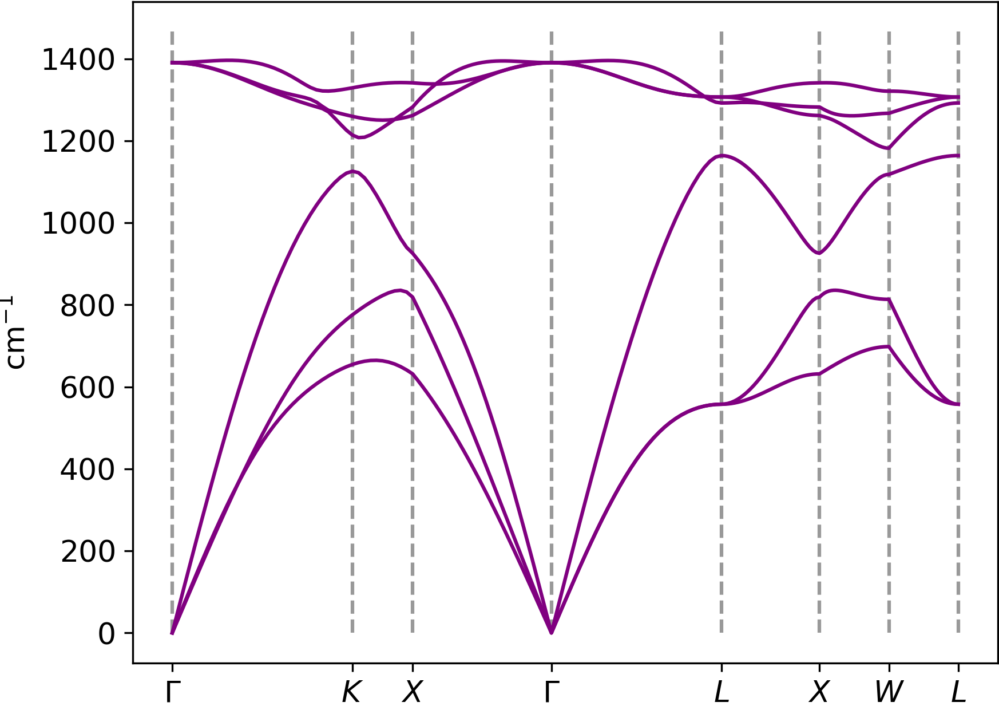

# Vibrational Normal Modes and Phonons
This week we will calculate the vibrational properties of molecules and solids. 

As you have seen in the lecture, the different vibrations that can be observed in molecules and crystals as well as their frequencies can be obtained from the potential energy surface (PES). More specifically, we can expand the PES in a Taylor series around the equilibrium atomic positions and then solve Newton's equation of motion. This procedure involves two important concepts: the force constant matrix and the dynamical matrix. 

Similar to last week, we will give a brief review of these matrices and why they are useful. Then we will learn how to calculate these quantities using Quantum Espresso. Let's now begin our dive into vibrations in molecules. 

## Vibrations in molecules: basic theory
When molecules are excited (e.g. by absorbing infrared radiation or by heating), they gain energy and the atoms start to vibrate around their equilibrium position. 

### Force constant matrix 
The change in total energy due to a small displacement of the atoms around their equilibrium positions, $\Delta U$, can be written as,  
$$
\Delta U = \frac{1}{2}\sum_{I\alpha J\beta} K_{I\alpha J\beta}u_{I\alpha}u_{J\beta},
$$
where $u_{I\alpha}$ denotes the $\alpha$-component of the displacement vector of the atom labelled by $I$. The matrix $K_{I\alpha J\beta}$ is called the force constant matrix. It is defined by the equation 
$$
K_{I\alpha J\beta} = \frac{\partial^2 U}{\partial u_{I\alpha}\partial{u_{J\beta}}}.
$$
Note that $I$ and $J$ both run from $1$ to $N$, where $N$ is the number of atoms in the molecule, and $\alpha$ and $\beta$ run from $1$ to $3$, with the convention $x\rightarrow1, y\rightarrow2, z\rightarrow3$.

??? tip "Tip on understanding the indices of $\mathbf{K}$"
    We can understand the indices of the matrix $\mathbf{K}$ by thinking about its physical meaning. It is called the force constant matrix because its components describe the $\alpha$-component of the force acting on nucleus $I$ generated by the motion of nucleus $J$ along direction $\beta$. 

??? tip "Tip on writing down $\mathbf{K}$ as a two-dimensional matrix"
    The matrix $\mathbf{K}$ can be written as a two-dimensional matrix although its entries are labelled by four indices. We can combine the indices into two pairs: $\{I\alpha\}$ and $\{J\beta\}$. In this way we can write $\mathbf{K}$ as a $3N\times3N$ matrix, where $N$ is the number of atoms and the factor of 3 comes from the fact that there are three Cartesian directions, $\{x,y,z\}$.

??? question "Optional quick quiz - for your own understanding"

    !!! question "What does the entry $K_{1123}$ physically mean?" 
        ??? success "Answer"
            It is the force acting on atom 1 along the $x$-direction when atom 2 (and only atom 2) moves along the $z$-direction 
    
    !!! question "What does the entry $K_{1111}$ physically mean?"
        ??? success "Answer"
            It is the $x$-component of the force experienced by atom 1 when it moves along the $x$-direction. In most cases this should be positive because atom 1 should experience a restoring force that drives it back to the equilibrium position.  

<!--!!! note "The force constant matrix is a symmetric matrix"-->

The force constant matrix is useful for calculating the change in the total energy change due to a displacement of the atoms. However, it is not directly related to vibrational properties.

### Dynamical matrix 
To calculate the vibrational properties, we need another matrix, the dynamical matrix.  

To obtain vibrational properties, we have to solve the following matrix eigenvalue problem:
$$
\omega^2\mathbf{v}=\mathbf{D}\mathbf{v}, 
$$
where $v_{I\alpha}=\frac{1}{\sqrt{M_I}}u_{I\alpha}$ are the mass-weighted displacements, $\omega$ denotes the vibration frequency, and the matrix $\mathbf{D}$ is the dynamical matrix given by 

$$
D_{I\alpha J\beta}=\frac{1}{\sqrt{M_I M_J}}K_{I\alpha J\beta}. 
$$

??? tip "Tip: what is the physical meaning of the entries of $\mathbf{D}$?"
    The physical meaning of the entries of $\mathbf{D}$ becomes evident when we compare the eigenvalue equation for vibrations to that of a one-dimensional classical spring-mass oscillator, with spring constant $k$ and mass $m$, which is 
    $$
    \omega^2x=\frac{k}{m}x,
    $$
    where $x$ is the displacement and $\omega$ is the oscillation frequency. By comparing this equation to $\omega^2\mathbf{v}=\mathbf{D}\mathbf{v}$, we see that $\mathbf{D}$ plays the same role as $k/m$ - it measures the ratio of the strength of the spring constant of the atomic forces to the mass of the vibrating object. 


## Vibrations of molecules with Quantum Espresso
Density-functional theory can be used to calculate the dynamical matrix $\mathbf{D}$ of molecules. Quantum Espresso uses density-functional perturbation theory (DFPT) to do this. 
We first calculate the vibrational properties of a methane molecule. You will learn how to use the programme `ph.x` for calculating the normal modes of a molecule. This calculation requires two steps:

### Step 1: run the `pw.x` calculation

The first step is to carry out a standard DFT calculation for the equilibrium structure of methane. 
!!! example "Task 1a - run `pw.x`"

    - Read the input file `01_CH4_scf.in`. You should be familiar with all the input variables.  
    ```python 
    ATOMIC_POSITIONS angstrom
     C  0.0           0.0           0.0
     H  0.634532333   0.634532333   0.634532333  #(1)!
     H -0.634532333  -0.634532333   0.634532333
     H  0.634532333  -0.634532333  -0.634532333
     H -0.634532333   0.634532333  -0.634532333
    
    K_POINTS automatic
    1 1 1  0 0 0   #(2)!
    ```
        1. The positions of the $\mathrm{H}$ atoms have been relaxed. We provide the atomic positions in a very symmetric way. This is useful for Quantum Espresso as it can exploit the symmetries of molecules to speed up the calculation. See extra notes below to learn more about this if you are interested.  
        2. As we are dealing with a molecule, we only use the $\Gamma$-point.
     
    - Now run `pw.x < 01_CH4_scf.in > pw.out`.

### Step 2: run the `ph.x` calculation
The second step is to carry out the DFPT calculation using `ph.x`. 

!!! example "Task 1b - run `ph.x`"
    - Take a look at the input file for the `ph.x` module. It is called `02_CH4_ph.in`:
    ```bash 
        phonons of CH4 (gamma only)  #(1)!
         &INPUTPH   #(2)!
          tr2_ph = 1.0d-15  #(3)!
          asr = .true.   #(4)!
         /
        0.0 0.0 0.0    #(5)!
    ```
        1. The first line can be any informative comment. 
        2. This is a new card required for performing `ph.x` calculations
        3. This is the scf convergence criterion for this normal mode calculation. Notice that it is very strict compared to what we usually use in standard DFT calculations.  
        4. 'asr' stands for the Acoustic Sum Rule. This rule is used to correct the dynamical matrix in order to avoid negative vibration frequencies. This will be explained at the end of the lab if you are interested. 
        5. This tells the code the wavevector of the vibrations. As we are dealing with a molecule, we are only interested in the $\Gamma$-point.

    !!! warning "Help file of `ph.x`"
        If you are interested in the input variables of `ph.x`, you can read about them   [here](https://www.quantum-espresso.org/Doc/INPUT_PH.html)

    - Run `ph.x < 02_CH4_ph.in > ph.out`. This will take a few minutes. 

    - You have successfully performed your first vibrational calculation!  

### Output files of ph.x 
There are two important output files created by the `ph.x` calculation. The first one is the `.out` file, which provides some information about the DFPT calculations. The second file is the `matdyn` file which contains the dynamical matrix. Let's take a look at it!  

!!! example "Task 2 - Reading the dynamical matrix from Quantum Espresso"
    - The most important section of the file begins with ` Dynamical  Matrix in cartesian axes`. 


    - Let's go through this file step by step:  
    ```python
         q = (    0.000000000   0.000000000   0.000000000 ) #(1)!
    
         ... 

        1    2  #(2)! 
     -0.24917799   0.00000000    -0.17192431   0.00000000    -0.17192431   0.00000000  #(3)! 
     -0.17192431   0.00000000    -0.24917799   0.00000000    -0.17192431   0.00000000  #(4)!
     -0.17192431   0.00000000    -0.17192431   0.00000000    -0.24917799   0.00000000  #(5)!
         
         ... 
    
         Diagonalizing the dynamical matrix
    
         q = (    0.000000000   0.000000000   0.000000000 ) 
    
     ************************************************************************** #(6)! 
         freq (    4) =       2.365513 [THz] =      78.905014 [cm-1] #(7)!
     (  0.000000  0.000000  0.000092  0.000000  0.000000  0.000000 ) #(8)!
     ( -0.353554  0.000000  0.000093  0.000000  0.353553  0.000000 ) #(9)!
     ( -0.353554  0.000000  0.000093  0.000000 -0.353553  0.000000 ) 
     (  0.353554  0.000000  0.000093  0.000000  0.353553  0.000000 ) 
     (  0.353554  0.000000  0.000093  0.000000 -0.353553  0.000000 ) 
    ```
        1. This tells us the wave vector of the vibration. Here, this is the $\Gamma$ point. 
        2. The matrix shown below is $D_{1{\alpha}2{\beta}}=\frac{1}{\sqrt{M_{1}M_{2}}}K_{1{\alpha}2{\beta}}$, i.e. the dynamical matrix associated with the displacements of atoms 1 and 2 along Cartesian directions $\alpha$ and $\beta$. 
        3. These entries are $D_{1x2x}$, $D_{1x2y}$, and $D_{1x2z}$, respectively. The entries in the second, fourth, and sixth columns are the imaginary parts of the dynamical matrix.  
        4. These entries are $D_{1y2x}$, $D_{1y2y}$, and $D_{1y2z}$, respectively. 
        5. These entries are $D_{1z2x}$, $D_{1z2y}$, and $D_{1z2z}$, respectively. 
        6. The results obtained from diagonalizing the dynamical matrix can be found below this line. 
        7. The vibration frequency of the fourth normal mode. 
        8. The polarization vector of each atom in the fourth normal mode. This line says that the polarization vector of the C atom (i.e. atom 1) is (0,-0.447,0). The numbers in the second, fourth, and sixth columns are the imaginary parts of the polarization vector. 
        9. Similar to the previous line, this line says that the polarization vector of one of the H atoms (atom 2) is (0,-0.447,0). 

    - So everything you want to know about the normal modes of a molecule will be contained in the `matdyn` file. Answer the following questions by reading this file. 

    ??? success "How many normal modes are there? Is this what we should expect?"
        15, since there are 15 frequencies in the file. This is expected because there are 5 atoms so the number of normal modes is $5\times3=15$.  

    ??? success "What are the **distinct** frequencies (up to 2 decimal places)?"
        The distinct frequencies are 0.01 THz, 2.37 THz, 37.37 THz, 44.29 THz, 87.07 THz, and 90.89 THz. Note that there are always three normal modes with nearly zero frequencies. 

    ??? success "What are the degeneracies of each distinct frequency?"
        In the order of increasing energy, the degeneracies (i.e. the number of normal modes with the same frequency) are 3, 3, 3, 2, 1, 3. One finds such degeneracies in molecules that have a symmetrical shape. 

!!! note "Visualising the normal modes"
    If you are interested in how the normal modes look like, you can visit this [link](https://people.chem.ucsb.edu/laverman/GauchoSpace/methane_vib.html). On this website, you can see all the different vibrations of the methane molecule. These vibratyional frequencies should be close to what you have obtained in Task 1b.  
    You will see symbols like $T_2$ and $A_1$ next to each mode. These symboles are intended for vibrational spectroscopists to identify the normal modes. 
    Notice how the degenerate normal modes have the same symbols and very similar vibration patterns.

??? tip "Extra notes - why do the three lowest normal modes always have zero frequency?"
    These normal modes corresponds to the rigid translations of the molecule, i.e. movements of the molecule without distorting any chemical bonds. If no bonds are distorted, the molecule will not vibrate and the vibrational frequency should be zero. You can inspect the polarization vectors of these normal modes: there are the same for all atoms. In fact, the three modes are simply rigid translations along the $y$, $x$, and $z$-directions, respectively.   

<!--??? notes "Extra notes: reading `ph.out` file" -->
<!--    The `ph.out` file contains quite a few information. Most of them are for your reference only and will be more useful for vibrational spectroscopy experiments. The following is what you will find: -->
    
<!--    1.  The frequencies of each normal mode in THz and $\mathrm{cm^{-1}}$. This is the most important for us. This will be written for example as `freq (    7) =      37.362598 [THz] =    1246.282111 [cm-1]`. -->
<!--    2.  The iterations performed for the DFPT calculations. This will be useful for monitoring and improving convergence of the calculations. -->
<!--    3.  The symmetry of each normal mode. This is more relevant for vibrational spectroscopy. This will be written for example as `freq (   7-   9) =       1246.3  [cm-1]   --><!-- T_2  G_15 P_4   I+R`. -->
    
<!--        ??? tip "Extra notes: what does the symbols `T_2  G_15 P_4   I+R` mean? (For your interest only)" -->
<!--            The first symbol tell us the degeneracy of this normal mode. The symbols `G_15 P_4` is the label of this normal mode in a language familiar to vibrational spectroscopists. Lastly, the symbol `I+R` tells us that both **I**nfrared and **R**aman spectroscopy can detect this normal mode.  -->
??? tip "Extra notes - symmetry reduction in Quantum Espresso"
     Quantum Espresso can exploit the symmetries of the molecule to reduce the number of the (rather costly) DFPT calculations: by placing the center of the molecule at the origin and giving the H atoms the same $x,y$ coordinates except for the sign, the code understands that the methane molecule has certain rotational symmetries. Quantum Espresso uses this knowledge and only calculates the derivatives of the total energy with respect to one of the hydrogen positions (instead of all four of them). Quantum Espresso prints out the symmetries it has found in `ph.out`. 
        
    
<!--    4.  The number of normal modes identified, and some information on how the frequency of that normal mode is calculated. This is really for reference only. You will see something like `Representation     7      1 modes - Calculated using symmetry` -->


## Vibrations in crystals: basic theory
Similar to electrons in crystals (whose wavefunctions are described by Bloch's theorem), vibrations in crystals have a wave-like character. Each vibration in a crystal is described by two labels: its wavevector $\mathbf{q}$ and its band index $\nu$ (similar to electrons in crystals which are described by a wavevector $\mathbf{k}$ and a band index $n$). The wavevector describes the propagation direction of the vibration and its spatial periodicity. The magnitude of the wavevector is given by
$$
q=\frac{2\pi}{\lambda},
$$
where $\lambda$ is the wavelength of the vibrational wave. These vibrational wave are often called phonons. 

Similar to the band structure of electrons in a crystal, the frequencies $\omega_\nu(\mathbf{q})$ of phonons give rise to a band structure. 


## Vibrations in crystals: Quantum Espresso (overview)
We will now learn how to calculate phonon band structures using Quantum Espresso. This requires the calculation of the dynamical matrix for a set of wavevectors $\mathbf{q}$ in the first Brillouin zone. As these calculations are quite time-consuming, Quantum Espresso uses a few numerical tricks (such as performing calculations for the force constants on a coarse grid of $\mathbf{q}$-points and then interpolating to a finer grid). This requires a few additional steps compared to the calculation for a molecule.

The calculation has five stages: 

1. Perform a self-consistent calculation of the electrons density and the Kohn-Sham wavefunctions. The module for this is `pw.x` as usual. 
2. Calculate the dynamical matrix on a coarse grid of wavevectors. The module for this is `ph.x`, which is the one we have used for molecules. 
3. Obtain a set of force constant matrices $\mathbf{K}(\mathbf{R})$ in real space by Fourier transforming the dynamical matrices $\mathbf{D}(\mathbf{q})$ obtained in the last step. The module for this is `q2r.x`.  
4. Obtain the dynamical matrix over a denser grid of wavevectors by Fourier interpolation. The module for this is `matdyn.x`.
5. Generate the phonon band structure plot. This will be done using Python. 

## Vibrations in crystals: Quantum Espresso (calculation)
We will now go through the calculations using carbon diamond as an example. 

### Step 1: run the `pw.x` calculation
!!! example "Task 4a - run `pw.x`"
    - Read the input file `01_CD_scf.in`. 
        - Again the variable `ecutrho` is set tighter. 
        - The prefix is defined explicitly as `'CD'`. This is useful when you run multiple calculations in different directories.
        - All other variables should be familiar to you.  
    - Run `pw.x < 01_CD_scf.in > pw.out`. 
    - The other output files generated will be in the `CD.save` directory since we specified the prefix.

### Step 2: run the `ph.x` calculation 
!!! example "Task 4b - run `ph.x`"
    - Read the input file `02_CD_ph.in`.
    ```bash 
    phonons of Carbon diamond on a grid 
     &INPUTPH
      prefix = 'CD',         #(1)!
      asr = .true.           #(2)! 
      ldisp = .true.         #(3)!
      nq1=4, nq2=4, nq3=4    #(4)!
      /
    ```
        1. We have specified the same prefix as in the scf input file.
        2. Use the acoustic sum rule.
        3. `ldisp = .true.` tells Quantum Espresso to perform dynamical matrix calculation over a grid of q-points.
        4. `nq1`, `nq2` and `nq3` define our q-point grid. This is the coarser grid. 
    - Run `ph.x < 02_CD_ph.in > ph.out`. This will take a few minutes. 
    - The calculation produces a number of dynamical matrices. They have the same format as the `matdyn` file for the methane molecule. The file also contains information about the $\mathbf{q}$-points at which the dynamical matrix is evaluated. 
    - Note that one file can contain dynamical matrices of several $\mathbf{q}$-points if these $\mathbf{q}$-points are related by a symmetry of the crystal. 

### Step 3: run the `q2r.x` calculation
Next we will generate the real-space force constants from the dynamical matrices calculated on a coarse grid in the first Brillouin zone using the `q2r.x` module.

!!! example "Task 4c - run `q2r.x`"
    !!! warning "Help file of `q2r.x`"
        If you are interested in the input variables of `q2r.x`, visit this [link](https://www.quantum-espresso.org/Doc/INPUT_Q2R.html) for the help file. 

    - Read the `03_CD_q2r.in` input file. 
    ```bash
     &input
       fildyn = 'matdyn'     #(1)!
       zasr = 'simple'       #(2)!
       flfrc = 'CD444.fc'    #(3)! 
     /
    ```
        1. `fildyn` is the name of the file for reading the dyamical matrices obtained from `ph.x`. 
        2. `zasr` decides how the acoustic sum rule is enforced. If the ASR is not enforced, the lowest frequency phonons at the $\Gamma$-point will not have zero frequencies (as they should).   
        3. `filefrc` specifies the output file name.
    
    - Run `q2r.x < 03_CD_q2r.in > q2r.out`. This will run almost instantly.
    - This calculation produces the output file `CD444.fc` containing the force constant matrix for each pair of atoms in a 4x4x4 supercell. So this is $K(\mathrm{R})$. 


### Step 4: run the `matdyn.x` calculation
Now we want to use this to generate phonon band structure of diamond. For this, we will use the `matdyn.x` code.

!!! example "Task 4d - run `matdyn.x`"
    !!! warning "Help file of `matdyn.x`"
        If you are interested in the input variables of `matdyn.x`, visit this [link](https://www.quantum-espresso.org/Doc/INPUT_MATDYN.html).

    - Read the input file `04_CD_matdyn-bands.in`.
    ```bash 
     &input
        asr = 'simple'            #(1)!
        flfrc = 'CD444.fc'        #(2)!
        flfrq = 'CD-bands.freq'   #(3)!
        dos=.false.               #(4)!
        q_in_band_form=.true.     #(5)!
     /
    8   #(6)!
     0.000 0.000 0.000 30   #(7)! 
     0.375 0.375 0.750 10
     0.500 0.500 1.000 30
     1.000 1.000 1.000 30
     0.500 0.500 0.500 30
     0.000 0.500 0.500 30
     0.250 0.500 0.750 30
     0.500 0.500 0.500 0
    ```
        1. `asr` tells the code to enforce the acoustic sum rule.
        2. `flfrc` to  give it the name of the file with the real-space force constants from the `q2r.x` calculation.
        3. `flfrq` to give it the name of the output file to store the calculated frequencies.
        4. `dos=.false.` tells the code we're not calculating the density of states 
        5. `q_in_band_form=.true.` tells the code we want to calculate bands between high-symmetry points.
        6. The number of high-symmetry points on the path. 
        7. The list of high-symmetry points with the number of points to calculate along each line, in the same way as we did for the electronic band structure.
    
    - Run `matdyn.x < 04_CD_matdyn-bands.in > matdyn.out`. Again, this is very fast.
    - The code generates the output files `CD-bands.freq` and `CD-zands.freq.gp`. Both of which contain the frequencies along the path we requested.
    
### Step 5: plotting the phonon band structure 
Finally, we want to generate a graph of these frequencies. For this, we will use the output file `CD-bands.freq.gp` which contains frequencies in units of cm-1.

!!! example "Task 5 - plotting the phonon band structure"
    A python script `PHONON_BAND.py` has been provided for generating the phonon band structure. If you are interested in how the plotting is done, you can read the script. 

    ??? success "What does the phonon band structure look like?"
         
        <figure markdown="span">
          {width=300}
        </figure>

    ??? success "How many normal modes are there at each q-point?"
        There are 2 atoms in the unit cell so there are $3\times2=6$ normal modes. 

    <!--??? success "Inspect the phonon band structure along $\Gamma-L$, which two phonon bands become degenerate?"-->
    <!--    The two lowest energy phonon bands. Degenerate bands tend to appear in crystals with some symmetry. -->

    <!--??? success "Near which q-point do the three lowest energy phonon bands become approximately linear?" 
        The $\Gamma$ point. In 3D crystals, the three lowest energy phonon bands always become linear near the $\Gamma$ point. If this is not the case, you might need to increase the PW cutoff or k(q)-point sampling in `pw.x` and `ph.x`. -->

    <!--??? tips "Extra notes: use of plotband.x (for the interested)"
        It can be easier to use the `plotband.x` tool to help generate a plot. The steps are as follows:  
        1. Call this with `plotband.x < CD-bands.freq`.  
        2. This will then ask you for an Emin and Emax value - you should pick values equal to or below and above the numbers it suggests.  
        3. Then it will ask you for an output file name. Pick "CD-bands-gpl.dat" here.  
        4. You can then cancel further running of this code with `ctrl+c`. Note it has output the location of the high-symmetry points along its x-axis. -->

!!! example "Task 6 - visualising the phonons"
    - Go to the [website](https://interactivephonon.materialscloud.io/). This is a website for visualising phonons.

    - Use `01_CD_scf.in` for the 'pw.x input file', `pw.out` for the 'pw.x output file', and `matdyn.modes` files for 'matdyn.modes file (generated by matdyn.x)'. 

    - Click 'Calculate phonon dispersion' and the visualisation should come up. 
	
    - You can select the phonon mode to visualise by clicking on the phonon band structure on the right. 

    - Now click on the lowest phonon band at the $\Gamma$ point. Firstly, you will notice that the frequencies of the three lowest phonon bands become zero. Secondly, all atoms move in-phase. These three lowest phonon modes are called **acoustic modes**. 

    - Now click on the highest phonon band at the $\Gamma$ point. You will notice how the atoms in each unit cell move in anti-phase. These phonon modes are called the **optical modes**. 

    - In both cases above, you will notice that periodicity of the atomic displacements is one unit cell. This is because we are at the $\Gamma$ point.
    
    - Now click on any other phonon away from the $\Gamma$ point. Notice how there is now a modulation of the amplitude from one unit cell to another. You can increase the number of supercells to fully visualise the phonon. 


------------------------------------------------------------------------------

Summary
-------

In this lab we have seen

- how to use the `ph.x` code to calculate the vibrational properties of a molecule.
- how to calculate the phonon band structure of a crystal.
