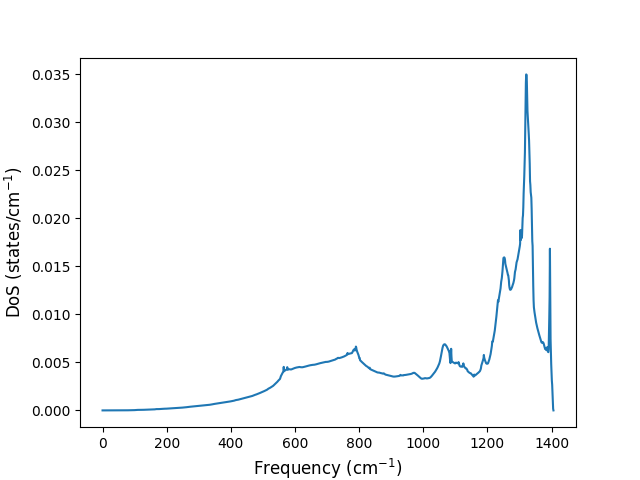

# Finite Temperature Properties

Everything we've done so far has in fact been for systems at effectively zero temperature. And even at zero temperature, we haven't taken into account the zero-point motion of the atoms and have treated them as purely classical objects residing at fixed positions.

In actuality, there will be an effect from the zero-point motion of the atoms, and as temperature increases the atoms will vibrate with larger amplitude and this can lead to changes in many properties of a material with temperature. You will learn how the thermodynamic properties of a material can be computed from first principles and be able to predict properties such as the total energy and the heat capacity.

Our approach will be to use the type of density functional theory (DFT) and density functional perturbation theory (DFPT) calculations you've already seen, and spend more time analysing the output to produce materials properties. To get the finite temperature properties, we need to get a list of the phonon modes available to the system. The more phonon modes we include in this list, the more accurate the calculation will be, but this comes at the cost of increased computational time. Once the phonon mode list has been obtained, we use it to compute the phonon density of states, which can then be used to obtain the thermodynamical quantity of interest. This will be done using [python](https://www.python.org/).

## Phonon density of states
The phonon density of states is obtained by counting how many phonon modes exist at each frequency. In order to do this, we first need to gather as much information as possible about the phonon modes by calculating the frequency of each mode in a grid of $\mathbf{q}$ points.


### Phonon calculations on a fine-grid

In [Lab08](../lab08/readme.md) you already learned most of the steps you need to follow to perform phonon calculations on a grid. The only difference is the input file for `matdyn.x`.

!!! example "Task 1 - Calculate the dynamical matrix on a fine grid"
    - Copy the lab09 file into your `data` directory and go to the `01_CarbonDiamond` directory. 
    - Using what you learned from [Lab08](../lab08/readme.md), follow the necessary steps to compute the force constant matrix.
    - Take a look at the `05_CD_matdyn-fine.in` input file. You will notice a few differences relative to the previous lab.
    ```bash
    &input
        asr='simple'
        flfrc='CD444.fc'
        flfrq='CD-fine.freq' 
        fldos='CD.dos' 
        nk1=20,nk2=20,nk3=20 #(1)!
        nosym=.true. #(2)!
        dos=.true. #(3)!
    /
    ```
          1. Request a 20x20x20 grid
          2. Do not use symmetry operations to speed up the calculation. This makes it easier to parse the output file
          3. Calculate the density of phonon states

    - Run `matdyn.x` with this input file. It'll take a bit longer than the band calculation as it is explicitly computing without invoking the symmetry.

After `matdyn.x` finishes executing, it will generate two important files: `CD-fine.freq` and `CD.dos`. Take a look at the contents of each file. 


!!! example "CD-fine.freq file"
    - The `CD-fine.freq` file contains the phonon frequencies for all the modes at each $\mathbf{q}$ point and is organized as follows
    ```python
    &plot nbnd=   6, nks=8000 /   #(1)!
                0.000000  0.000000  0.000000 #(2)! 
      -0.0000    0.0000    0.0000 1390.4720 1390.4720 1390.4720 #(3)!
              -0.050000  0.050000 -0.050000
      96.9791   96.9791  162.3473 1387.9266 1387.9266 1391.4163
              -0.100000  0.100000 -0.100000
      190.7327  190.7327  321.7228 1380.5533 1380.5533 1393.6345
              -0.150000  0.150000 -0.150000
      278.1010  278.1010  475.2404 1369.1811 1369.1811 1395.4974
        ... 
    ```
          1. The first line tells you there are six bands per $\mathbf{q}$ point and 8000 (20x20x20) $\mathbf{q}$ points.
          2. Specifies the $\mathbf{q}=(0,0,0)$ point.
          3. There are six frequencies on this line, one for each band of the $\mathbf{q}=(0,0,0)$ point.

Now that you have obtained the phonon vibrational frequencies for a set of $\mathbf{q}$ points, the phonon density of states is calculated by counting how many phonon modes exist for a given frequency range. For example, if you want to know how many phonon modes exist between frequency $\omega$ and $\omega+d\omega$, this quantity is given by $\rho(\omega)d\omega$:

$$ \text{number of phonon modes between } \omega \text{ and } \omega+d\omega=\rho(\omega)d\omega $$

The density of phonon states is calculated via the following expression:

$$ \rho(\omega) = \sum_{\mathbf{q}\nu}\delta\left(\omega-\omega(\mathbf{q}\nu)\right)$$

where $\delta(...)$ is the Dirac delta function, $\mathbf{q} \nu$ denotes phonon mode $\nu$ at vector $\mathbf{q}$ and $\omega(\mathbf{q}\nu)$ is the frequency of that phonon mode. You can find the result of this calculation in the `CD.dos` file computed by `matdyn.x`.

!!! example "CD.dos file"
    - The `CD.dos` file is organized as follows
    ```python
     # Frequency[cm^-1] DOS PDOS
     -1.3637193144E-05  0.0000000000E+00  0.0000E+00  0.0000E+00 #(1)!
      9.9998636281E-01  1.8451769729E-09  9.2259E-10  9.2259E-10
      1.9999863628E+00  7.3808263018E-09  3.6904E-09  3.6904E-09
      2.9999863628E+00  1.6606947988E-08  8.3035E-09  8.3035E-09
      3.9999863628E+00  2.9523542031E-08  1.4762E-08  1.4762E-08
        ... 
    ```
          1. The first column provides the frequency of oscillation in cm^-1 and the second provides the density of states as states/cm^-1.

To know what the density of states actually looks like, let's now plot it.

!!! example "Task 2 - Plot the density of states"
    - Look for a python file `DOS.py` and inspect it. You should see the following code:
    ```python
    import numpy as np
    import matplotlib.pyplot as plt
    dos = np.loadtxt("CD.dos", skiprows=1) #(1)!
    plt.plot(dos[:,0], dos[:,1]) #(2)!
    plt.xlabel(r'Frequency ($\mathrm{cm}^{-1}$)',fontsize=12)
    plt.ylabel(r'DoS (states/$\mathrm{cm}^{-1}$)',fontsize=12)
    plt.savefig("CD_dos.png") #(3)!
    plt.show()
    ```
        1. Read the DoS file, skipping the first row. The first row is a header and should not be read as data
        2. Plot column 0 against column 1
        3. Save the plot into an image file called `CD_dos.png`
    
    - Run this script with `python DOS.py` 

    ??? success "What does the density of states look like?"
         
        <figure markdown="span">
          {width=600}
        </figure>

    ??? success "How is the density of states related to the band structure?"
        If you compare against the band structure you calculated in the previous lab, you will see that the density of states is larger when the bands are flatter. If the bands are flatter, it means there are more phonon states per unit frequency, which directly translates to a larger density of states.
         
         
We will utilize the density of states to compute several thermodynamic properties using python in the next step.

## Total energy at temperature T
One of the simplest and most important quantities that can be obtained from information about vibrations is the phonon energy. The total energy due to phonons can be written as

$$ E(T) = \int_{0}^{+\infty} \hbar\omega \rho(\omega)\left(\frac{1}{2} + n_{BE}(\hbar\omega,T)\right)d\omega $$

where the factor $n_{BE}(E,T) = \frac{1}{\exp(E/k_\mathrm{B} T)-1}$ is recognized as the Bose-Einstein occupation factor. Notice how the total energy requires considering the contribution of every energy $E$ weighed by the phonon density of states and the Bose-Einstein occupation factor.

### Performing the integral using python
This integral will be calculated numerically using python. Let's begin by analysing the python script which performs this calculation.

!!! example "energy.py"
    - In the `01_CarbonDiamond` folder you will find the `energy.py` python script which performs the energy integration. The script reads in the the phonon density of states and the temperature and prints out the total energy at that temperature. Note that some constants are deliberately missing from this file, denoted by `???`.
    ```python
    import sys
    import numpy as np

    filename = sys.argv[1] 
    T = float(sys.argv[2]) #(6)!

    data = np.loadtxt(filename, skiprows=1) #(5)!
    freqs = data[:,0]
    dos = data[:,1]
    constant1 = ???  #(1)!
    constant2 = ???  #(2)!
    dw = freqs[1] - freqs[0] #(3)! 

    total_energy = 0
    for w, rho in zip(freqs, dos):

      if abs(w) < 1e-5:
        continue #(4)!

      bose = 1.0/(np.exp(constant1*w/T) - 1.0)
      total_energy += constant2*w*rho*(0.5 + bose)*dw

    print(total_energy)
    ```
        1. Replace ??? by the relevant physical constant (or constants) with your choice of units
        2. Replace ??? by the relevant physical constant (or constants) with your choice of units
        3. Numerical integration requires specifying the numerical discretization step
        4. If the frequency is too small, it will cause numerical problems because of a division by a very small number inside the Bose-Einstein occupation factor. Since we're summing over a large number of terms, these ignored terms will have a residual contribution and can be safely ignored
        5. The first row of the `CD.dos` file is a header and should be ignored
        6. The temperature should be in Kelvin


Note that this program ignores very small frequencies due to the possibility of dividing by zero.


!!! example "Task 3 - Plot the energy as function of temperature"
    1. Go back to the lecture notes and determine what are the physical constants which are missing in the program above. Modify the `energy.py` so it has the correct constants **(Note: physical constants can be expressed in many different units. Feel free to use whichever units you think best express these quantities, just remember to be consistent!)**

        ??? success "Answer" 
            `constant1=0.0366 K/cm^-1`<br>
            `constant2=6.58e-16 eV s`
    2. Run this program using the phonon density of states obtained in the previous section, for a temperature of 1 Kelvin (1K): `python energy.py CD.dos 1` 
    3. Repeat the previous step for the following list of temperatures in Kelvin `(1, 2, 3, 4, 5, 6, 8, 10, 15, 20, 30, 50, 70, 100)` and plot it using your favourite tools to get a graph of energy as a function of temperature

### Analysing the energy

!!! example "Task 4 - Analyse the plot"
    ??? success "As the temperature decreases, the energy drops, but eventually it starts stabilizing and never drops below a certain value. Why?"  
        Answer: As the temperature drops, the phonons lose their thermal energy, but there's still a contribution to their energy coming from the zero-point energy ($\hbar \omega /2$) of each mode 
    ??? success "As the temperature increases, the energy increases linearly with temperature. Why?"
        Answer: For sufficiently large temperatures, the system starts behaving classically, so the amount of energy it can store is proportional to the temperature and the constant of proportionality is the heat capacity.


## Heat capacity at constant volume
Using this type of approach, we are not limited to only computing the total energy. Some key quantities we can calculate are the heat capacity, the entropy and the Helmholtz free energy (For reference, see [Wikipedia](https://en.wikipedia.org/wiki/Quasi-harmonic_approximation) and the reference therein).

The specific heat at constant volume tells us how much energy is required to increase the temperature of a system by a given amount. It can be obtained from the total energy calculations by differentiating with respect to temperature:

$$C_V(T) = \left(\frac{\partial E}{\partial T} \right )_{const\ V}
 = k_B \int_{0}^{+\infty} \left(\frac{\hbar\omega}{k_B T}\right)^2 \rho(\omega)\frac{\exp(\hbar\omega/k_B T)}{\left[ \exp(\hbar\omega/k_B T)-1\right]^2} d\omega$$

!!! example "Task 5 - Plot the specific heat as a function of temperature"
    - Create a new program `heat_capacity.py` that calculates the heat capacity of Carbon Diamond by doing the necessary modifications to the `energy.py` program.
    - Calculate the heat capacity for the same temperatures as you did for the energy in the previous task.

### Analysing the heat capacity
At high temperatures, the heat capacity approaches a constant. This is the [Dulong-Petit](https://en.wikipedia.org/wiki/Dulong%E2%80%93Petit_law) law, followed (approximately) by most materials. At low temperatures, the heat capacity is proportional to $T^3$, as predicted by the [Debye model](https://en.wikipedia.org/wiki/Debye_model).

# Summary
In this lab you have learned

- How to compute the phonon density of states
- How to use the phonon density of states to obtain the total phonon energy and the specific heat.