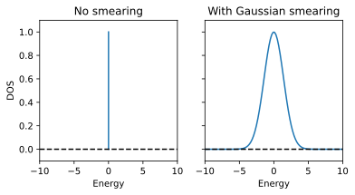
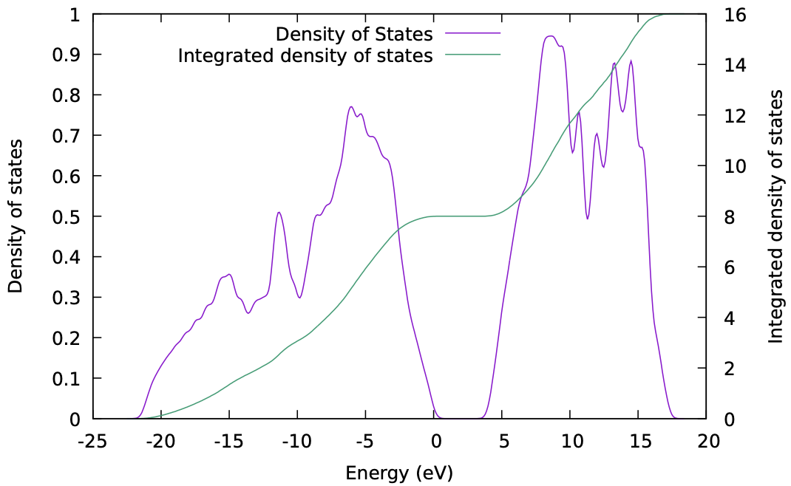

Metals and Density of States
============================

This week we'll be discussing the metallic systems and the electronic density of
states. For metals, there are a couple of complications which mean we have to
treat them differently from systems with a non-zero band gap.

<div markdown="span" style="margin: 0 auto; text-align: center">
[Download the input files for this tutorial](./assets/lab10_input.zip){ .md-button .md-button--primary }
</div>

-------------------------------------------------------------------------------

## Density of States

The electronic Density of states (DOS) describes the distribution of electronic
states in a material with respect to their energy. More precisely, it tells us
how many electronic states, for a system of volume V, can be occupied in a small
(infinitesimal) energy range near a specific energy. The DOS is defined as:

$$ 
\mathrm{DOS}(E) = \sum_{n} \int  \delta(E - \epsilon_{n\mathbf{k}}) d\mathbf{k},
$$

where $\epsilon_{n\mathbf{k}}$ are the Kohn-Sham eigenvalues for band $n$ and
$k$-point $\mathbf{k}$.

For a molecular system, the DOS looks exactly the same to the eigenenergy
spectrum and is discrete (with a constant hight of one), since we only have one
set of molecular states. However, for periodic systems, each k-point has a set
of eigenenergies and the DOS should become continuous.

<figure markdown="span">
   </figure>


Since the DOS and the band structure are both related the Kohn-Sham eigenvalues,
intuitively, the DOS is also related to the band structures: bands with large
energy dispersion in the Brillouin zone result in low DOS spread across a large
interval, whereas less dispersive (more flat) bands result in high DOS near a
small energy interval. In insulators and semiconductors the DOS is zero inside
the band gap, as there are no available states in that energy range. Hence, the
DOS can give us an accurate estimation of the band gap (unlike the band
structure plot which only goes along a certain path in the Brillouin zone, DOS
reflects eigenvalues of all k-points in the Brillouin zone).

### Smearing

The definition of the DOS can also be represented as a sum over an infinite
amount of k-points that sample the Brillouin zone:

$$
\mathrm{DOS}(E) = \sum_{n} \sum^\infty_{\mathbf{k}}  \delta(E -
\epsilon_{n\mathbf{k}}) \Delta \mathbf{k}.
$$

However, since we can only have a finite sampling of the Brillouin zone, in
pratice, interpolation of the $\delta$ function (or, smearing) is used to
artifically include some contributions from k-points that we missed.

<figure markdown="span">
  
</figure>

While this scheme is quite fast and straight-forward, you'll need to tune the
broadening energy so that your calculated density of states is smooth in the
correct way: 

- If you use too large a broadening, you may smear out important
  features.
- If you use too small a broadening you may introduce spurious features
  and your density of states plot will look very bumpy/spikey.
- In principle you would want the smearing to be comparable to the **typical
  change in energy of a state from a k-point to its neighbours**. In practice
  though it's easiest to just try different values until it looks right.

??? note "Tetrahedron Method"
    The other way to interpolate is to use the so-called tetrahedron method.
    Essentially this corresponds to doing a three dimensional linear
    interpolation from a regular grid of values. This calculation can be
    noticeably slower than using a broadening but there is no need to to worry
    about using the correct smearing. The density of states will simply become
    more finely featured as you increase the density of the k-point grid in the
    non-self-consistent calculation.

    It's important to note that in a real measurement of the density of
    states of a system, there is an implicit broadening that comes from

      1. Electron-phonon coupling: the states are not simply at a fixed
      energy, but will have some distribution as the atoms vibrate.

      2. Any measurement probe will have a finite energy width associated
      with it, which will limit how finely it can resolve density of states
      features.

    So while tetrahedron may seem the more accurate approach, you shouldn't
    necessarily think of it as a more correct representation of a real
    system.

### Steps to Calculate the DOS
In a similar way to the electronic band structure, we produce the density of 
states plot in three steps.

#### Step 1 - SCF Calculation
Perform a self-consistent calculation as before, producing a converged
charge density.

!!! example "Task 10.1 - SCF Calculation"
    Run `pw.x` using the input file
    [:link:01_C_diamond_scf.in](01_densityofstates/01_C_diamond_scf.in)
    for diamond.

#### Step 2 - NSCF Calculation
Take the density calculated in the previous step and use it to
perform a non-self-consistent calculation on a more dense grid of k-points.
We want a good representation of how the state energies vary as we move
around the Brillouin zone so we use a much denser grid here than we need
to obtain a converged density in the previous step.

The difference between this and the band structure calculation is that here
we use a uniform sampling of the Brillouin zone, rather than a path between
k-points. The input file for this calculation can be found at
[:link:02_C_diamond_nscf.in](01_densityofstates/02_C_diamond_nscf.in):

```python
 &CONTROL
    pseudo_dir = '.'
    calculation = 'nscf' #(1)!
 /

 &SYSTEM
    ibrav =  2
    A = 3.567
    nat =  2
    ntyp = 1
    ecutwfc = 60.0
    # Add 4 conduction bands also
    nbnd = 8 #(2)!
 /

 &ELECTRONS
 /

ATOMIC_SPECIES
 C  12.011  C.pz-vbc.UPF

ATOMIC_POSITIONS crystal
 C 0.00 0.00 0.00
 C 0.25 0.25 0.25

K_POINTS automatic #(3)!
  20 20 20  0 0 0
```

1.  `calculation = nscf` specifies that we are calculating the 
    non-self-consistent calculation.
2.  `nbnd = 8` specifies that we want to calculate 8 bands.
3.  `K_POINTS automatic` specifies that we are using an automatically generated
    k-point grid. We've increased the k-point sampling to a 20x20x20 grid, and 
    we have removed the shift. Many systems have a valence band maximum or
    conduction band minimum at the gamma point, so it is good to ensure it's
    explicitly included in the grid.

!!! example "Task 10.2 - NSCF Calculation"
    Run `pw.x` using the input file
    [:link:02_C_diamond_scf.in](01_densityofstates/02_C_diamond_nscf.in)
    for diamond.

#### Step 3 - Density of States Calculation

Then, we need to convert the state energies calculated on this dense k-point
grid to a density of states using `dos.x`.
[:link:03_C_diamond_dos.in](01_densityofstates/03_C_diamond_dos.in) is the input
file for `dos.x` and contains just a `DOS` section:

```python
 &DOS
  degauss = 0.03 #!(1)!
  DeltaE = 0.1 #(2)!
 /
```

1.  `degauss` specifies the Gaussian broadening (in Rydberg) to use in the
    density of states calculation.
2.  `DeltaE` specifies the spacing between points in the output file, in eV.

!!! note
    we've picked values for these of similar magnitude despite their different 
    units. In fact if `degauss` is not specified, and no broadening scheme is 
    used in the DFT calculation, `degauss` will take the value of `DeltaE` by
    default. You can check the documentation [:link:
    INPUT_DOS](https://www.quantum-espresso.org/Doc/INPUT_DOS.html) for more
    details.

!!! example "Task 10.3 - Plotting Density of States"
    Run `dos.x` using the input file
    [:link:03_C_diamond_dos.in](01_densityofstates/03_C_diamond_dos.in)
    for diamond.

The final step produces a file named `pwscf.dos` by default. This is a simple
text file you can plot. It has three columns:

1. Energy (eV)
2. Density of States (states/eV)
3. Integrated Density of States (states)

It is customary to shift the x-axis in the plot such that the Fermi energy
or valence band max is at 0. While a value for the Fermi level is given in
the file header of the generated `pwscf.dos`, this is determined in a simple
way from the integrated density of states. It may be worth obtaining this from
a separate calculation using a relatively small broadening if you're looking a
metallic system, while for semiconductors and insulators you could find the
maximum valence band state energy manually. 

The directory `03_densityofstates` contains a gnuplot and a python script that 
can be used to plot the shifted DOS along with the integrated DOS:

!!! example "Task 10.4 - Density of States Calculation"
    Plot the density of states using the script provided.

    ??? success "Final result"
        <figure markdown="span">
          { width="500" }
        </figure>

------------------------------------------------------------------------------

## Metals

Metals have a Fermi surface that can be quite complex in k-space. This means
that in contrast to an insulator or semiconductor where every k-point has the
same number of **occupied** states, **in a metal the number of occupied states
can vary from k-point to k-point**. Remembering that DFT is a gound state theory
, a rapidly varying occupation number will makes it more difficult to converge. 


### Tackling Discontinuities

Generally, there are two things that we typically do for metals:

1.  Use a denser k-point grid than you would need for a semiconductor or
    insulator. This is to help sampling the rapid change in the Fermi surface at
    different k-points.

2.  Use some smearing scheme for the calculation of occupation number of bands
    at each k-point. This is in relation to the smearing used in the calculation
    of the [:link: density of states](#density-of-states). The difference is
    that here the occupation is also smeared (i.e., can no longer be intergers
    of 0 and 1).

    To determine the occupation number at each SCF step, we first need to obtain
    the Fermi energy of the system. This is usually achieved by using the finite
    temperature Fermi-Dirac distrubtion and a smeared DOS by:
    $$
    N_e = \int_{-\infty}^{E_F} \mathrm{DOS}(\varepsilon) f_T(E) dE
    $$
    where $N_e$ is the number of electrons in the system and $f$ represents the
    Fermi-Dirac distribution function at temperature $T$. As we already know,
    the Fermi-Dirac function at 0K is a step function which would spoil the
    convergence of metals (due to discontinuities). Here, we simply raise the
    temperature to a small number (using the tag `degauss` for `pw.x`) so that
    the Fermi-Dirac function is smeared out and the convergence can be achieved
    more easily. It is worth noting that other smearing methods such as gaussian
    smearing can also be used. Once the Fermi energy is found, the occupation
    function is determined and the occupation number at each k-point and band
    $n$ can be easily calculated:
    $$
    f_{n\mathbf{k}} = f_T(\varepsilon_{n\mathbf{k}} - E_F).
    $$
    Adding a smearing to the occupation function helps significantly in
    achieving a smooth SCF convergence, as otherwise a small change in a state
    energy from once cycle to the next could lead to a very large change in its
    occupation and to the total energy in turn (this is called
    'ill-conditioning'). We set the smearing scheme (for both DOS and occupation
    function) and width with the `occupations` and `degauss` variables in the
    input file.

### Example: Aluminium

Aluminium forms in a standard FCC structure with one atom per unit cell, which
we know how to deal with at this point. The thing about Aluminium that makes it
more complicated within DFT is that it is a metal.

Here is an example input file for a calculation of Aluminium:

```python
 &CONTROL
    pseudo_dir = '.'
 /

 &SYSTEM
    ibrav =  2
    A = 2.863
    nat =  1
    ntyp = 1
    ecutwfc = 18.0
    occupations = 'smearing' #(1)!
    smearing = 'fermi-dirac' #(2)!
    degauss = 0.1d0 #(3)!
 /

 &ELECTRONS
 /

ATOMIC_SPECIES
 Al  26.982  Al.pz-vbc.UPF

ATOMIC_POSITIONS crystal
 Al 0.00 0.00 0.00

K_POINTS automatic
  8 8 8 1 1 1
```

1.    The `occupations` variable is set to `smearing` to tell Quantum Espresso
      to use a smearing scheme [:link:input 
      description](https://www.quantum-espresso.org/Doc/INPUT_PW.html#idm362).
2.    The `smearing` variable is set to `fermi-dirac` to tell Quantum Espresso
      to use a Fermi-Dirac smearing scheme. [:link:input
      description](https://www.quantum-espresso.org/Doc/INPUT_PW.html#idm404). 
3.    The `degauss` variable is set to 0.1d0 to set the width of the smearing.
      see [:link:input
      description](https://www.quantum-espresso.org/Doc/INPUT_PW.html#idm401).


!!! example "Task 10.5 - Smearing"

    First, run the `pw.x` calculation with the supplied input file in
    [:link:02_aluminium/Al.in](02_aluminium/Al.in).
    
    Then, look in the `pwscf.xml` file and find the various `ks_energies`
    entries towards the end. These give the various k-points used in the
    calculation and the energies and occupations of each state for this k-point.
    Note, for a metal the default number of bands is at least four more than are
    needed for the number of electrons per cell. The pseudopotential we have
    used has 3 valence electrons, which could be represented with two
    potentially doubly occupied bands, so we have four more bands in the
    calculation for a total of 6.

    ??? success "Example" 
        ```
              <ks_energies>
                <k_point weight="7.812500000000000E-003">-6.250000000000000E-002  6.250000000000000E-002  6.250000000000000E-002</k_point>
                <npw>59</npw>
                <eigenvalues size="6">
          1.315972343567215E-001  1.505697520824042E+000  1.607697079464305E+000
          1.607697714947740E+000  1.834366371282428E+000
          1.952726961146777E+000
                </eigenvalues>
                <occupations size="6">
          9.999990177787399E-001  1.181697427742303E-006  1.536561074875367E-007
          1.536541545820267E-007  1.650917762173208E-009
          1.547598926179030E-010
                </occupations>
              </ks_energies>
         ... 
        ```
    
    Now, try removing the `occupations` and `degauss` variables from the input
    file and see what happens when you try to run the calculation.

    ??? success "Example" 
        ```
        %%%%%%%%%%%%%%%%%%%%%%%%%%%%%%%%%%%%%%%%%%%%%%%%%%%%%%%%%%%%%%%%%%%%%%%%%%%%%%
             Error in routine electrons (1):
             charge is wrong: smearing is needed
        %%%%%%%%%%%%%%%%%%%%%%%%%%%%%%%%%%%%%%%%%%%%%%%%%%%%%%%%%%%%%%%%%%%%%%%%%%%%%%
        ```

------------------------------------------------------------------------------

Summary
-------

In this tutorial, we have learned:
- How to use the `dos.x` code from the Quantum Espresso package.
- How to treat a metallic system.
